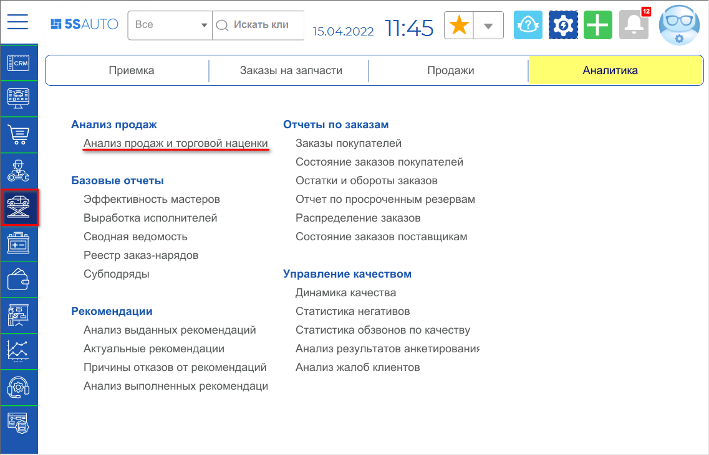
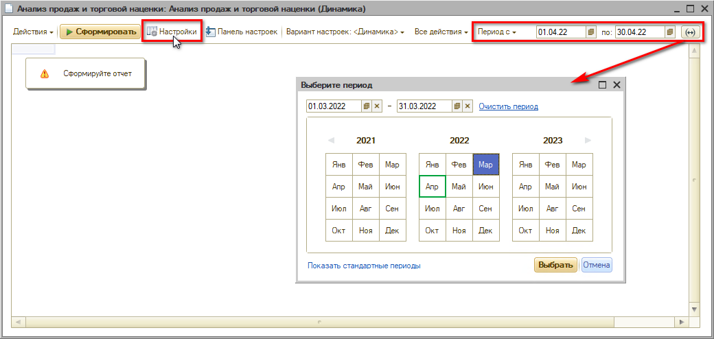
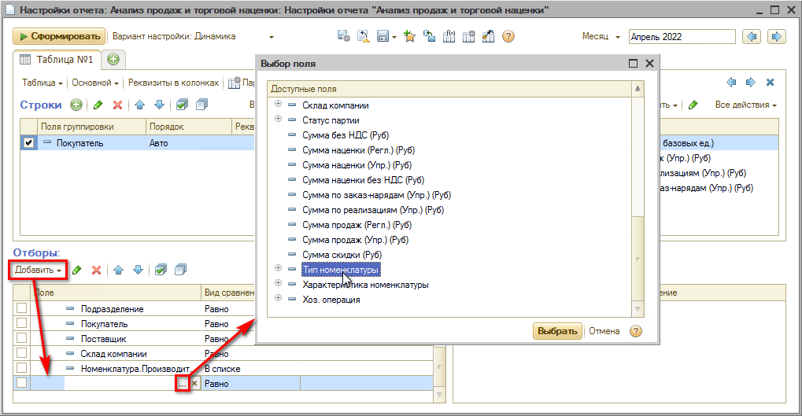
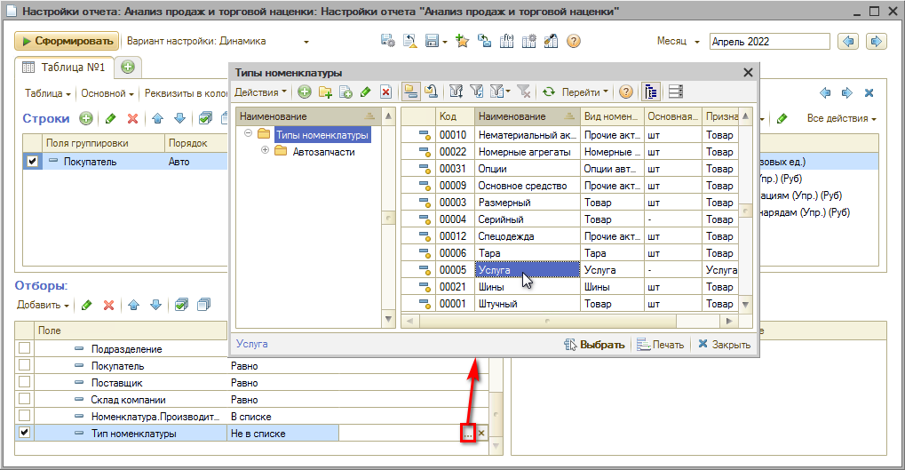
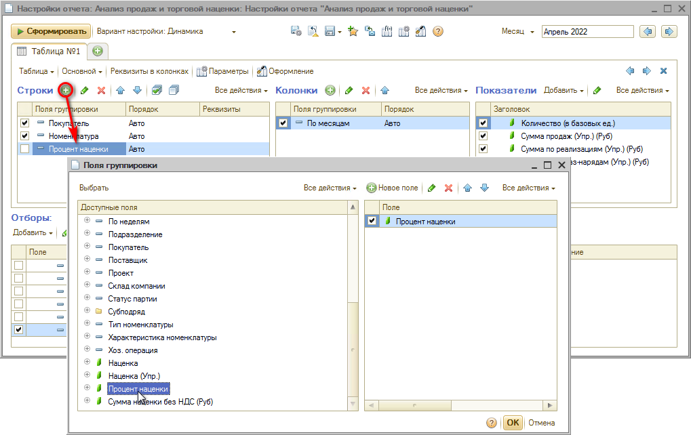
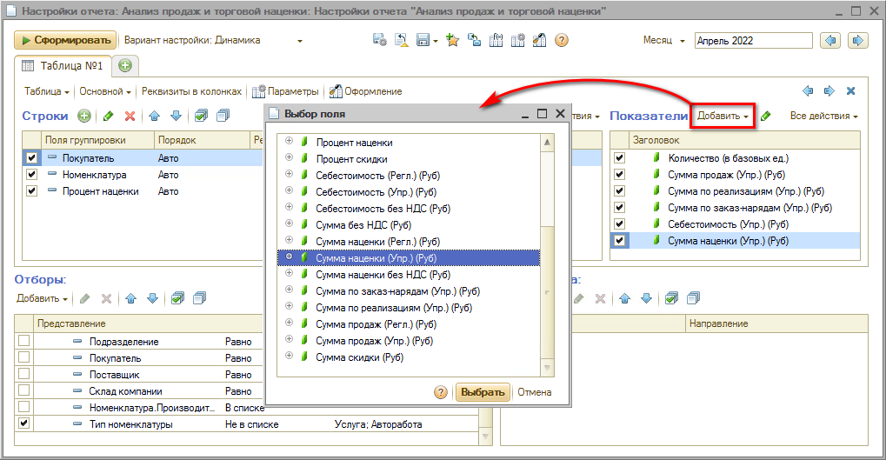
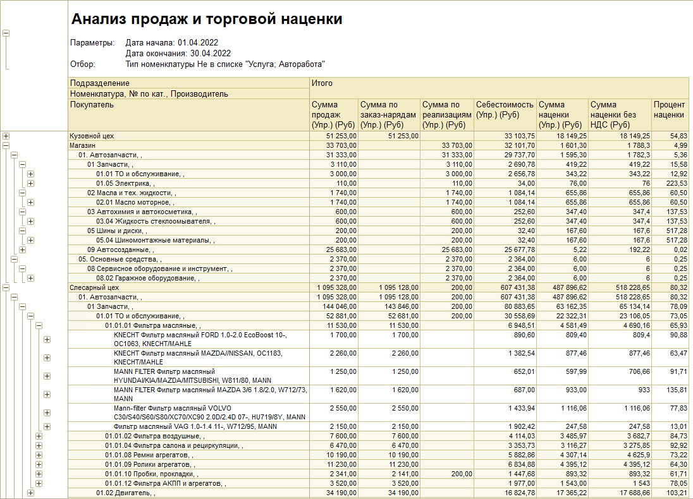

# Как увидеть наценку по проданным товарам

<table><tr><td><b>Время чтения:</b> 4 мин.</td><td><b>Обновлено:</b> 11.07.2022</td></tr></table>

Источник: https://www.5systems.ru/help/kak-uvidet-nacenku-po-prodannym-tovaram

## Содержание

1. [Настройка](#настройка)
2. [Показатели](#показатели)
3. [Пример сформированного отчета](#пример-сформированного-отчета)

Увидеть наценку по проданным товарам позволяет специальный отчет **Анализ продаж и торговой наценки**. Открыть отчет можно через главное меню программы: *Автосервис → Аналитика → Анализ продаж → Анализ продаж и торговой наценки*

## Настройка

В открывшемся отчете нужно установить *период* и открыть *настройки*:

Важно установить фильтр, чтобы в отчет попали только *товары* и не попали работы. Для этого в области настроек *“Отборы”* нужно добавить поле *“Тип номенклатуры”*:

Далее требуется выбрать вид соответствия *“Не в списке”*, значения из справочника типов номенклатуры *“Услуга”* и *”Авторабота”*, а также установить флаг использования (галочку):

В области *“Строки”* выбираются поля группировки:

В области *“Показатели”* производится выбор показателей, которые требуется отразить в отчете:

## Показатели

- ***Количество (в базовых ед.)*** – Количество проданного товара в базовых единицах измерения.
- ***Количество нормочасов*** – Количество нормочасов по выполненным заказ-нарядам.
- ***Сумма продаж (Упр.)*** – Сумма продаж с учетом скидки в валюте управленческого учета.
- ***Сумма по заказ-нарядам (Упр.)*** – Сумма по выполненным заказ-нарядам, с учетом скидки, в валюте управленческого учета.
- ***Сумма по реализациям (Упр.)*** – Сумма по реализованным товарам и оказанным услугам, с учетом скидки, в валюте управленческого учета.
- ***Себестоимость (Упр.)*** – Себестоимость товара (закупочная стоимость с учетом дополнительных расходов) в валюте управленческого учета.
- ***Сумма наценки (Упр.)*** – Наценка (маржинальная прибыль): разница между суммой продажи и себестоимостью в валюте управленческого учета.
- ***Процент наценки*** – Процентное отношение наценки к себестоимости.
- ***Сумма скидки*** – Сумма предоставленных скидок в валюте регламентированного учета.
- ***Процент скидки*** – Процентное отношение скидки к стоимости реализации товара.
- ***Субподряд*** – Группа показателей по субподряду, назначение которых аналогично показателям данного отчета.

## Пример сформированного отчета

Нажать *“Сформировать”*. Пример сформированного отчета:

Далее для удобства работы с данными можно изменять уровень группировки строк (клик правой кнопкой мыши → Уровни группировок).

---

**Теги:** доходы и расходы, наценка, продажи, отчет

