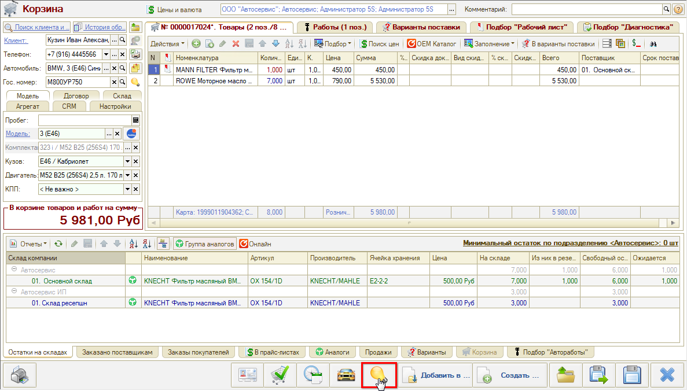
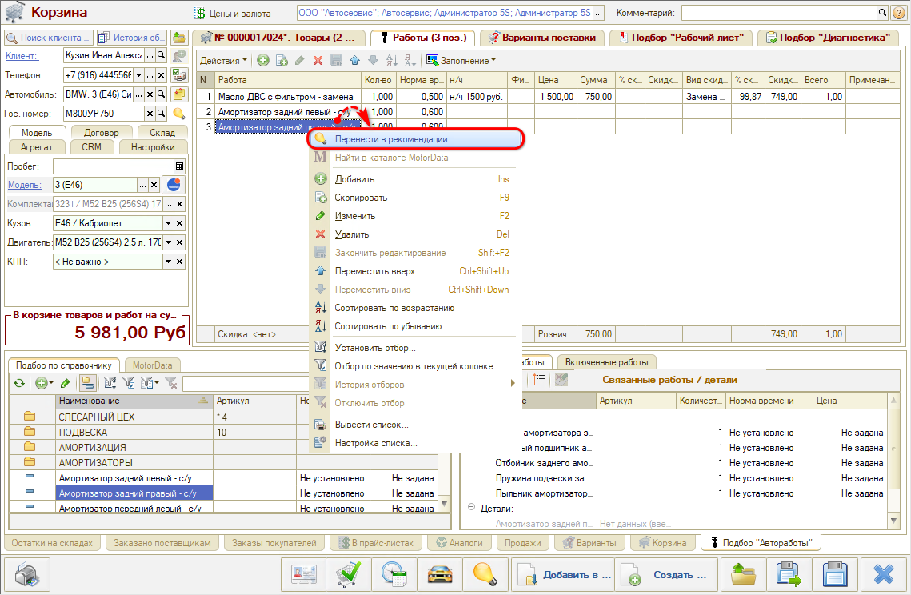
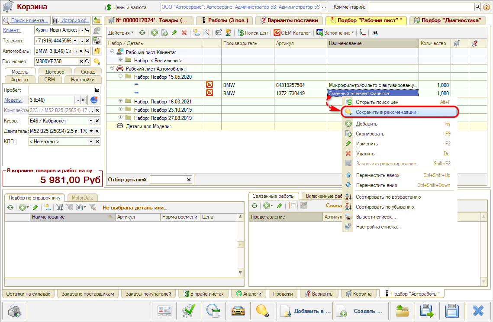

# Как добавить рекомендации к автомобилю

<table><tr><td><b>Время чтения:</b> 4 мин.</td><td><b>Обновлено:</b> 06.06.2025</td></tr></table>

Источник: https://www.5systems.ru/help/kak-dobavit-rekomendacii-k-avtomobilyu

## Содержание

1. [Способы добавления рекомендаций](#способы-добавления-рекомендаций)
2. [Добавление вручную](#добавление-вручную)
3. [Перенос из документа](#перенос-из-документа)
4. [Перенос из Корзины](#перенос-из-корзины)

## Способы добавления рекомендаций

Есть несколько ***способов*** заполнить рекомендации по автомобилю:

1. Добавить рекомендацию вручную.
2. Перенести работы/деталь из документа (Заявка на ремонт, Заказ-наряд) в Рекомендации.
3. Перенести работы/деталь из Корзины в Рекомендации.

## Добавление вручную

Чтобы добавить работу или деталь в рекомендации вручную:

1. Перейдите в окно "Подбор рекомендаций".
2. Добавьте строку в окне подбора:  
   
3. Заполните строку рекомендацией. 
   Выберите конкретную работу или деталь:  
     
   ИЛИ напишите просто в виде комментария (в этом случае рекомендация не может быть перенесена в документ, а отображаться будет при установленном фильтре "Только с текстовым описанием"):  
   

Остальные поля строки с рекомендацией заполните при необходимости:

- *Кол-во* - проставляется количество рекомендаций по работе/детали.
- *Сумма* - для работы рассчитывается автоматически исходя из нормочаса, для детали проценивается через обработку "Поиск цен".
- *Актуально по* - по необходимости можно установить дату, до которой выдавать клиенту рекомендацию.
- *Критичность* - выставляется степень критичности. Если не указать, то по умолчанию выставляется "По возможности".
- *Ущерб* – значение заполняется мастером вручную. Сумма потенциального ущерба для владельца автомобиля, если он не согласится выполнить рекомендуемую работу / установить рекомендуемую деталь. Выводится в печатную форму для клиента (внешнюю загруженную).

*Обратите внимание!* Если рекомендации добавлены вручную, то цены на работы или товары, которые не проценены или выбраны со склада, будут пересчитываться каждый раз при открытии окна "Подбор рекомендаций" или печати рекомендаций в Заказ-наряде. Цены на работы и товары, которые перенесены из документа или Корзины, а также на товары, процененные у поставщика, перерасчитываться не будут.

## Перенос из документа

Чтобы перенести работы или деталь из документа (Заказ-наряд, Заявка на ремонт) в Рекомендации выполните одно из следующих действий:

1. Удалите работу или деталь из документа. В этом случае программа спросит перенести ли удаляемую работу/деталь в Рекомендации. Выберите "Да".
2. Кликните правой кнопкой мыши по работе/детали, в контекстном меню выберите пункт "В рек. работы"/"В рек. товары":  
   

В этом случае работа/деталь добавится в рекомендации и в то же время останется в документе.

## Перенос из Корзины

Чтобы перенести *все подобранные работы или детали* из Корзины в Рекомендации к автомобилю, нажмите на кнопку "Сохранить все позиции в корзине как рекомендации к автомобилю":

Чтобы перенести *конкретный товар, вариант поставки или работу* из Корзины в Рекомендации к автомобилю, выберите пункт "Перенести в рекомендации" контекстного меню, вызванного у этого товара, варианта поставки или работы:

Чтобы *добавить деталь из подбора "Рабочий лист", "Авторабот" Корзины*, выберите пункт "Сохранить в рекомендации" контекстного меню, вызванного у выбранной детали или работы:

---

**Теги:** рекомендации, автомобиль, добавление рекомендаций, работы, запчасти

