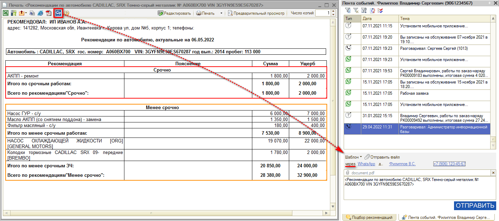

# Как отправить рекомендации клиенту

<table><tr><td><b>Время чтения:</b> 1 мин.</td><td><b>Обновлено:</b> 14.09.2026</td></tr></table>

Источник: https://www.5systems.ru/help/kak-otpravit-rekomendacii-klientu

Для того чтобы отправить рекомендации клиенту, следует:

1. В печатной форме рекомендаций нажать кнопку "В мессенджер";
2. В открывшемся окне выбрать номер телефона и мессенджер, через который требуется отправить сообщение – это делается нажатием на соответствующие кнопки-ссылки:  
   
3. Нажать кнопку "Отправить".

---

**Теги:** рекомендации, отправка клиенту, мессенджер, сообщение

