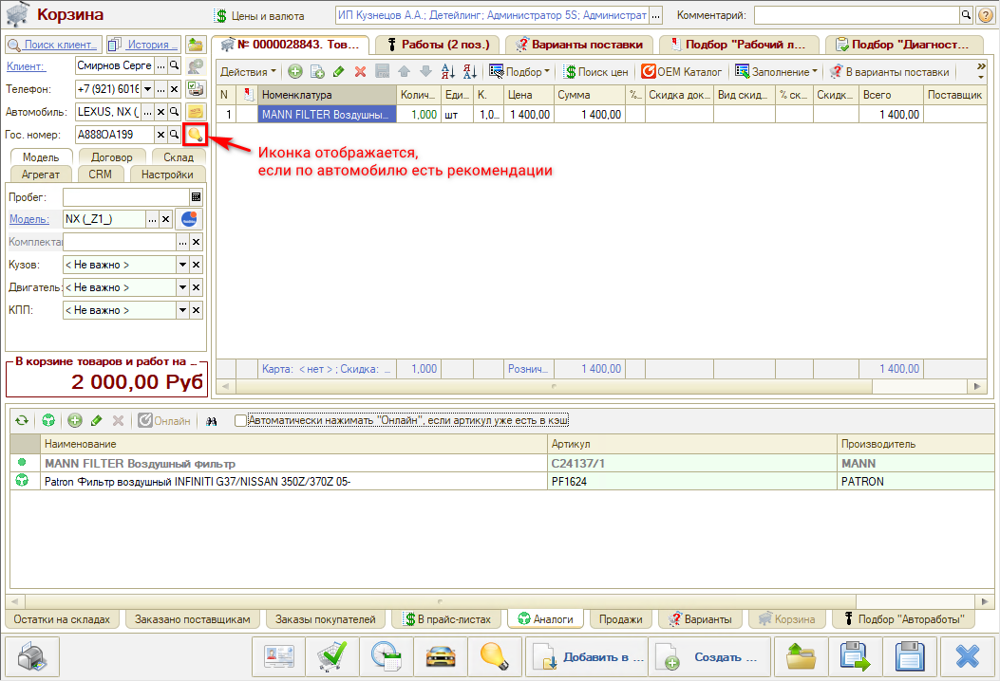
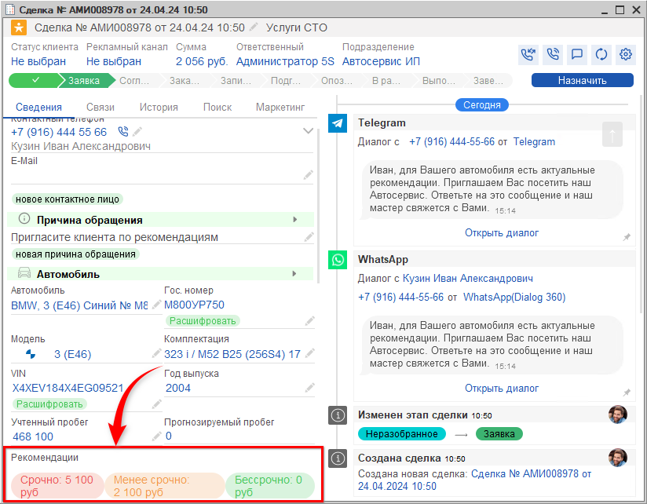

# Как перейти к подбору рекомендаций

<table><tr><td><b>Время чтения:</b> 4 мин.</td><td><b>Обновлено:</b> 28.04.2025</td></tr></table>

Источник: https://www.5systems.ru/help/kak-pereyti-k-podboru-rekomendaciy

***Рекомендации*** – это автоработы/детали, которые автосервис рекомендует клиенту произвести/установить для его автомобиля. В рекомендациях к конкретному автомобилю в программе отображаются те работы или детали, которые были подобраны ранее для автомобиля, но от которых клиент отказался на то время при согласовании списка работ.

Если по автомобилю есть актуальные рекомендации, то в различных документах, формах и АРМ в программе рядом с полем "Автомобиль" отображается кнопка в виде *горящей* л*ампочки*   .

## Подбор рекомендаций

Перейти в окно *"Подбор рекомендаций"* можно из следующих мест в программе:

1. Заказ-наряд: 
   
2. Заявка на ремонт: 
   
3. Корзина: 
   
4. Карточка автомобиля: 
   
5. Сделка: 
   

---

**Теги:** рекомендации, подбор рекомендаций, АРМ, автомобиль

