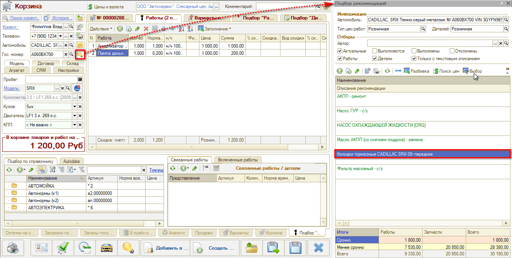

# Как перенести рекомендации в Корзину

<table><tr><td><b>Время чтения:</b> 1 мин.</td><td><b>Обновлено:</b> 11.07.2022</td></tr></table>

Для того, чтобы перенести имеющиеся рекомендации в Корзину, следует:

1. Находясь в Корзине, открыть *Подбор рекомендаций* нажатием на кнопку-лампочку в области информации об автомобиле клиента;
2. Выбрать среди рекомендаций нужную работу или деталь и дважды кликнуть по ней, либо выделить (одним кликом) и нажать кнопку "Выбор":  
   
3. Рекомендация добавится в Корзину – на вкладку *Товары,* если это деталь, или на вкладку *Работы,* если это авторабота.

О дальнейшей работе в Корзине см. курс видеоуроков *[Подбор запчастей и работ](../../Урок%206.%20Подбор%20запчастей%20и%20работ/).*

---

**Теги:** рекомендации, корзина, перенос рекомендаций

