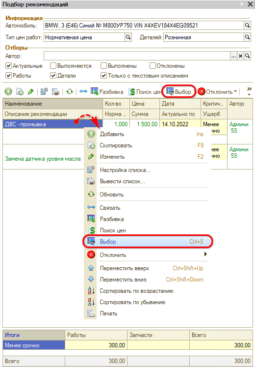
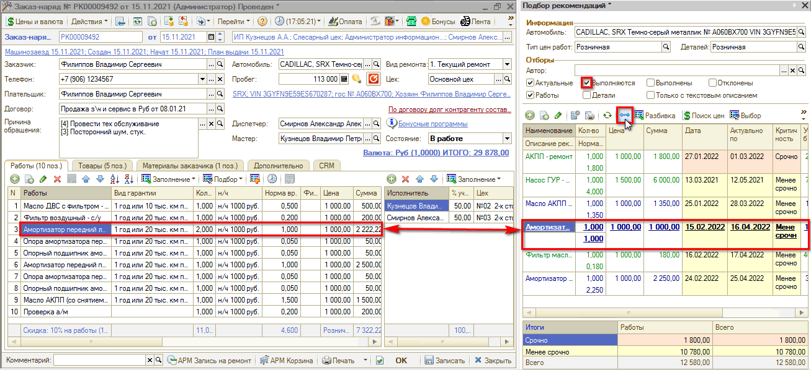

# Как перенести рекомендации в заказ-наряд

<table><tr><td><b>Время чтения:</b> 2 мин.</td><td><b>Обновлено:</b> 06.06.2025</td></tr></table>

Для исполнения рекомендаций необходимо перенести их в документ (Заказ-наряд или Заявка на ремонт).

Для этого выполните одно из действий:

1. Дважды кликните мышью на рекомендацию.
2. Выделите рекомендацию и нажмите на кнопку "Выбор":  
   

## Установка связки

Для того, чтобы переносимая в документ рекомендация считалась в программе выполненной, требуется установить связку Рекомендации с текущей работой/деталью.

Для установления связи выделите нужную работу/деталь и выберите соответствующую рекомендацию. Нажмите кнопку "Связать рекомендацию с текущей работой (номенклатурой)".

Правильно связанная с работой/деталью рекомендация перейдёт в состояние "Выполняется" и будет выделена синим цветом, а при закрытии Заказ-наряда перейдёт в состояние "Выполнена".

*Примечание:* Чтобы в Подборе рекомендаций отображались выполняемые рекомендации, требуется установить фильтр "Выполняются".

---

**Теги:** рекомендации, заказ-наряд, перенос рекомендаций

