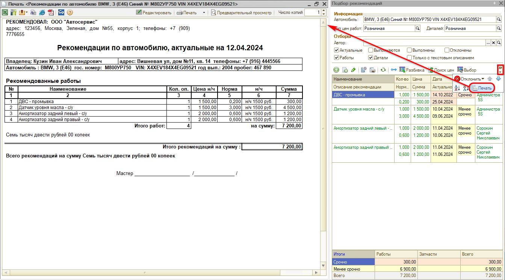

# Как распечатать рекомендации

<table><tr><td><b>Время чтения:</b> 2 мин.</td><td><b>Обновлено:</b> 06.06.2025</td></tr></table>

Рекомендации можно вывести на печать нажатием на кнопку "Печать" в *Подборе рекомендаций*, используя один из двух вариантов печатных форм:

## 1. Стандартная печатная форма

В стандартной печатной форме печати рекомендаций в таблице отображается список рекомендаций, включающий значения: наименование, количество, цена и сумма.

## 2. Загруженная внешняя печатная форма

Во внешней печатной форме печати рекомендаций список рекомендаций выводится с цветовой разметкой по уровню критичности и включает колонку "Ущерб" (сумма потенциального ущерба в случае отказа от рекомендуемого ремонта) для мотивации клиента принять рекомендации.

---

**Теги:** рекомендации, печать, печатная форма

