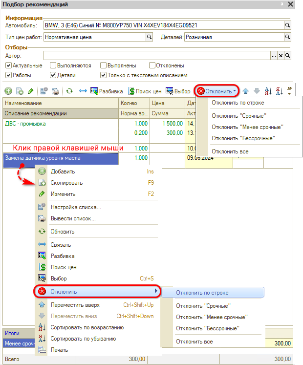

# Как удалить рекомендации

<table><tr><td><b>Время чтения:</b> 2 мин.</td><td><b>Обновлено:</b> 31.10.2025</td></tr></table>

Источник: https://www.5systems.ru/help/kak-udalit-rekomendacii

Рекомендацию после добавления удалить *нельзя*, но можно совершить следующие действия:

1. Отклонить с указанием причины: 
   
   Отклоненные рекомендации будут отображаться при установке фильтра "Отклоненные".
2. Добавить в Заказ-наряд работу/услугу, которая есть в рекомендациях - тогда до закрытия Заказ-наряда рекомендация будет в состоянии "Выполняется", а после закрытия "Выполнена" и предлагаться клиенту не будет. 
   Просмотреть выполняемые рекомендации можно, установив фильтр "Выполняется", а выполненные – установив фильтр "Выполнены".

---

**Теги:** рекомендации, удаление рекомендаций

