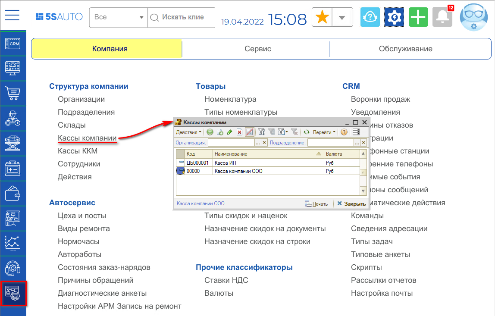
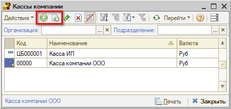
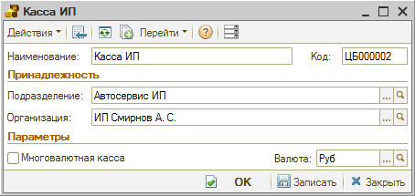
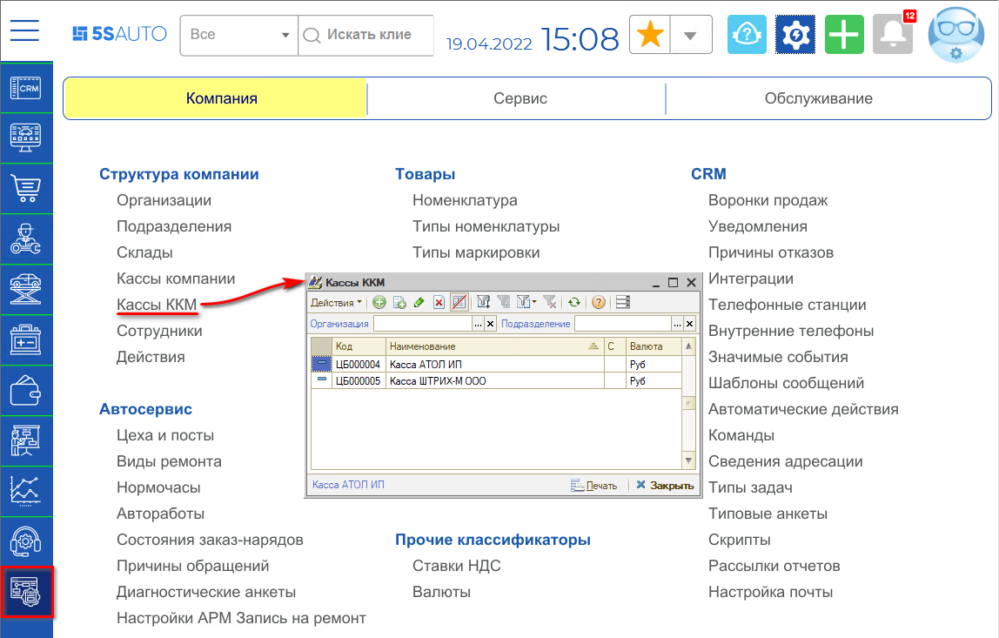
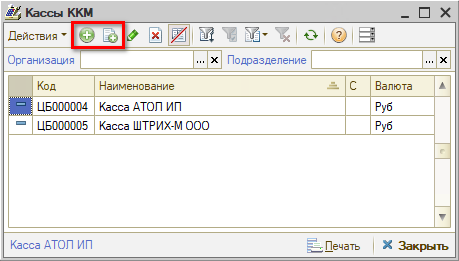
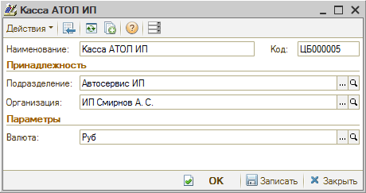

# Как добавить кассу

<table><tr><td><b>Время чтения:</b> 4 мин.</td><td><b>Обновлено:</b> 15.02.2023</td></tr></table>

Источник: https://www.5systems.ru/help/kak-dobavit-kassu

## Содержание

1. [Различие между кассами компании и кассами ККМ](#различие-между-кассами-компании-и-кассами-ккм)
2. [Как добавить кассу компании](#как-добавить-кассу-компании)
3. [Как добавить кассу ККМ](#как-добавить-кассу-ккм)

## Различие между кассами компании и кассами ККМ

Справочник ***Кассы ККМ*** содержит список контрольно-кассовых машин компании и используется при оформлении документов розничной продажи. *Касса ККМ* – это операционная касса, т.е. по сути денежный ящик контрольно-кассовой машины. Денежные средства, полученные при продаже товара в розницу (в торговом зале, удаленной торговой точки, розничном магазине и т.д.), поступают в кассу ККМ.

Справочник ***Кассы компании*** используется для идентификации мест фактического хранения и движения денежных средств (кассовые помещения, сейфы руководителей подразделений). Кассы, описанные в этом справочнике, служат для приема и выдачи денежных сумм. *Касса компании* – по сути, сейф в кабинете бухгалтера или руководителя подразделения. 
Для оформления приема и выдачи денег из касс служат специальные документы – кассовые ордера.

Торговая выручка должна инкассироваться из операционной кассы в кассу компании. Процесс инкассации описан в [*уроке по Закрытию смены*](https://5systems.ru/help/kak-zakryt-smenu).

## Как добавить кассу компании

Перейти в справочник “Кассы компании” можно через меню интерфейса:  *Администрирование → Компания → Структура компании → Кассы компании*

Для добавления новой *кассы компании* требуется в справочнике нажать кнопку "Добавить" или "Добавить копированием", заполнить основные реквизиты и записать карточку.

**Реквизиты карточки Кассы компании**

- ***Подразделение*** – подразделение компании, которому приписана касса.
- ***Организация*** – организация, которой принадлежит касса.
- ***Многовалютная касса*** – если флажок установлен, то в кассе могут храниться средства в любых валютах. Учет денежных средств ведется в разрезе нескольких валют. Поле *Валюта* при этом становится недоступным.
- ***Валюта*** – задает валюту для кассы.

## Как добавить кассу ККМ

Перейти в справочник “Кассы ККМ” можно через меню интерфейса: *Администрирование → Компания → Структура компании → Кассы ККМ*

Для добавления новой *кассы ККМ* требуется в справочнике нажать кнопку "Добавить" или "Добавить копированием", заполнить основные реквизиты и записать карточку.

**Реквизиты карточки Кассы ККМ**

- ***Подразделение*** – подразделение компании, которому приписана касса.
- ***Организация*** – организация, которой принадлежит касса.
- ***Валюта*** – задает валюту работы кассы и наличности в денежном ящике. Валюта должна соответствовать национальной валюте страны (Администрирование → Компания → Прочие классификаторы → Валюты).

---

**Теги:** структура компании, касса компании, касса ККМ, кассовая смена
