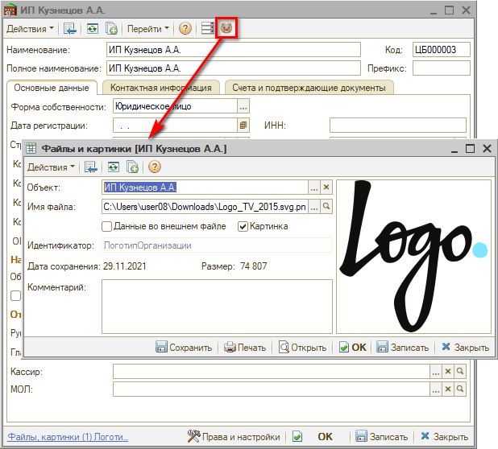

# Как добавить логотип компании

<table><tr><td><b>Время чтения:</b> 1 мин.</td><td><b>Обновлено:</b> 10.10.2022</td></tr></table>

Источник: https://www.5systems.ru/help/kak-dobavit-logotip-kompanii

Для загрузки логотипа выполните следующие действия:

1. перейдите в справочник "Организации";
2. выберите организацию, для которой необходимо загрузить логотип;
3. нажмите на кнопку "Логотип организации";
4. выберите файл для загрузки с картинкой логотипа и сохраните изменения:

Логотип будет отображаться в печатных формах документов.

---

**Теги:** структура компании, логотип, печатные формы, интерфейс

