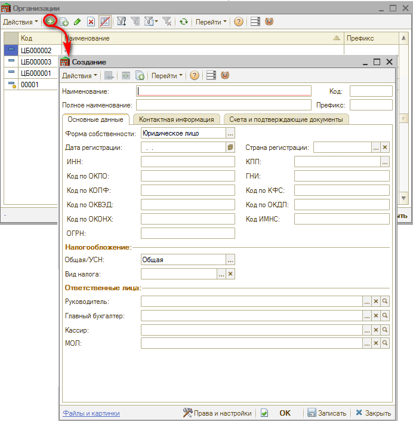

# Как добавить организацию

<table><tr><td><b>Время чтения:</b> 1 мин.</td><td><b>Обновлено:</b> 31.03.2025</td></tr></table>

Источник: https://www.5systems.ru/help/kak-dobavit-organizaciyu

Для добавления организации необходимо перейти в соответствующий справочник “Организации” – *Администрирование → Компания → Структура компании → Организации*:

В данном справочнике обязательно должен быть предопределенный элемент "-". Рекомендуется его не изменять.

Для создания (добавления) организации используем кнопку “+” (Добавить):

В открывшемся окне обязательно заполняем поля “Наименование”, “Полное наименование” и “Префикс”. Остальные данные при наличии.

Подробнее читайте в статье [*Справочник "Организации"*](../../../articles/5S%20AUTO/Структура%20компании/Справочник%20Организации/spravochnik-organizacii.md).

---

**Теги:** структура компании, организация, справочник организаций, реквизиты

