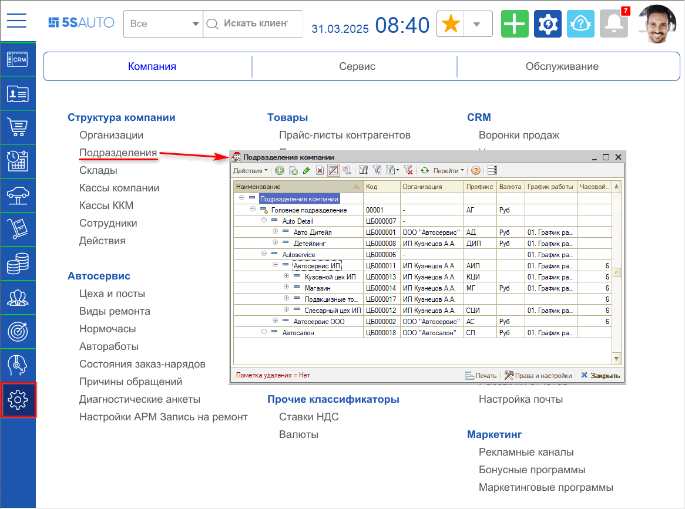
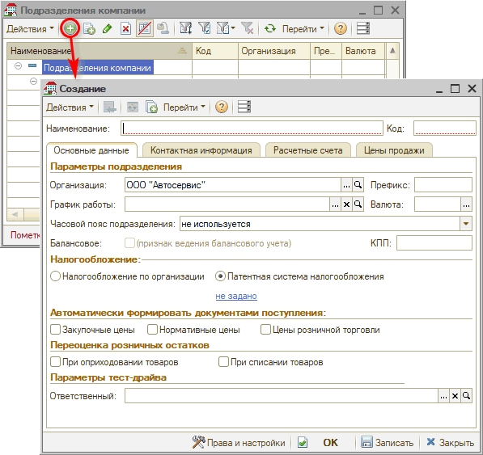

# Как добавить подразделение

<table><tr><td><b>Время чтения:</b> 1 мин.</td><td><b>Обновлено:</b> 31.03.2025</td></tr></table>

Источник: https://www.5systems.ru/help/kak-dobavit-podrazdelenie

Для добавления подразделения необходимо перейти в справочник "Подразделения компании" – *Администрирование → Компания → Структура компании → Подразделения*:

В справочнике "Подразделения компании" следует нажать кнопку "Добавить":

В открывшемся окне заполнить данные о подразделении. Обязательное поле для заполнения - Наименование.

Подробнее читайте в статье [*Справочник "Подразделения компании"*](../../../articles/5S%20AUTO/Структура%20компании/Справочник%20Подразделения%20компании/spravochnik-podrazdeleniya-kompanii.md).

---

**Теги:** структура компании, подразделение, справочник подразделений

