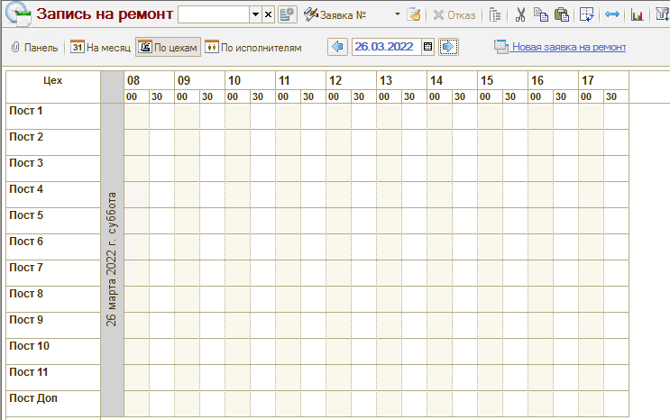
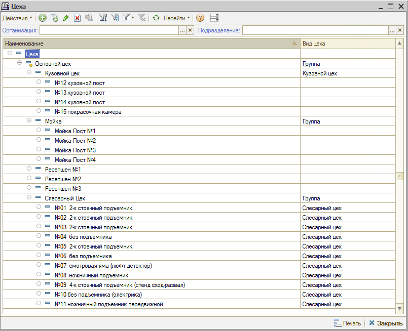
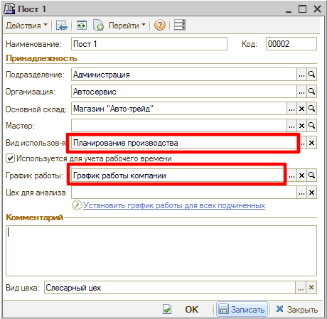
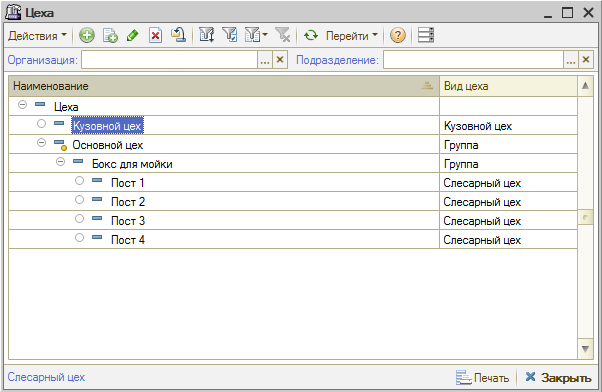
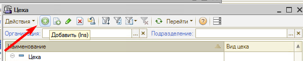
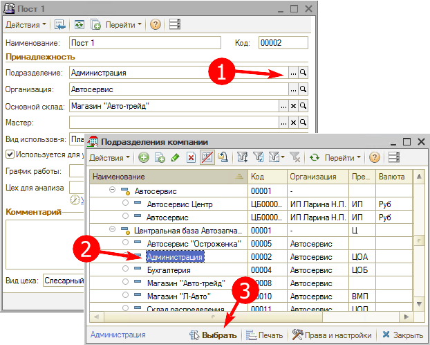
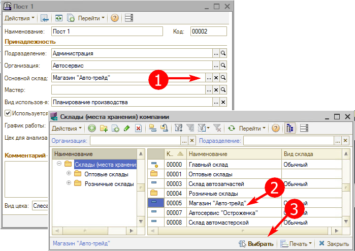
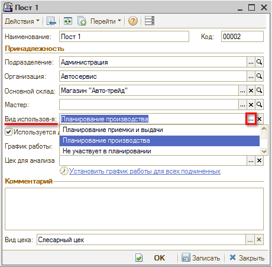
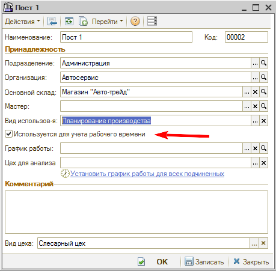
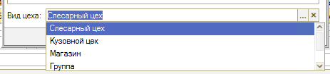

# Как добавить пост/цех

<table><tr><td><b>Время чтения:</b> 6 мин.</td><td><b>Обновлено:</b> 15.09.2022</td></tr></table>

Источник: https://www.5systems.ru/help/kak-dobavit-postcekh

## Содержание

1. [Использование цехов/постов](#использование-цеховпостов)
2. [Настройка цехов](#настройка-цехов)
3. [Заполнение параметров цеха/поста](#заполнение-параметров-цехапоста)

Справочник "Цеха" используется для хранения перечня производственных цехов, по которым необходимо вести раздельный учет производственных операций.

В справочнике используется иерархия элементов, таким образом, что один цех может иметь подчиненные цеха. Вложенность цехов может быть только до третьего уровня.

## Использование цехов/постов

Применяются в АРМ Запись на ремонт и присутствуют как реквизит в документах.

В справочнике «Цеха» (*меню программы:* Справочники -> Структура компании -> Цеха) задаются все рабочие места автосервиса в виде иерархической структуры.

У рабочего места, по которому будет происходить планирование работ, необходимо установить параметр «Вид использования» = «Планирование производства» и задать график работ:

## Настройка цехов

Цеха в базе настраиваются в зависимости от нескольких факторов.

Первый фактор - вариант ведения записи на ремонт:

- Если запись на ремонт ведется по исполнителям, а не по постам, то структура цехов может ограничится одним цехом на организацию. Добавление дополнительных цехов по вашему желанию.
- Если запись на ремонт по постам, то этих постов может быть достаточно много.

Второй фактор - количество организаций, подразделений:

- Если организаций несколько, то создавать цеха нужно только там, где это требуется. Если у вас один фактический цех на две и более организаций, то не нужно создавать дубли для цехов на разные организации, достаточно создать всего один цех. В программе разрешено вести запись на посты другой организации, это настраивается в АРМ Запись на ремонт. Большое количество бессмысленно созданных цехов/постов может привести к хаосу в справочнике и проблемам в дальнейшем при добавлении новых цехов/постов.
- Если организаций несколько, но при этом подразделения физически находятся в разных местах, то в таком случае, на каждое подразделение можно создать цеха/посты. Обычно при такой ситуации в анкете для каждой организации свой список постов.
- Если организация одна, а подразделений несколько, они разнесены по карте, то у каждого подразделения могут быть свои посты. Их нужно создавать.

Третий фактор - вид цеха:

- Для кузовных цехов нужно выбирать в карточке цеха вид "Кузовной".
- Если цех слесарный то в карточке цеха нужно выбрать вид “Слесарный”
- Для цехов, которые используются в качестве названия группировки цехов меньшего порядка Вид цеха устанавливается "Группа".
- Во всех цехах желательно заполнять вид цеха.  
  

## Заполнение параметров цеха/поста

Название цехов или постов можно выбрать любое. В случае, если вы решили сгруппировать цеха по какому-либо признаку, то можно назвать цех в зависимости от этого признака. Например, посты на улице Ленина объединить под головным постом с названием "Посты на Ленина" и видом цеха "Группа".

Подразделение и Организация указывается в зависимости от фактического расположения и принадлежности.

Параметр Склад указывается в зависимости от фактического склада, который будет использоваться чаще всего данным цехом. Зачастую данная информация не до конца ясна и указывается основной склад по выбранному подразделению.

Вид использования цеха является важным параметром. В зависимости от того, что вы укажете, изменится доступность данного цеха/поста для планирования в АРМ Запись на ремонт. Рекомендуется указывать "Планирование производства" постам, которые нужно будет потом настраивать для вывода. При этом группам и Цехам, которые имеют подцеха/посты, выбирается "Не участвует в планировании".

График работы заполняется в соответствии с реальным временем работы. Часы работы, настроенные в выбранном графике, будут доступны при планировании. Обычно График работы цеха/поста такой же, как и у выбранного подразделения цеха. Влияет на часы записи в АРМ Запись на ремонт.

*Если цех не подходит ни под один из доступных Видов цеха, то поле Вид цеха можно оставить пустым.*

Галочка “Используется для учета рабочего времени” ставится только, если у вас куплен ключ от модуля 1С “Учет рабочего времени”.

Вид цеха задается в указанном поле.

---

**Теги:** структура компании, цех, пост, запись на ремонт, планировщик

