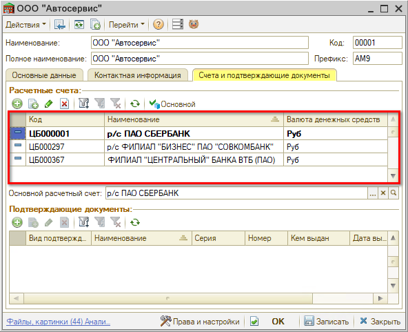
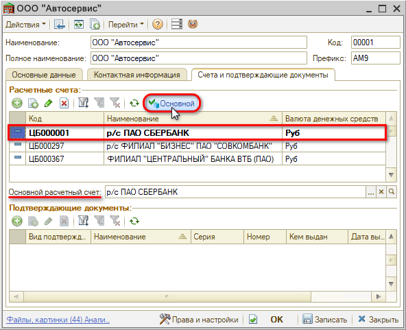
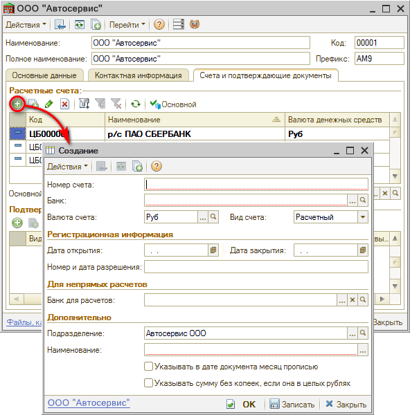
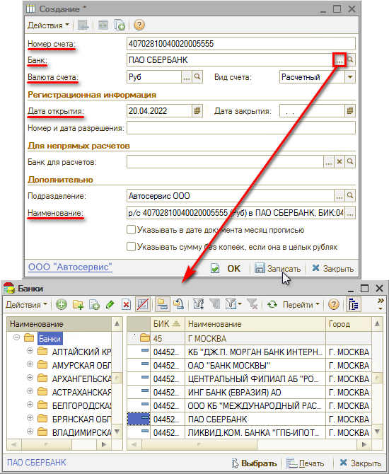

# Как добавить р/счет организации

<table><tr><td><b>Время чтения:</b> 3 мин.</td><td><b>Обновлено:</b> 08.07.2022</td></tr></table>

Источник: https://www.5systems.ru/help/kak-dobavit-rschet-organizacii

## Содержание

1. [Как добавить новый расчетный счет](#как-добавить-новый-расчетный-счет)
2. [Реквизиты карточки Банковского счета](#реквизиты-карточки-банковского-счета)

В *карточке Организации* на вкладке *Счета и подтверждающие документы* содержится список расчетных счетов компании:

Один из счетов может быть отмечен как *основной* при помощи кнопки "*Основной"*: он будет подтягиваться по умолчанию в банковские документы – *банковские выписки* и *счета на оплату*.

## Как добавить новый расчетный счет

Для того, чтобы добавить новый расчетный счет, требуется в карточке организации на вкладке “Счета и подтверждающие документы” в поле “Расчетные счета” нажать кнопку *“Добавить”* или *“Добавить копированием”*:

## Реквизиты карточки Банковского счета

При создании расчетного счета требуется заполнить основные реквизиты.

- ***Номер счета*** – уникальный двадцатиразрядный номер счета.
- ***Банк*** – банк, в котором открыт счет, его нужно выбрать из справочника *“Банки”*.
- ***Валюта счета*** – валюта накопления денег на счете.
- ***Вид счета*** – автоматически выбирается *Расчетный*, также возможны значения: *Депозитный*, *Ссудный*, *Иной*. Для ведения взаиморасчетов с контрагентами используются только расчетные счета.
- ***Регистрационная информация*** – группа полей, задающих справочные реквизиты счета. При создании можно заполнить дату открытия счета.
- ***Банк для расчетов*** – банк для случаев непрямых расчетов.
- ***Подразделение*** – подразделение компании, которому приписан счет. Заполняется автоматически, можно выбрать другое.
- ***Наименование*** – основное представление счета в документах. Текстовое поле, формируемое автоматически (при помощи номера счета, валюты счета и названия банка). Его можно отредактировать.
- *Указывать в дате документа месяц прописью; Указывать сумму без копеек, если она в целых рублях* – два флажка, влияющие на печатные формы платежных документов, выписанных по этому счету.

---

**Теги:** структура компании, расчетный счет, банковский счет, реквизиты организации

