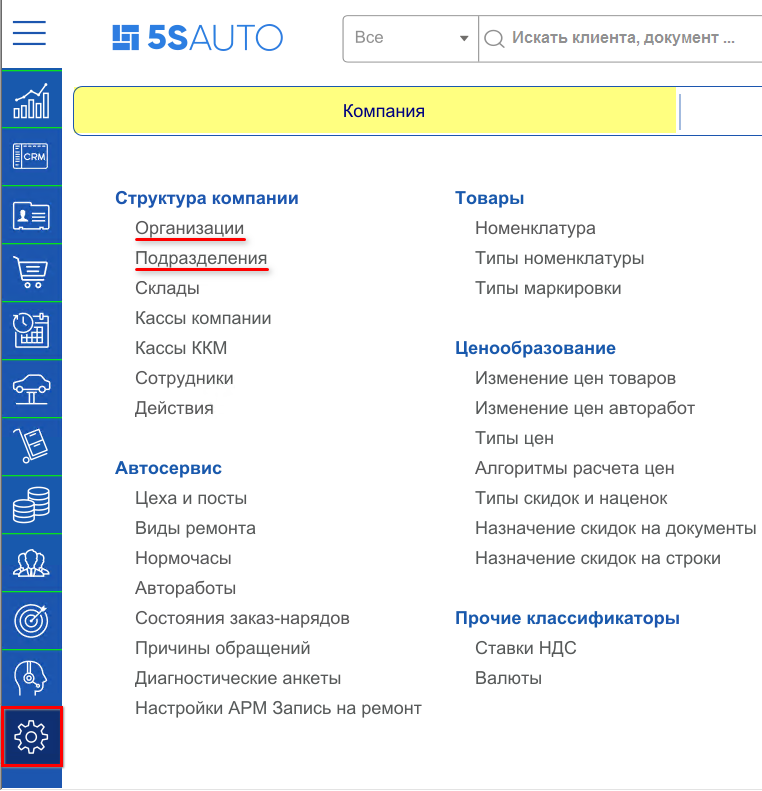
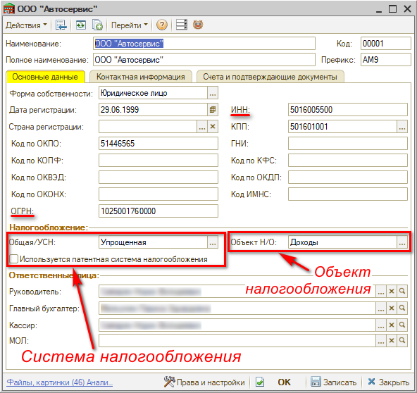
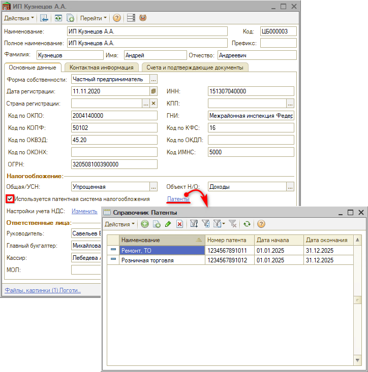
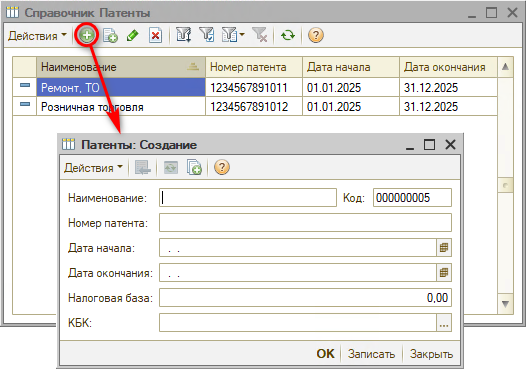
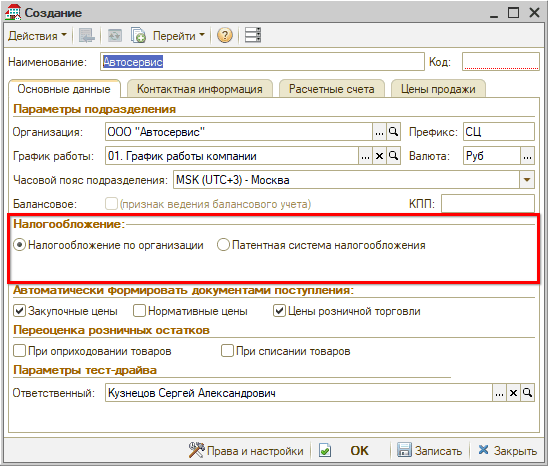
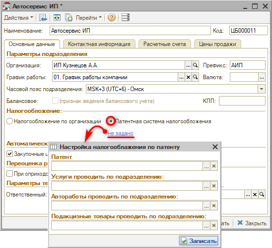
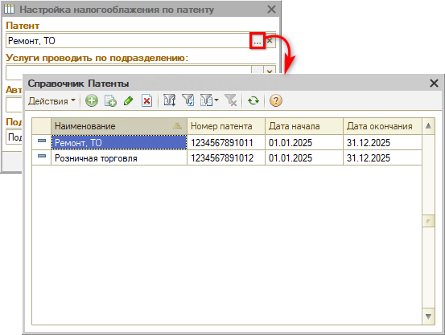
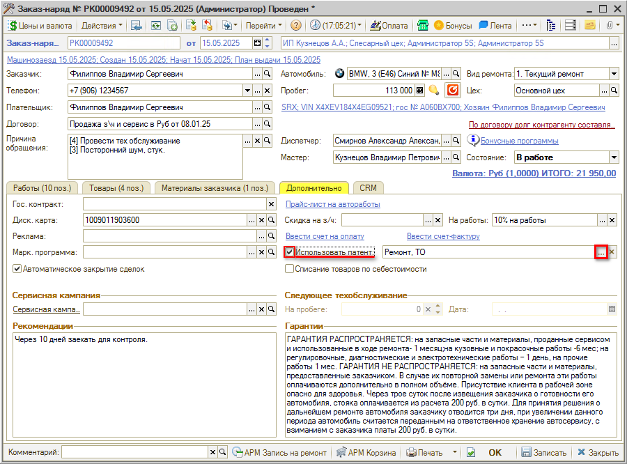

# Как настроить систему налогообложения

<table><tr><td><b>Время чтения:</b> 6 мин.</td><td><b>Обновлено:</b> 23.12.2025</td></tr></table>

Источник: https://www.5systems.ru/help/kak-nastroit-sistemu-nalogooblozheniya

## Содержание

1. [Настройка по организации](#настройка-по-организации)
2. [Настройка по подразделению](#настройка-по-подразделению)
3. [Системы налогообложения Российской Федерации](#системы-налогообложения-российской-федерации)
   - [Общая система налогообложения](#общая-система-налогообложения)
   - [Упрощенная система налогообложения](#упрощенная-система-налогообложения)
   - [Патентная система](#патентная-система)

Краткое описание систем налогообложения см. [*ниже*](#системы-налогообложения-российской-федерации).

Настройка систем налогообложения производится в карточках организаций и подразделений компании. Перейти к справочникам "Организации" и "Подразделения" можно через меню интерфейса:  *Администрирование → Компания → Структура компании → Организации / Подразделения.*

*См. уроки: [Как добавить организацию](../Как%20добавить%20организацию/kak-dobavit-organizaciyu.md) и [Как добавить подразделение](../Как%20добавить%20подразделение/kak-dobavit-podrazdelenie.md).*

## Настройка по организации

В карточке организации система налогообложения настраивается на вкладке "Основные данные" в разделе "Налогообложение": необходимо выбрать либо *Общую* либо *Упрощенную систему*. При выборе упрощенной системы налогообложения появляется поле выбора объекта налогообложения – "Доходы" или "Доходы, уменьшенные на величину расходов":

В случае использования *патентной системы* необходимо поставить флажок "Используется патентная система налогообложения": после установки галочки появляется ссылка *"Патенты"*, при нажатии на которую открывается справочник "Патенты".

В данный справочник требуется добавить все имеющиеся у компании патенты – при нажатии на кнопку "Добавить" открывается окно, в котором необходимо заполнить поля: *Наименование, Номер патента, Дата начала, Дата окончания, Налоговая база* и *КБК*.

При использовании *патентной системы налогообложения* операции, попадающие под патент, учитываются отдельным порядком. Для этого рекомендуется создавать под патент отдельное подразделение и *настраивать налогообложение* по нему. Если патентов несколько, рекомендуется создавать подразделение под каждый из них. 
Если какой-то из видов деятельности компании не попадает под имеющийся патент, то налоговый учет будет осуществляться по системе налогообложения, выбранной для организации – для этого также должно быть создано отдельное подразделение.

## Настройка по подразделению

Для настройки системы н/о по подразделениям необходимо в карточке подразделения на вкладке "Основные данные" в разделе "Налогообложение" выбрать вариант налогообложения – *"Налогообложение по организации"* или *"Патентная система налогообложения"*:

При выборе варианта "Налогообложение по организации", система налогообложения для подразделения будет подтягиваться из карточки организации, к которой данное подразделение принадлежит.

При выборе "Патентной системы налогообложения" появляется поле "Не задано", при нажатии на которое открывается окно настройки налогообложения по патенту:

В данном окне настройки нужно выбрать Патент, который будет использоваться для этого подразделения:

Во все документы, которые будут создаваться по подразделению, будет подтягиваться заданный в его карточке патент:

## Системы налогообложения Российской Федерации

***Система (или режим) налогообложения*** – это совокупность налогов и сборов, взимаемых с компании в установленном законом порядке. В зависимости от системы налогообложения различается количество налогов и их размеры.

Юридические лица, а также ИП, согласно законодательству Российской Федерации, могут выбрать один из двух вариантов системы налогообложения: *общую* либо *упрощенную*.

### Общая система налогообложения

***Общая система налогообложения (ОСН, ОСНО)*** – это общие условия работы для предпринимателей и организаций, предусматривающие полное ведение бухгалтерского и налогового учета. Система предполагает уплату наибольшего количества налогов: налог на прибыль для юр. лиц, НДФЛ для ИП, НДС, налог на имущество, страховые взносы и прочие налоги.

Работать на общем режиме может любой предприниматель или организация – для этого нет ограничений и специальных условий. Если организация или ИП не подавали в налоговую инспекцию заявление о применении другого режима, они автоматически находятся на общем.

Подробнее о действующих налогах см. на сайте ФНС: [https://www.nalog.gov.ru/rn77/taxation/taxes/](https://www.nalog.gov.ru/rn77/taxation/taxes/)

### Упрощенная система налогообложения

***Упрощенная система налогообложения (УСН)*** – это специальный налоговый режим, который ориентирован на представителей малого и среднего бизнеса. В упрощенной системе часть "традиционных" налогов заменяется единым налогом. Для ее применения необходимо соблюдение определенных законом условий осуществления предпринимательской деятельности.

Подробности см. на сайте ФНС: [https://www.nalog.gov.ru/rn77/taxation/taxes/usn/](https://www.nalog.gov.ru/rn77/taxation/taxes/usn/)

### Патентная система

Патентную систему налогообложения могут применять только индивидуальные предприниматели в отношении определенных видов деятельности. Система предполагает получение патента, заменяющего собой уплату налога на получаемые предпринимателем доходы на определенный срок. Налоговым кодексом установлены условия и ограничения применения ПСН.

Подробнее см. на сайте ФНС: [https://www.nalog.gov.ru/rn77/taxation/taxes/patent/](https://www.nalog.gov.ru/rn77/taxation/taxes/patent/)

---

**Теги:** структура компании, система налогообложения, ОСНО, УСН, патент, организация, подразделение
