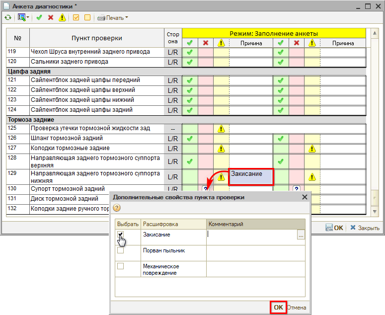
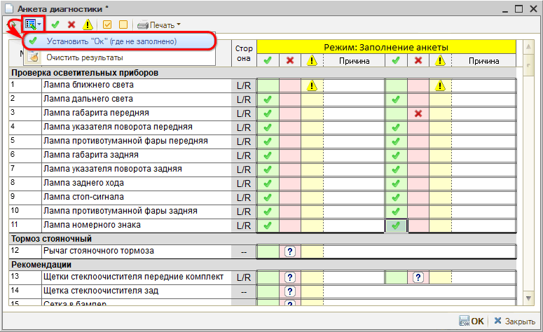
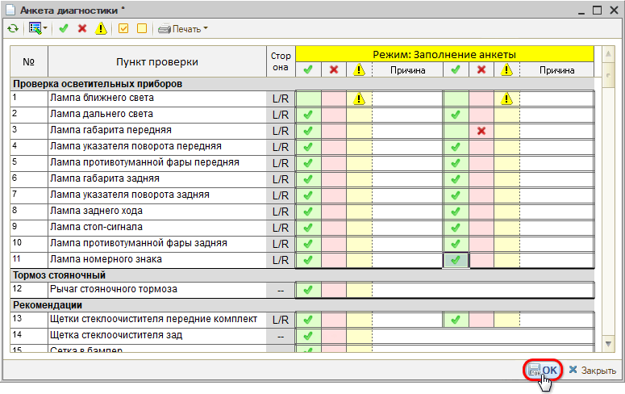
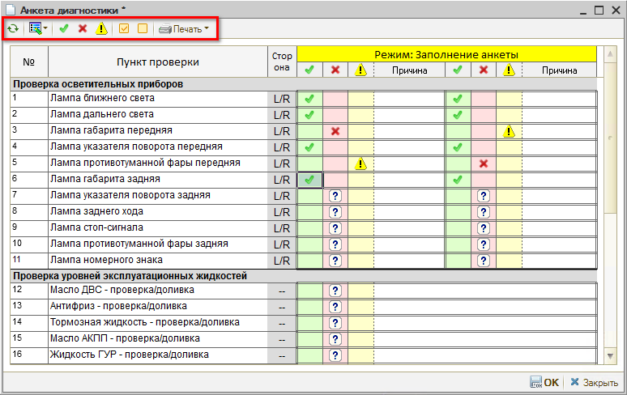
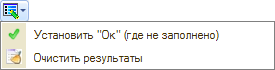
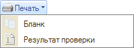

# Как заполнить результаты диагностики

<table><tr><td><b>Время чтения:</b> 3 мин.</td><td><b>Обновлено:</b> 11.04.2025</td></tr></table>

Источник: https://www.5systems.ru/help/kak-zapolnit-rezultaty-diagnostiki

Для *занесения результатов проверки* по заполненному бланку диагностической анкеты дважды кликните мышью по анкете в Заказ-наряде. В режиме заполнения анкеты внесите результаты:

1. Двойным кликом мыши отметьте выявленные проблемы и предупреждения по пунктам проверки с указанием причины. Если для причины в анкете установлен список значений, то откроется окно выбора значений с возможностью написать комментарий: 
   
2. По остальным пунктам проверки заполните, что "все ОК": 
   
3. Сохраните изменения: 
   

В результате диагностическая анкета перейдет в состояние "Обработана":

Заполненную анкету можно [распечатать](../Как%20распечатать%20результаты%20диагностики/kak-raspechatat-rezultaty-diagnostiki.md) для клиента.

## Панель управления диагностической анкеты

Командное меню обработки диагностической анкеты содержит следующие кнопки управления:

<table><tr><td><b>Кнопка</b></td><td><b>Наименование</b></td><td><b>Действие</b></td></tr><tr><td align="center"></td><td><i>Обновить диагностический лист</i></td><td>Обновить данные по диагностическому листу.</td></tr><tr><td colspan="3"><b><i>Кнопка быстрого заполнения:</i></b></td></tr><tr><td align="center"></td><td><i>Установить "Ок" (где не заполнено)</i></td><td>По всем необработанным пунктам установить результат проверки "Ок".</td></tr><tr><td><i>Очистить результаты</i></td><td>Удалить все занесенные результаты проверки.</td></tr><tr><td colspan="3"><b><i>Отборы по результату:</i></b></td></tr><tr><td align="center"></td><td><i>Отбор "Ок"</i></td><td>Отобразить только те пункты, где установлен результат "Ок".</td></tr><tr><td align="center"></td><td><i>Отбор "Замена"</i></td><td>Отобразить только те пункты, где установлен результат "Замена".</td></tr><tr><td align="center"></td><td><i>Отбор "Внимание"</i></td><td>Отобразить только те пункты, где установлен результат "Внимание".</td></tr><tr><td colspan="3"><b><i>Отборы по заполнению:</i></b></td></tr><tr><td align="center"></td><td><i>Отбор "Все проверенные" (Режим обработки результата)</i></td><td>Отобразить только те пункты, по которым проставлены результаты. Доступно для Режима: Обработка результата.</td></tr><tr><td align="center"></td><td><i>Отбор "Все непроверенные" (Режим внесение данных)</i></td><td>Отобразить только те пункты, по которым не проставлены результаты. Доступно для Режима: Заполнение анкеты.</td></tr><tr><td colspan="3"><b><i>Печать:</i></b></td></tr><tr><td align="center"></td><td><i>Бланк</i></td><td>Распечатать Диагностическую анкету в виде Бланка для заполнения.</td></tr><tr><td><i>Результат проверки</i></td><td>Распечатать заполненную Диагностическую анкету.</td></tr></table>

---

**Теги:** диагностические анкеты, результаты диагностики, диагностический лист

