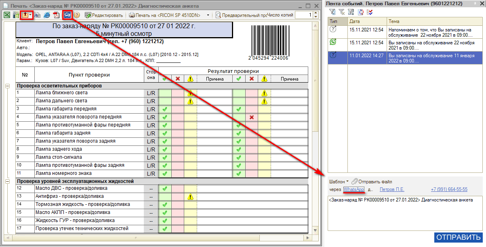

# Как отправить результаты диагностики клиенту

<table><tr><td><b>Время чтения:</b> 1 мин.</td><td><b>Обновлено:</b> 11.07.2022</td></tr></table>

Отправить результаты диагностики клиенту можно по электронной почте или через мессенджер. Для этого в печатной форме нужно нажать кнопку "В мессенджер", выбрать по кнопкам-ссылкам нужный мессенджер и телефон клиента и нажать кнопку "Отправить":

---

**Теги:** диагностические анкеты, отправка клиенту, мессенджер, результаты диагностики

