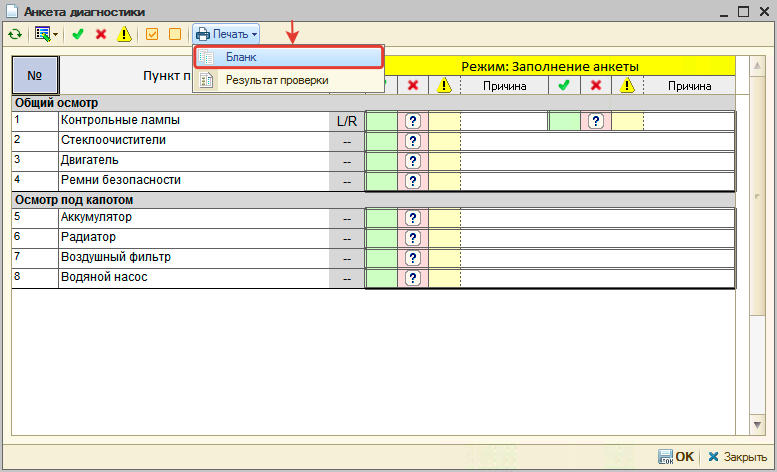
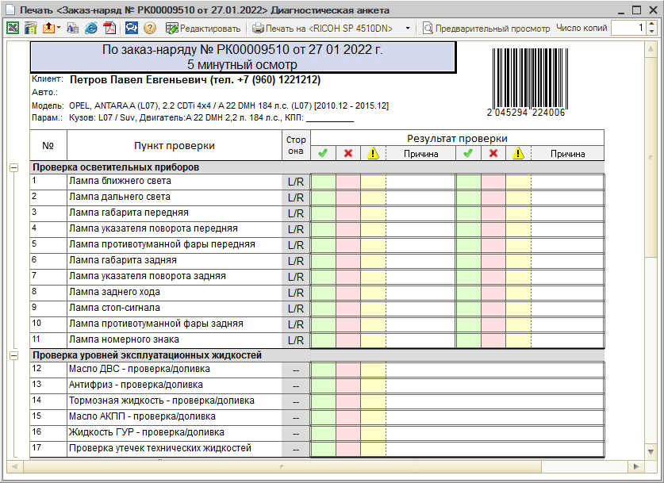

# Как распечатать бланк анкеты

<table><tr><td><b>Время чтения:</b> 1 мин.</td><td><b>Обновлено:</b> 14.09.2026</td></tr></table>

Источник: https://www.5systems.ru/help/kak-raspechatat-blank-ankety

Анкету можно заполнять прямо в программе – например, с использованием планшета. Если необходимо распечатать бланк, нужно перейти в режим заполнения анкеты из Заказ-наряда двойным кликом мыши по анкете и нажать кнопку *Печать → Бланк*:

В печатной форме выбрать нужный принтер, число копий и т.д.:

---

**Теги:** диагностические анкеты, бланк анкеты, печать, диагностика

