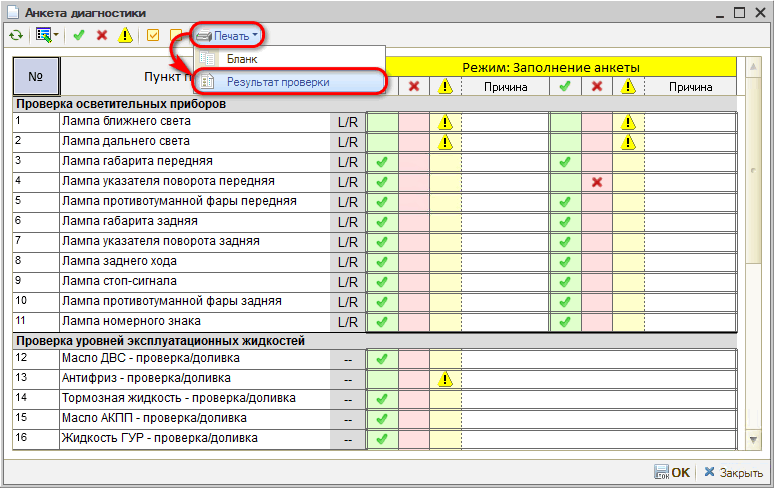
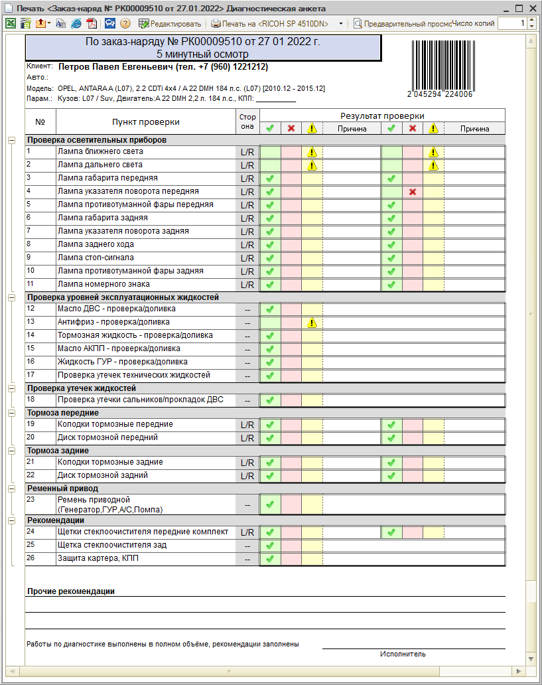

# Как распечатать результаты диагностики

<table><tr><td><b>Время чтения:</b> 1 мин.</td><td><b>Обновлено:</b> 14.09.2026</td></tr></table>

Источник: https://www.5systems.ru/help/kak-raspechatat-rezultaty-diagnostiki

Чтобы распечатать результаты диагностики, следует перейти в режим заполнения анкеты из Заказ-наряда двойным кликом мыши по анкете и нажать кнопку *Печать → Результат проверки:*

Открывшуюся форму можно распечатать или отправить клиенту.

---

**Теги:** диагностические анкеты, печать, результаты диагностики

