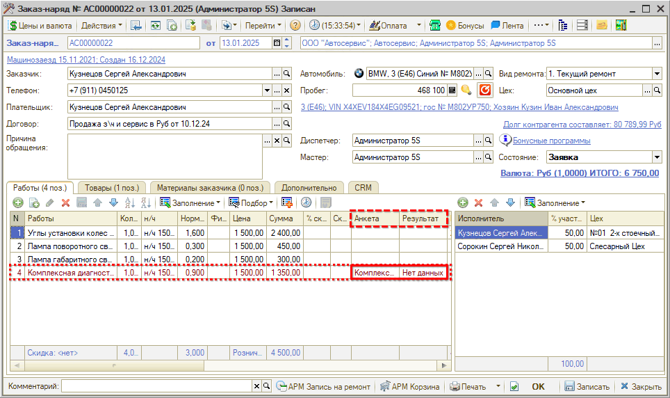

# Как указать анкету в заказ-наряде

<table><tr><td><b>Время чтения:</b> 2 мин.</td><td><b>Обновлено:</b> 11.04.2025</td></tr></table>

***Диагностические анкеты*** представляют собой чек-листы проверки, которые могут применяться в ходе быстрого осмотра автомобиля или проведения техосмотра. Диагностические анкеты позволяют *заложить алгоритм* проведения диагностики автомобиля и помогают *обработать результаты* проведенной диагностики. По выявленным проблемам и замечаниям формируется предложение для клиента.

Процесс работы с диагностическими анкетами в программе выглядит следующим образом:

1. Создание диагностической анкеты.
2. Связь работы и диагностической анкеты.
3. Выбор работы для проведения диагностики и печать диагностической анкеты для механика из Заказ-наряда.
4. Занесение результатов диагностики, проведенной механиком, в Заказ-наряд.
5. Формирование предложения по выявленным проблемам и замечаниям через АРМ "Корзина".

## Отображение Диагностической анкеты в Заказ-наряде

Для работы с диагностической анкетой нужно добавить в Заказ-наряд автоработу, с которой эта анкета связана (как создать анкету и установить ее связь с работой см. в статье [*Диагностические анкеты*](../../../articles/5S%20AUTO/Автосервис/Диагностические%20анкеты/diagnosticheskie-ankety.md)). При этом в Заказ-наряде в таблице *Работы* в столбце "Анкета" будет отображаться наименование диагностической анкеты, а в соседнем столбце – результат "Нет данных":

*Примечание:* Как добавить в Заказ-наряд автоработу – см. урок [*Как добавлять автоработы в Заказ-наряд*](../../Урок%2010.%20Работа%20с%20Заказ-нарядами/Как%20добавить%20работы%20в%20Заказ-наряд/kak-dobavit-raboty-v-zakaz-naryad.md).

---

**Теги:** диагностические анкеты, заказ-наряд, диагностика, анкета

