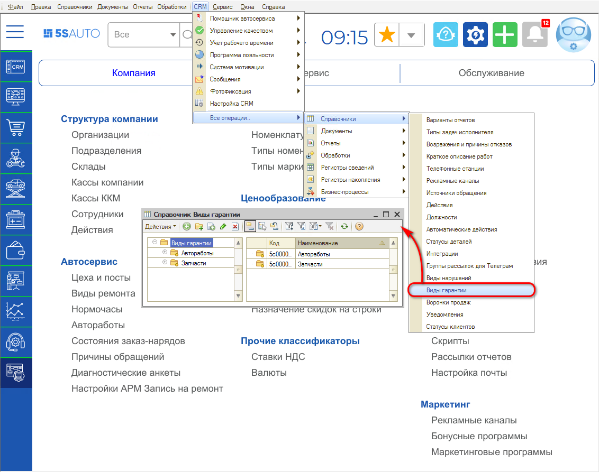
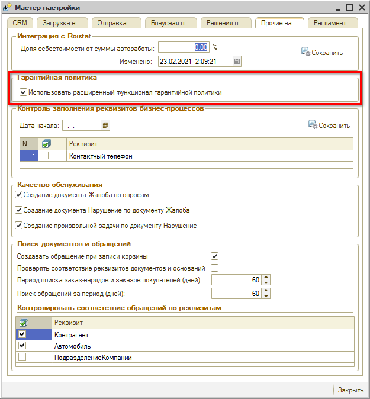

# Как настроить виды гарантий

<table><tr><td><b>Время чтения:</b> 2 мин.</td><td><b>Обновлено:</b> 11.07.2022</td></tr></table>

Источник: https://www.5systems.ru/help/kak-nastroit-vidy-garantiy

## Содержание

1. [Настройка Видов гарантий](#настройка-видов-гарантий)
2. [Включение расширенной гарантийной политики](#включение-расширенной-гарантийной-политики)

## Настройка Видов гарантий

Виды гарантий настраиваются в справочнике *"Виды гарантии"* (стандартное меню программы: CRM → Все операции → Справочники → Виды гарантии):

По каждому предполагаемому виду гарантии на автоработы и запчасти укажите наименование и описание:

Описание вида гарантии отражается в [печатной форме Заказ-наряда](../../Урок%2010.%20Работа%20с%20Заказ-нарядами/Методический%20материал%20по%20теме%20«Работа%20с%20Заказ-нарядами»/metodicheskiy-material-po-teme-rabota-s-zakaz-naryadami.md).

## Включение расширенной гарантийной политики

*Расширенная гарантийная политика* включается/отключается через *Мастер настройки системы* (меню интерфейса: Администрирование → Сервис → Начальная настройка → Мастер настройки) на вкладке "Прочие настройки":

---

**Теги:** гарантийная политика, виды гарантий, справочник, настройка

