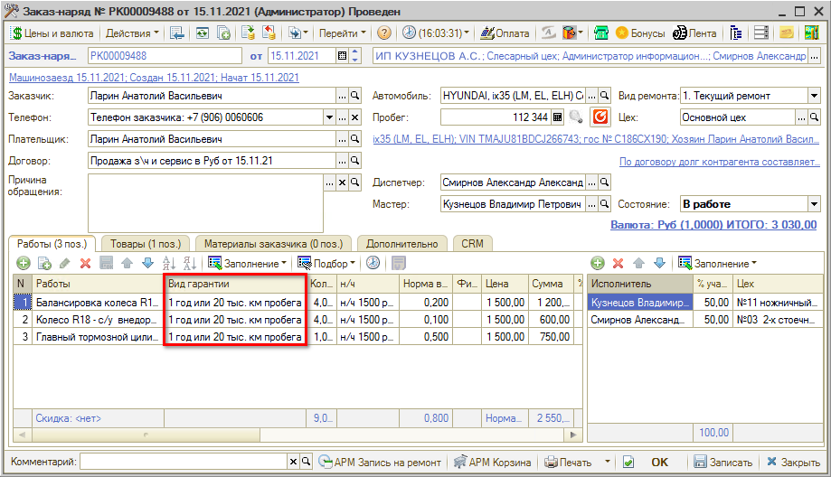

# Как указать гарантии в заказ-наряде

<table><tr><td><b>Время чтения:</b> 2 мин.</td><td><b>Обновлено:</b> 21.11.2022</td></tr></table>

При [*включении расширенной гарантийной политики*](../Как%20настроить%20виды%20гарантий/kak-nastroit-vidy-garantiy.md) в табличной части "Работы" и "Товары" Заказ-наряда появляется колонка "Вид гарантии":

Значение в колонку "Вид гарантии" подставляется из преднастроенного справочника "Виды гарантии" вручную или автоматически, если для Автоработы или Номенклатуры [*настроен параметр "Вид гарантии"*](../Как%20установить%20гарантии%20по%20умолчанию/kak-ustanovit-garantii-po-umolchaniyu.md).

Для всех работ/товаров, для которых не указано значение в колонке "Вид гарантии", при записи документа по умолчанию подставляется предопределенное значение "Без гарантии" справочника "Виды гарантии".

В печатной форме Заказ-наряда по работам и товарам отражается информация о том, какой вид гарантии на них распространяется:

***Обратите внимание!*** В описании гарантийной политики отражается как описание из общей гарантийной политики (если оно задано в настройках), так и описание по видам гарантий, настроенным для товаров и работ в Заказ-наряде.

---

**Теги:** гарантийная политика, гарантия, заказ-наряд, виды гарантий

