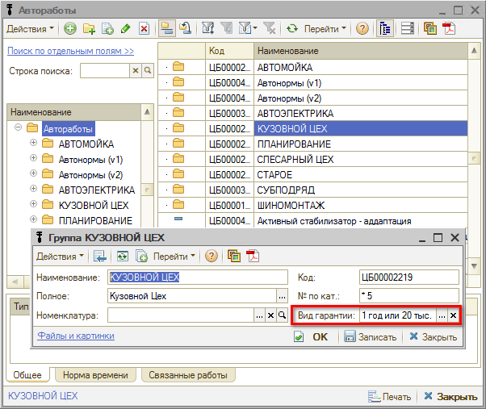
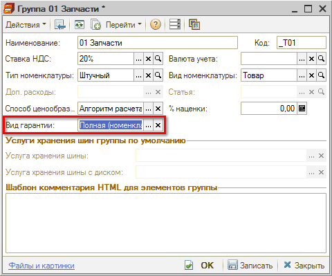
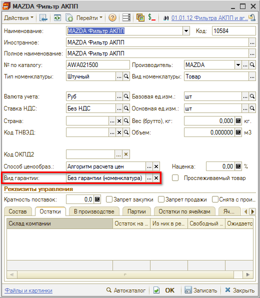

# Как установить гарантии по умолчанию

<table><tr><td><b>Время чтения:</b> 4 мин.</td><td><b>Обновлено:</b> 11.07.2022</td></tr></table>

Источник: https://www.5systems.ru/help/kak-ustanovit-garantii-po-umolchaniyu

## Настройка Вида гарантии для Автоработы

Настройка *Вида гарантии* для авторабот производится через справочник "[Автоработы](../../Урок%204.%20Запчасти%20и%20автоработы/Как%20работать%20со%20справочником%20«Автоработы»/avtoraboty.md)" для группы или элемента.

**Настройка для группы авторабот**

Выберите в справочнике группу авторабот, нажмите кнопку "Изменить"   и выберите значение параметра "Вид гарантии":

**Настройка в карточке автоработы**

Если требуется настроить вид гарантии на отдельные автоработы, откройте карточку автоработы и выберите вид гарантии в соответствующем поле:

**Алгоритм определения вида гарантии для работ**

Определение вида гарантии в Заказ-наряде на автоработу происходит по иерархии снизу вверх: если вид гарантии не указан в карточке, то значение подтягивается из группы и т.д.

## Настройка Вида гарантии для Номенклатуры

Настройка *Вида гарантии* для запчастей производится через справочник ["](https://support.5systems.ru/hc/ru/articles/5171750244369)[Номенклатура](../../Урок%204.%20Запчасти%20и%20автоработы/Как%20работать%20со%20справочником%20«Номенклатура»/nomenklatura.md)["](https://support.5systems.ru/hc/ru/articles/5171750244369) также для группы или элемента.

**Настройка Вида гарантии для группы номенклатуры**

Выберите в справочнике группу номенклатуры, нажмите кнопку "Изменить"   и выберите значение параметра "Вид гарантии":

**Настройка в карточке номенклатуры**

Если требуется настроить вид гарантии на отдельные запчасти, откройте карточку номенклатуры и выберите вид гарантии в соответствующем поле:

Можно указать вид гарантии для производителя товара:

В этом случае вид гарантии на товар будет автоматически подставляться в Заказ-наряд по производителю, если в карточке товара не задан свой вид гарантии.

**Алгоритм определения вида гарантии для товаров**

Определение вида гарантии в Заказ-наряде на товар происходит следующим образом:

- если указан в карточке товара, то подставляется из карточки товара;
- если не указан в карточке товара, но указан в производителе, то подставляется по производителю;
- если не указан в карточке товара и по производителю, то ищется снизу вверх по группе номенклатуры:
  - если указан в группе, то подставляется из группы;
  - если нигде не указан, то ничего не подставляется.

---

**Теги:** гарантийная политика, гарантия по умолчанию, автоработы, номенклатура

