# Как добавить пользователя

<table><tr><td><b>Время чтения:</b> 7 мин.</td><td><b>Обновлено:</b> 16.08.2023</td></tr></table>

Источник: https://www.5systems.ru/help/kak-dobavit-polzovatelya

Пользователи в программе находятся в отдельном справочнике: *Администрирование → Сервис → Пользователи и права → Пользователи*.

Для создания нового пользователя требуется в справочнике *"[Пользователи](../../../articles/5S%20AUTO/Пользователи%20и%20права/Пользователи/polzovateli.md)"* (или в справочнике *"Сотрудники"*) на верхней панели нажать кнопку ***"Быстрый ввод"***:

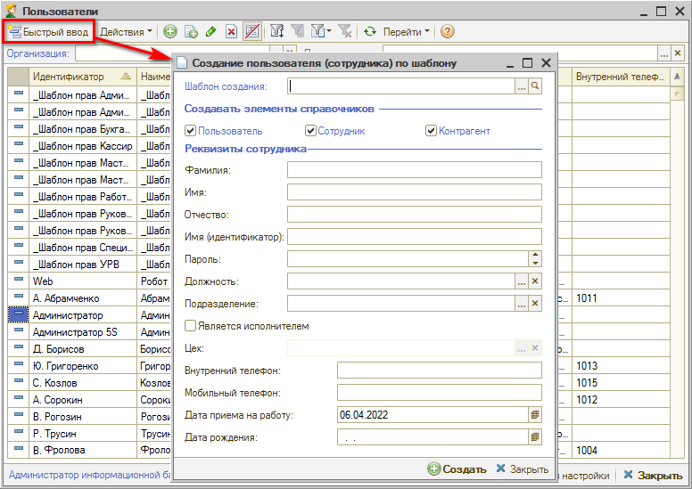

В открывшемся поле быстрого создания пользователя в поле ***"Шаблон создания"*** требуется выбрать один из преднастроенных *шаблонов* (или создать новый):

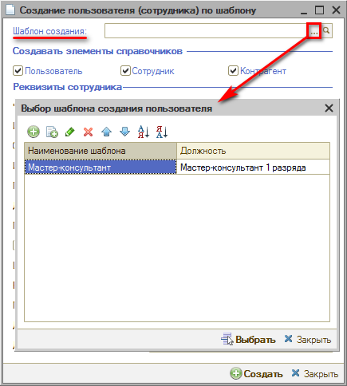

При этом в поле ***"Должность"*** подтянется значение из справочника "Должности", соответствующее выбранному шаблону создания.

В поле ***"Создавать элементы справочников"*** требуется поставить галочки, в каких справочниках требуется создать новые элементы: ***Пользователь***, ***Сотрудник*** и ***Контрагент***. Если сотрудник (например, механик) не будет сам работать в системе, то можно не создавать карточку *пользователя*, но создать для него только карточки *сотрудника* и *контрагента*.

При создании *Контрагента* будут также автоматически созданы 3 договора: *Зарплата*, *Подотчет* и *Продажа товаров*.

Затем необходимо заполнить ***Фамилию***, ***Имя***, ***Отчество*** сотрудника:

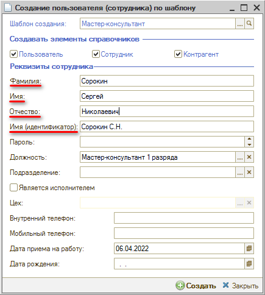

Значение ***"Имя (идентификатор)"*** заполняется при этом автоматически в формате *<Фамилия И.О.>*. Данное значение – это *логин* создаваемого пользователя для входа в систему.

Далее требуется ввести ***пароль***. Стрелками "Вверх/Вниз" можно увеличить или уменьшить *сложность* пароля: от 3-х цифр до 8 знаков разного регистра.

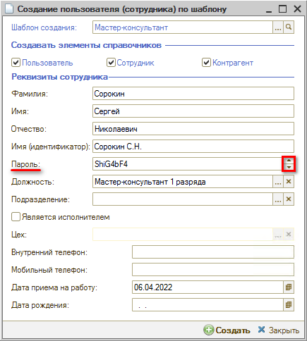

Затем необходимо выбрать ***Подразделение***, в котором работает сотрудник, и – если требуется для определенной должности – установить галочку ***"Является исполнителем"*** и выбрать ***Цех***. Если сотрудник не является исполнителем – заполнять поле "Цех" не нужно.

***Внутренний телефон*** заполняется только в том случае, если данный сотрудник (либо он и его сменщик) всегда работает с этим номером. Если трубки между сотрудниками постоянно передаются – внутренний номер указывать не нужно. Подробнее см. [*статью*](../../../articles/5S%20AUTO/Телефония/Настройка%20внутренних%20телефонов%20сотрудников/nastroyka-vnutrennikh-telefonov-sotrudnikov.md).

Далее заполняются поля ***"Мобильный телефон"***, ***"Дата приема на работу"*** (автоматически подтягивается текущая дата) и ***"Дата рождения"***.

После заполнения всех полей требуется нажать кнопку ***"Создать"***: при этом будут созданы карточки в отмеченных галочками справочниках.

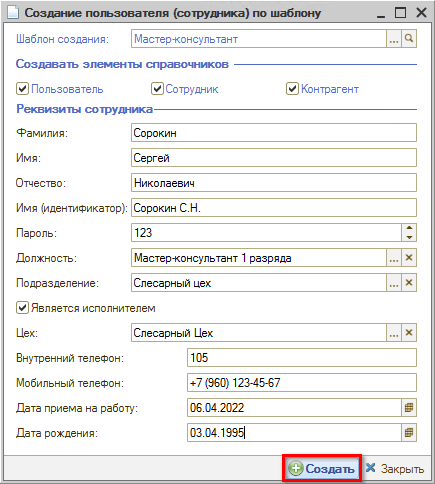

Для просмотра всех параметров настройки нужно открыть карточку пользователя. Подробнее *см. [статью](../../../articles/5S%20AUTO/Пользователи%20и%20права/Пользователи/polzovateli.md)*.

## Как настроить шаблоны создания пользователей

Для добавления нового шаблона создания пользователей требуется в окне "Выбор шаблона создания пользователя" создать добавлением или копированием новый элемент:

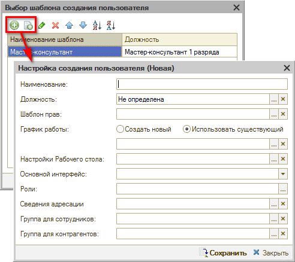

В поле ***"Должность"*** требуется выбрать должность из справочника нажатием на кнопку   "Выбрать" – при этом поле ***"Наименование"*** заполнится автоматически (при необходимости можно будет скорректировать).

Затем необходимо выбрать ***Шаблон прав*** (см. урок "[Как изменить права сотруднику → Шаблоны прав](../Как%20изменить%20права%20сотруднику/kak-izmenit-prava-sotrudniku.md)").

В поле ***"График работы"*** нужно выбрать вариант заполнения: *Создать новый* или *Использовать существующий*. При выборе варианта "Использовать существующий" в поле выбора графика можно будет выбрать график из справочника "Графики работы". При выборе варианта "Создать новый" в этом же поле будет доступен выбор *Смены по умолчанию*. В этом случае индивидуальный график сотрудника будет создан автоматически (в его наименовании будет ФИО сотрудника).

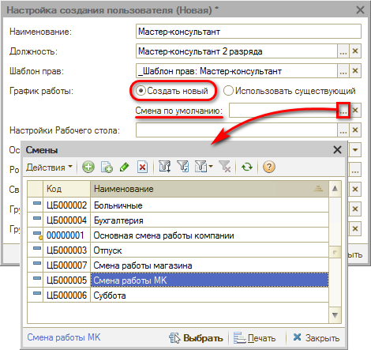

Индивидуальный график необходим, если на сотрудника будет осуществляться [*Запись на ремонт*](../../Урок%208.%20Запись%20на%20ремонт/). Если это не имеет значения – можно выбрать стандартный "график работы компании".

Далее следует выбрать ***настройку рабочего стола*** (см. [*статью*](../../../articles/5S%20AUTO/Администрирование%20и%20настройка%20системы/Настройка%20рабочего%20стола/nastroyka-rabochego-stola.md)) и вариант ***основного интерфейса***, т.е. отображение типового меню системы (выбрать ***"Сервис 5C"***).

Затем нужно заполнить поле ***"Роли"*** – в открывающемся списке отметить нужные значения и нажать "ОК":

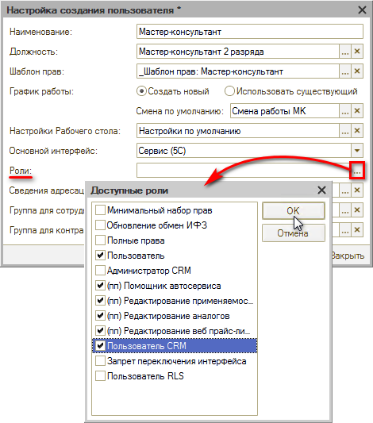

При настройке учетной записи для *руководителя* или *системного администратора* можно выбрать роли *"Полные права"* и *"Администратор CRM"*. По этим ролям у сотрудника будет доступ ко всем справочникам и права на редактирование всего. Рядовым сотрудникам полные права предоставлять не нужно: минимальные роли, которые должны быть отмечены у *каждого* пользователя – это *"Пользователь"* и *"Пользователь CRM"*.

Следующий параметр – ***"Сведения адресации"*** (см. [*статью*](../../../articles/5S%20AUTO/Задачи/Адресация%20задач%20в%20CRM%20по%20исполнителям/adresaciya-zadach-v-crm-po-ispolnitelyam.md)). В открывшемся окне редактирования выбрать (или добавить) должности и подразделения. Варианты значений *"Свое подразделение"* (т.е. подразделение пользователя) или *"Все подразделения"* определяют, по какому подразделению будет происходить адресация.

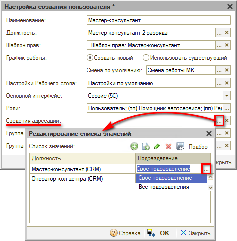

Поля ***"Группа для сотрудников"*** и ***"Группа для контрагентов"*** определяют, в каких папках в справочниках "Сотрудники" и "Контрагенты" будут созданы карточки по данному сотруднику:

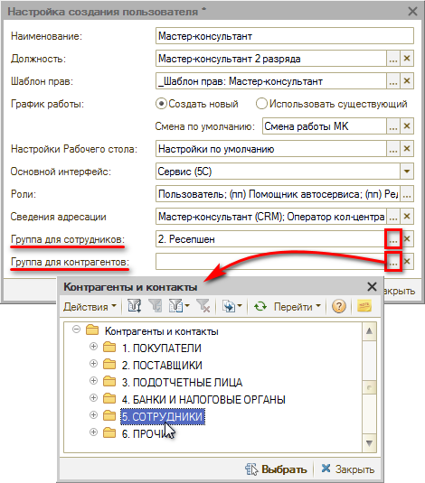

После заполнения всех полей обязательно нужно ***Сохранить*** настройки:

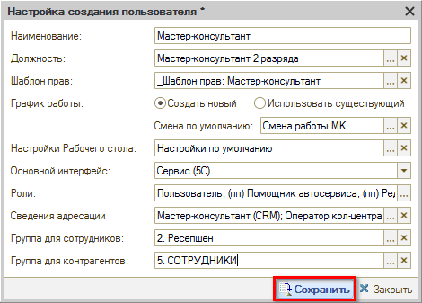

---

**Теги:** пользователи и права, пользователь, сотрудник, быстрый ввод, шаблон создания

