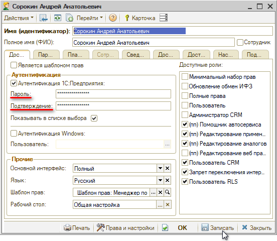
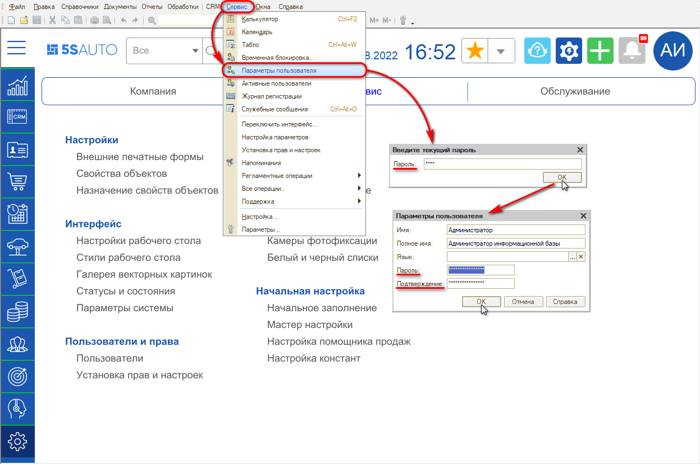

# Как изменить пароль пользователю

<table><tr><td><b>Время чтения:</b> 1 мин.</td><td><b>Обновлено:</b> 22.08.2022</td></tr></table>

## Способ 1

Для того, чтобы изменить пароль определенному пользователю, следует *администратору* зайти в карточку пользователя, ввести новый пароль и подтверждение в соответствующих полях и нажать “Записать” или “ОК”:

## Способ 2

Для того, чтобы текущему пользователю сменить пароль самому себе, необходимо зайти в меню *Сервис → Параметры пользователя*, ввести текущий пароль, затем в открывшейся форме ввести новый пароль и подтверждение и сохранить – нажать “ОК”:

---

**Теги:** пользователи и права, пароль, карточка пользователя, параметры пользователя

