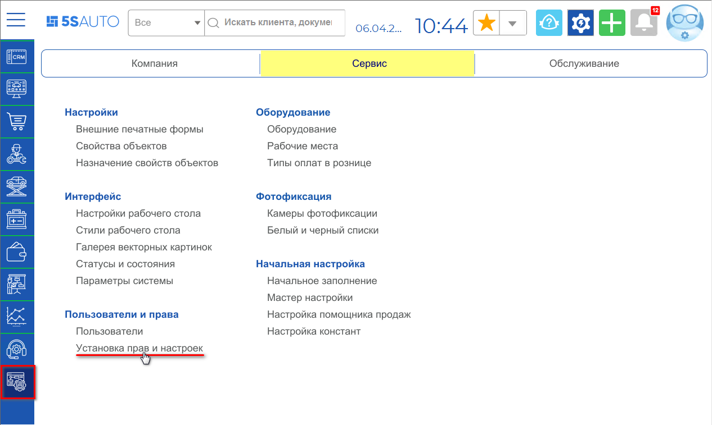
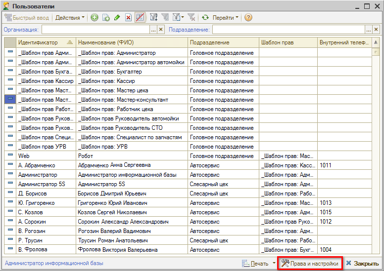
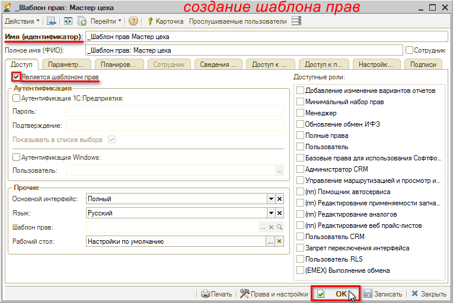
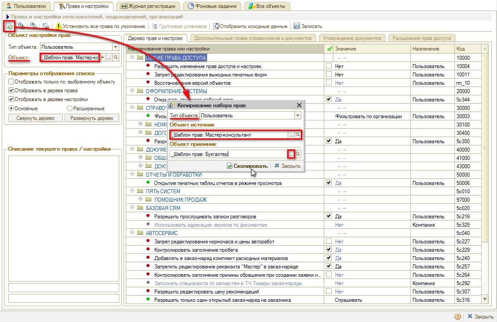
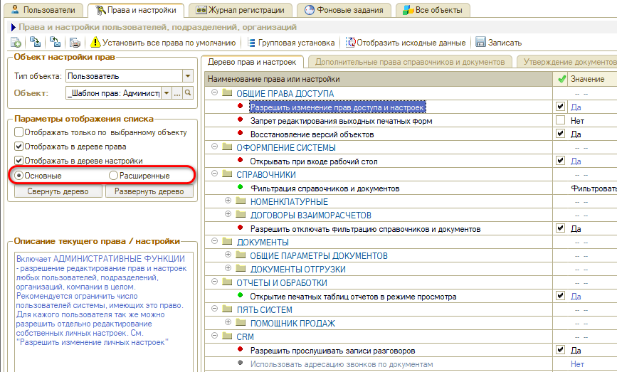
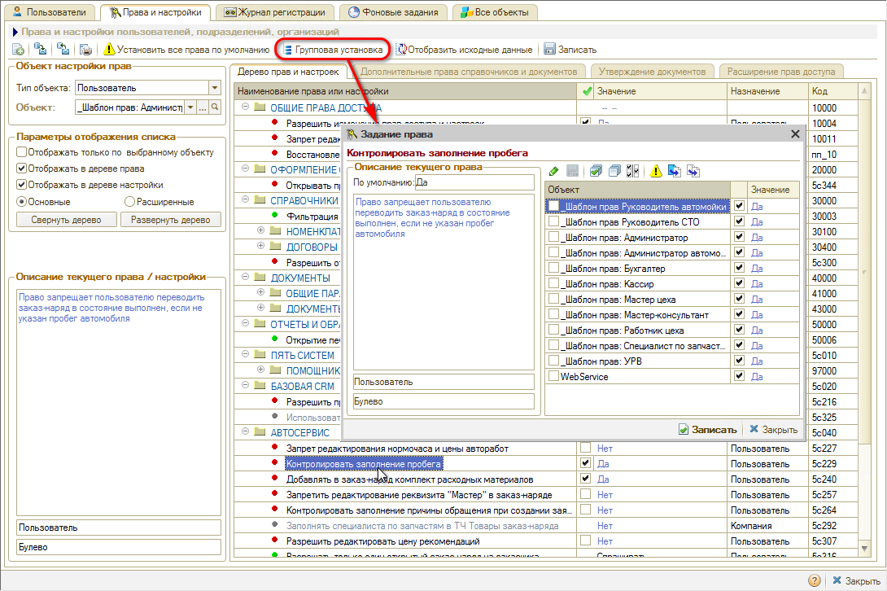
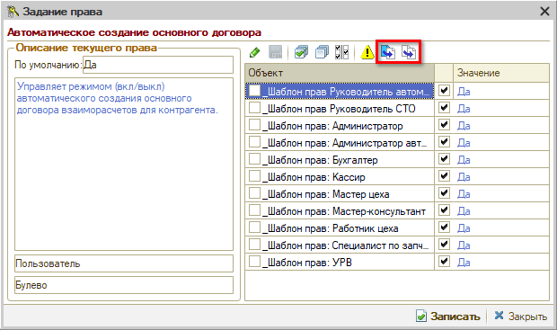
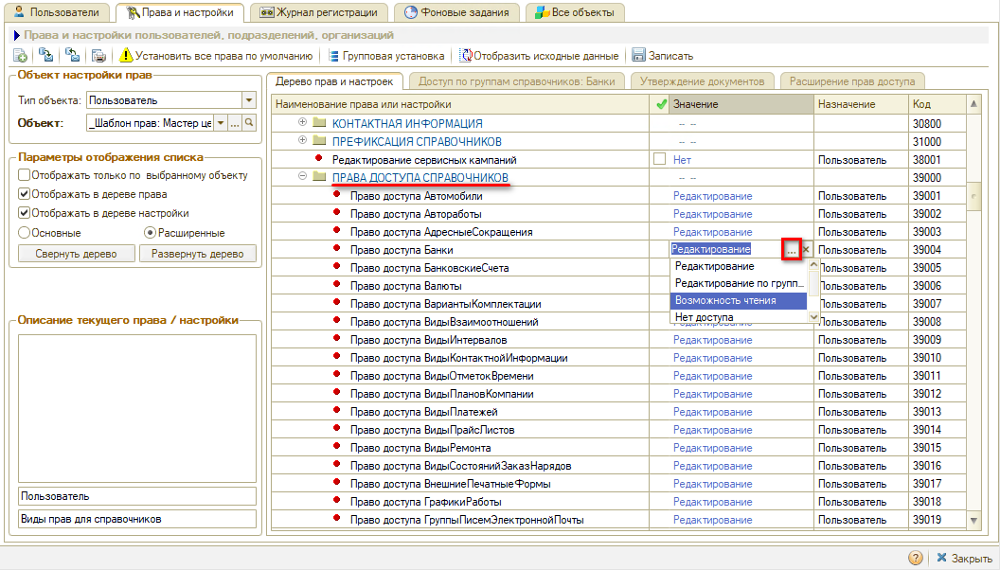

# Как изменить права сотруднику

<table><tr><td><b>Время чтения:</b> 9 мин.</td><td><b>Обновлено:</b> 11.07.2022</td></tr></table>

Источник: https://www.5systems.ru/help/kak-izmenit-prava-sotrudniku

Работа механизмов системы и доступ к отдельным функциям в программе определяется *[Правами и настройками](../../../articles/5S%20AUTO/Пользователи%20и%20права/Установка%20прав%20и%20настроек%20пользователя/ustanovka-prav-i-nastroek-polzovatelya.md)* пользователей. *Права* регулируют доступы к данным и функциям системы, а *настройки* определяют логику работы. При необходимости *Права и настройки* для конкретного пользователя можно изменить.

## Переход к установке Прав и настроек

Перейти к установке *Прав и настроек* можно через главное меню программы: Администрирование → Сервис → Пользователи и права → Установка прав и настроек

А также нажатием кнопки *"Права и настройки"* в справочнике *"[Пользователи](../../../articles/5S%20AUTO/Пользователи%20и%20права/Пользователи/polzovateli.md)"* или карточке пользователя:

## Шаблоны прав

Права и настройки каждого сотрудника определяются *шаблоном прав*, который назначается пользователю при создании. Основные шаблоны прав созданы в базе по умолчанию: можно их настроить для своей компании.

При этом в системе также есть возможность настраивать права и на каждого отдельного пользователя, но такой путь не является оптимальным. Шаблоны прав нужно будет настроить только один раз, и затем просто выбирать их для новых пользователей.

Настройка шаблонов прав по должностям дает возможность предоставить либо закрыть доступ определенным сотрудникам к отдельным документам и справочникам программы. Также в программе есть некоторые механизмы, заточенные на права: например, одному пользователю нужно, чтобы расходные материалы добавлялись в Заказ-наряд, другому пользователю не нужно. Для удобства настройки этих механизмов создаются *шаблоны прав по должностям.*

При необходимости можно создавать шаблоны прав не только по должностям, но и по подразделениям, т.к. в разных подразделениях, в разных филиалах у сотрудников с одинаковыми должностями могут быть разные права.

## Создание шаблона прав

Когда шаблон прав создается первый раз или если появляется новая должность, требуется заполнить следующие параметры.

***"Имя (идентификатор)"***, или наименование шаблона, лучше начинать с символа "_" - "подчеркивание", чтобы шаблоны в списке группировались вверху и не перемешивались с реальными пользователями.

*Например: "_Шаблон прав: Мастер цеха"*

Обязательно проставить флажок ***"Является шаблоном прав"***. Больше в шаблоне делать ничего не нужно, сразу нажать "Ок". Далее нужно присвоить этот шаблон нужному пользователю. Дальнейшая настройка ведется уже именно на шаблон, а на пользователя права не настраиваются.

Чтобы быстро перейти в настройку прав, требуется зайти в созданный шаблон и нажать внизу кнопку *"Права и настройки"*  .

В *Правах и настройках* при создании шаблона прав требуется нажать кнопку *"Скопировать текущий набор прав"*. Форма *"Копирование набора прав"* открывается в контексте текущего объекта: необходимо выбрать *Объект-источник* – шаблон, *с которого* требуется скопировать права, и *Объект-приемник* – новый созданный шаблон, который нужно настроить. И нажать кнопку *"Скопировать"*.

Затем требуется произвести донастройку *Прав и настроек* на создаваемый шаблон прав (см. [*далее*](#установка-прав-и-настроек)).

## Дерево прав и настроек

Выбор прав производится на вкладке *"Дерево прав и настроек"*.

### Описание прав

Описание каждого права/настройки находится в соответствующем поле: чтобы с ним ознакомиться, требуется выделить нужное право в списке.

### Объект настройки прав

Права настраиваются на объект. Окно прав и настроек открывается в контексте объекта *шаблона прав пользователя.* Подгружаются значения: *"Тип объекта: Пользователь"*, *"Объект настройки прав:<наименование шаблона>"*.

Если в поле *"Параметры отображения списка"* стоит флажок *"Отображать только по выбранному объекту"*, то отображаются только права, у которых назначение "Пользователь". Права, завязанные на компанию, на подразделение и т.д. – не отображаются. Если не ставить этот флажок, то будут отображаться все права, но те, которые не относятся к пользователю, будут написаны *серым цветом*, и их невозможно будет редактировать. Для того, чтобы их можно было редактировать, требуется выбрать другой *тип объекта* – который указан в назначении этих прав: *Компания*, *Организация*, *Подразделение* или *Пользователь*. Подробнее см. в [*статье*](../../../articles/5S%20AUTO/Пользователи%20и%20права/Установка%20прав%20и%20настроек%20пользователя/ustanovka-prav-i-nastroek-polzovatelya.md).

### Основные и расширенные права

Для удобства работы с функционалом прав и настроек можно переключить вариант отображения: *основные* или *расширенные*.

По умолчанию открываются ***основные*** права и настройки. Отображаемых в данном варианте прав достаточно для настройки стандартного пользователя.

***Расширенные*** – это полный список прав и настроек.

### Поиск прав

Поиск *основных* прав осуществляется по дереву прав и настроек. Найти нужное право в *расширенном* списке *всех* прав бывает сложно, т.к. их очень много. Можно *свернуть Дерево прав и настроек*, чтобы увидеть *разделы*, если точно известно в каком разделе искомое право.

Если неизвестно, в каком разделе искать, можно развернуть Дерево и найти право через *«поиск»* на верхней *стандартной* панели. Подробнее см. в [*статье*](../../../articles/5S%20AUTO/Пользователи%20и%20права/Установка%20прав%20и%20настроек%20пользователя/ustanovka-prav-i-nastroek-polzovatelya.md).

## Установка прав и настроек

### Установка на выбранный шаблон прав

Для установки выбранного права или настройки *на отдельный шаблон* требуется отметить нужные права ***галочками***, установить требуемое ***значение*** в соответствующем столбце и ***записать***.

### Групповая установка прав

Часто требуется настроить право сразу на все шаблоны. Для этого удобно сделать групповую установку: требуется выделить нужное право и нажать кнопку "Групповая установка".

В открывшемся окне можно увидеть, для каких шаблонов или пользователей назначено данное право, поменять *значение* для определенных шаблонов, а также изменить значение для всех объектов: для этого нужно задать значение у одного шаблона, выделить его и нажать кнопку «Установить для всех». Можно восстановить значение права *по умолчанию* для всех – кнопкой «Установить для всех по умолчанию».

Для установки выбранных параметров нажать кнопку *"Записать"*.

## Ограничение доступа к справочникам и документам

При необходимости можно ограничить или закрыть доступ к определенным *Документам* и *Справочникам* в соответствующих разделах: задать права доступа для каждой должности – в столбце "Значение права" выбрать значение, например, "Чтение" или "Нет доступа".

## Завершение настройки

Чтобы сохранить произведенные настройки, требуется обязательно в *Правах и настройках* нажать кнопку ***"Записать"***:

---

**Теги:** пользователи и права, права и настройки, шаблон прав, должность

