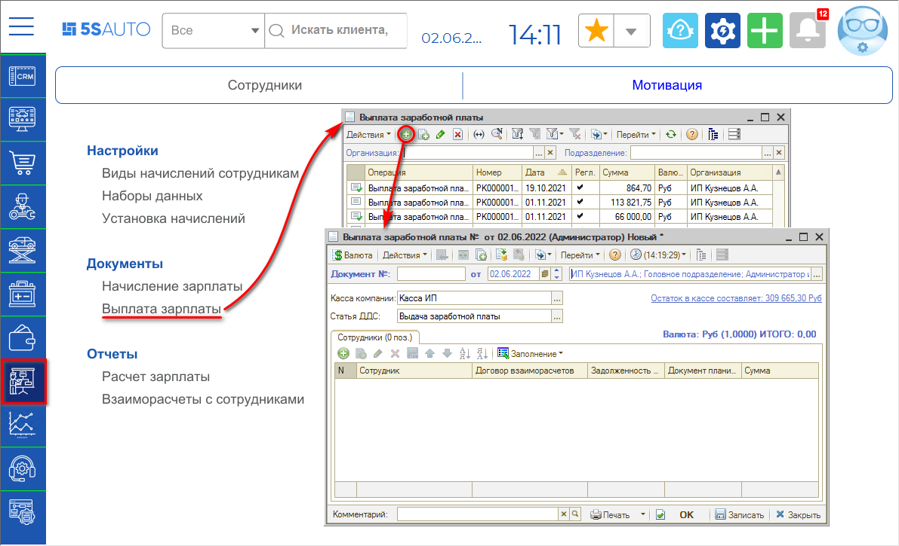
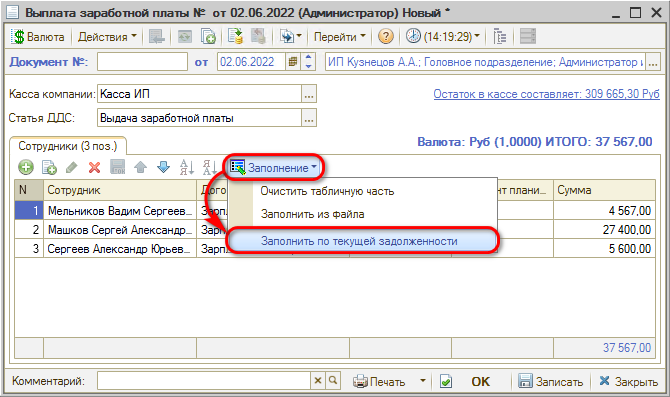
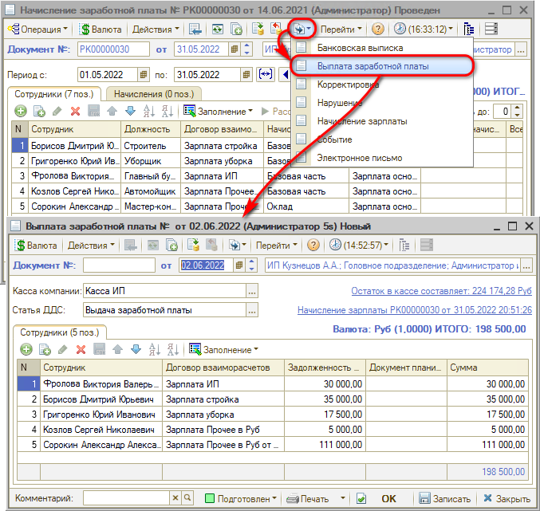

# Как выплатить зарплату

<table><tr><td><b>Время чтения:</b> 2 мин.</td><td><b>Обновлено:</b> 11.08.2022</td></tr></table>

Источник: https://www.5systems.ru/help/kak-vyplatit-zarplatu

## Содержание

- [1. Создать вручную](#1-создать-вручную)
- [2. Создать на основании](#2-создать-на-основании)

Чтобы выплатить зарплату сотруднику, требуется создать документ *"Выплата зарплаты"*. 
Важно, чтобы документ был создан от правильного подразделения и организации.

Создать его можно двумя способами:

## 1. Создать вручную

Создаваемый документ можно заполнить вручную (например, частичные выплаты), либо с помощью автозаполнения – на основании задолженности перед сотрудником.

## 2. Создать на основании

При создании на основании все данные перенесутся в документ.

Проводим документ или нажимаем "ОК", чтобы подтвердить данные, внесенные в документ.

---

**Теги:** расчет зарплаты, выплата зарплаты, документ, подотчетное лицо

