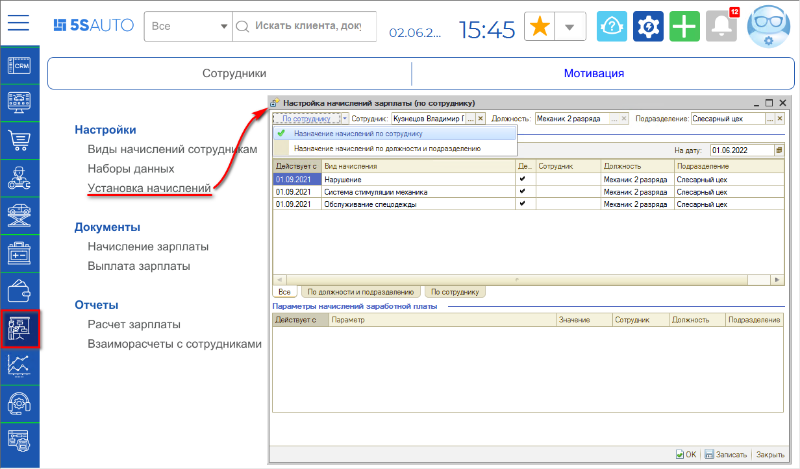
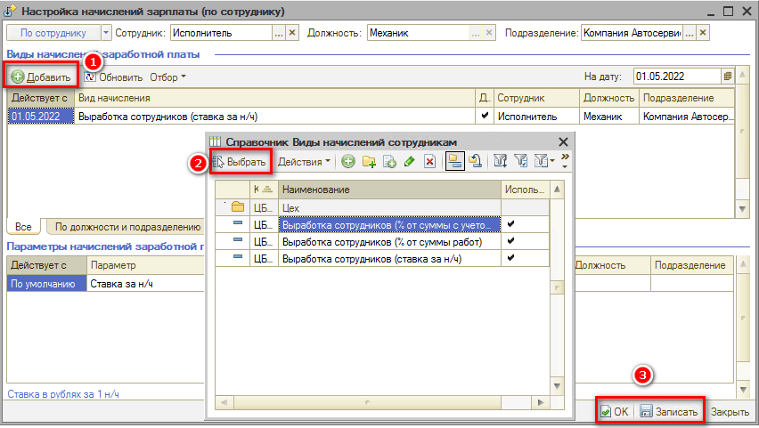
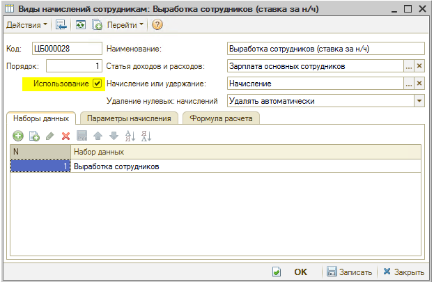
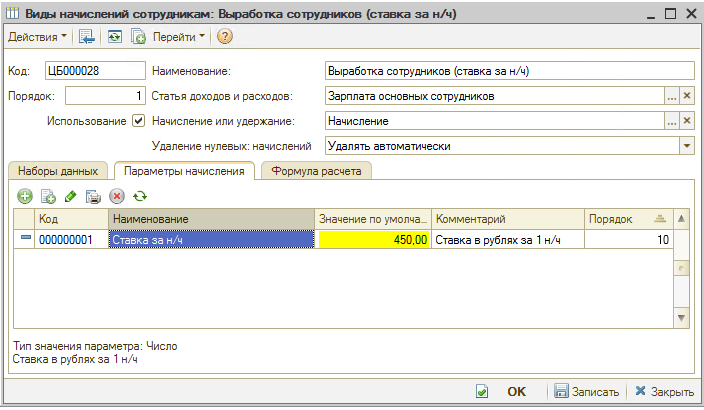
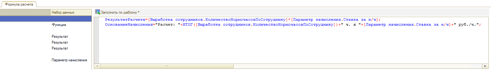

# Как добавить начисления сотруднику

<table><tr><td><b>Время чтения:</b> 3 мин.</td><td><b>Обновлено:</b> 11.08.2022</td></tr></table>

<sub>Источник: https://www.5systems.ru/help/kak-dobavit-nachisleniya-sotrudniku</sub>

## Содержание

1. [Как добавить начисление](#как-добавить-начисление)
2. [Как установить параметры начисления](#как-установить-параметры-начисления)

## Как добавить начисление

Начисления сотрудникам добавляется в разделе настройки мотивации *"Установка начисления"*.<br>
В программе есть возможность установить начисления как по должности, так и по сотруднику.

*Примечание:* Не забываем указывать подразделение, даже если оно одно.



Выбираем требуемый вид начислений (их может быть несколько):



## Как установить параметры начисления

Параметры начислений устанавливаются в разделе настройки мотивации *"Виды начислений сотрудников"*.<br>
Настройка производится на трех вкладках:

1. ***Набор данных*** – это цифры/данные, которые программа отбирает из документов по определенным критериям.

   Есть предустановленные наборы, но всегда можно добавить свои или заказать у сотрудников *технической поддержки "Пять Систем"*.<br>
   В приведенном примере это количество н/ч и исполнитель, который их выполнил.

   

2. ***Параметры начисления*** – переменные, которые будут использоваться в формуле.

   

   В данном примере Исполнители получают 450р за 1 н/ч. Это значение будет по умолчанию при добавлении начислений сотруднику.

3. ***Формула расчета:*** здесь и производится расчет мотивации по данному виду начисления сотруднику, а конкретно – по формуле "РезультатРасчета". "ОснованиеРасчета" дублирует расчет для пояснения расчетов в документе "Начисление зарплаты".

   *Пример:*

   ```
   РезультатРасчета=[Выработка сотрудников.КоличествоНормочасовПоСотруднику]*[Параметр начисления.Ставка за н/ч];
   ОснованиеНачисления="Расчет: "+ИТОГ([Выработка сотрудников.КоличествоНормочасовПоСотруднику])+" ч. x "+[Параметр начисления.Ставка за н/ч]+" руб./ч.";
   ```

   

После изменений не забываем нажать "Записать" или "ОК".

---

**Теги:** расчет зарплаты, мотивация, начисления, виды начислений, установка начисления

