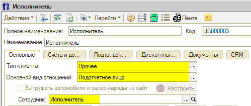
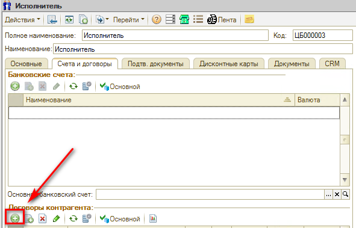
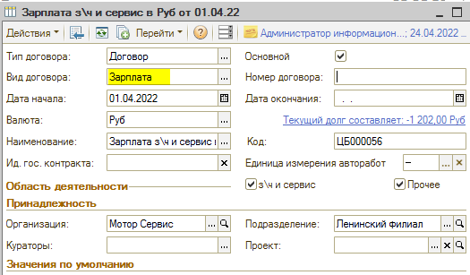
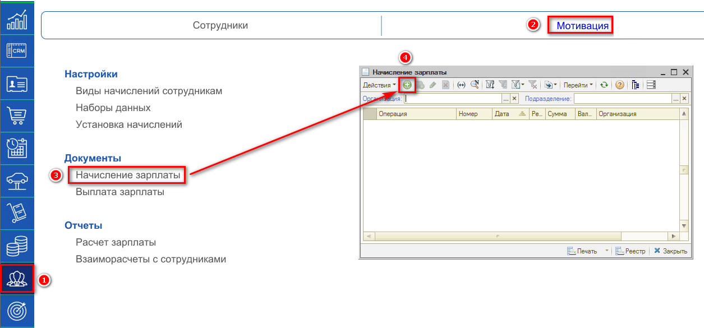
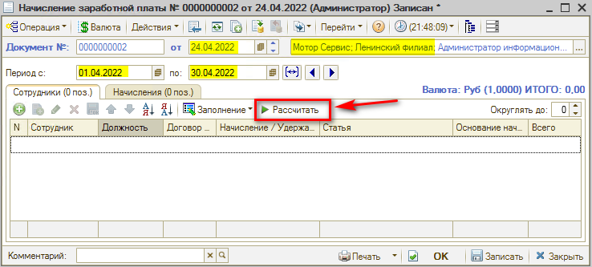
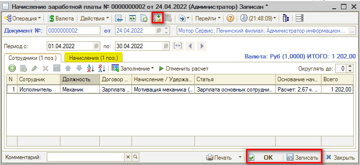

# Как начислить зарплату

<table><tr><td><b>Время чтения:</b> 2 мин.</td><td><b>Обновлено:</b> 14.09.2026</td></tr></table>

Источник: https://www.5systems.ru/help/kak-nachislit-zarplatu

Для того чтобы сотруднику начислялась зарплата, требуется чтобы он был занесен в программу как подотчетное лицо с "привязанным" сотрудником и созданным зарплатным договором на конкретную организацию и подразделение.

Создаем зарплатный договор:

Не забываем указать вид "Зарплата":

Зарплата начисляется при помощи документа "Начисление зарплаты". Реестр документов находится в разделе Управление персоналом → Мотивация → Документы → Начисление зарплаты:

Создается документ, указывается период за который идет начисление, также важную роль играет реквизит "Подразделение" у документа – оно должно совпадать с подразделением в "Установке начислений" и зарплатным договором. Дата документа должна быть в периоде, за который начисляется зарплата. Нажимаем "Рассчитать".

Далее записываем/проводим документ в зависимости от того, окончательный он или нет. В графе начисления можно увидеть детализацию по начислениям.

При проведении документа он создаст долг перед сотрудником по зарплатному договору.

---

**Теги:** расчет зарплаты, начисление зарплаты, зарплатный договор, мотивация

