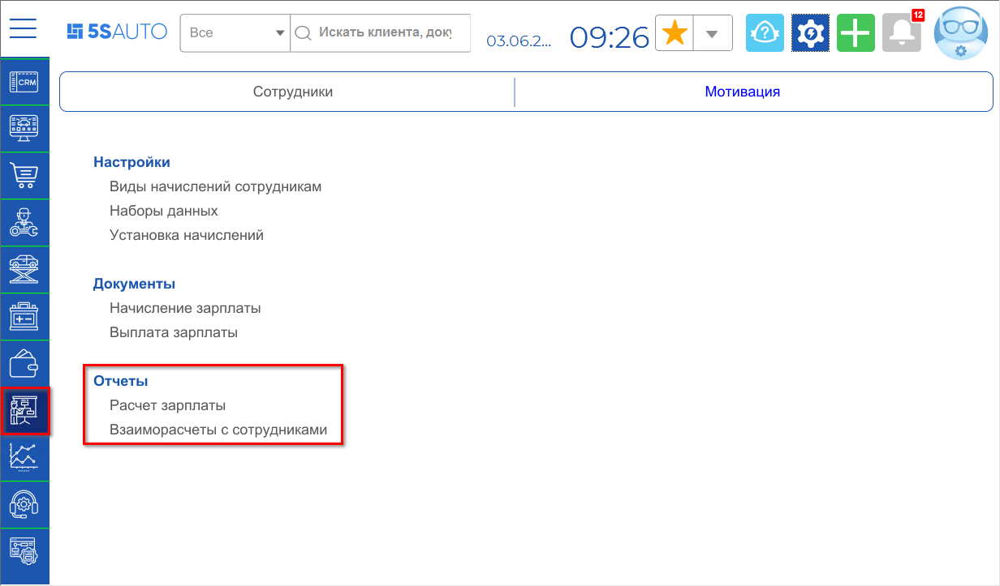
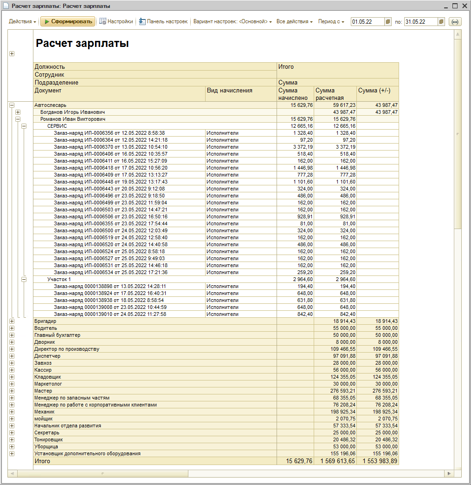
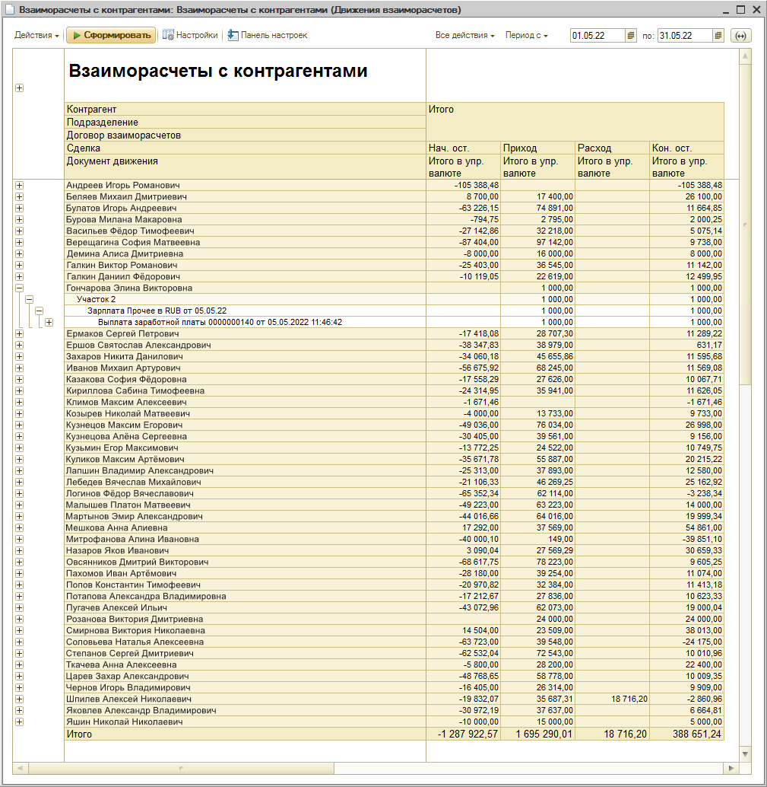

# Как отразить выплату зарплаты

<table><tr><td><b>Время чтения:</b> 2 мин.</td><td><b>Обновлено:</b> 14.09.2026</td></tr></table>

Источник: https://www.5systems.ru/help/kak-otrazit-vyplatu-zarplaty

Для отражения выплаты заработной платы используются 2 отчета: для предварительного расчета с сотрудниками – "Расчет зарплаты", для учета взаиморасчета с сотрудниками – "Взаиморасчеты с сотрудниками".

Перейти к отчетам можно через меню программы: *Управление персоналом → Мотивация → Отчеты*

**Отчет "Расчет зарплаты"** поможет предварительно рассчитать зарплату, а также увидеть, по каким документам уже начислена зарплата, а по каким нет. Для предварительного расчета зарплаты не требуется создавать документ "Начисление зарплаты", достаточно сформировать отчет "Расчет зарплаты".

**Отчет "Взаиморасчеты с сотрудниками"** отражает общую задолженность – Вашу или сотрудника. К примеру, если начислили зарплату за месяц, но не выплатили полностью, или сотрудник за счет зарплаты купил товар у Компании.

Формировать отчет "Взаиморасчеты с сотрудниками" можно, чтобы понять, осталась ли компания должна сотруднику или нет. Если у вас нет долгов перед сотрудниками, то отчет будет пуст без дополнительных настроек.

---

**Теги:** расчет зарплаты, отчет, взаиморасчеты с сотрудниками, мотивация

