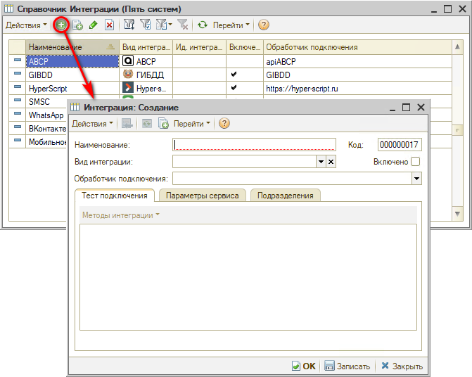
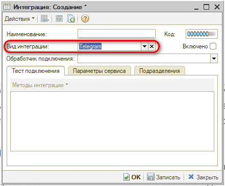
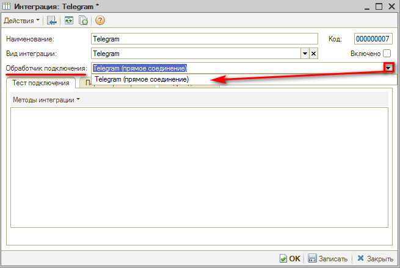
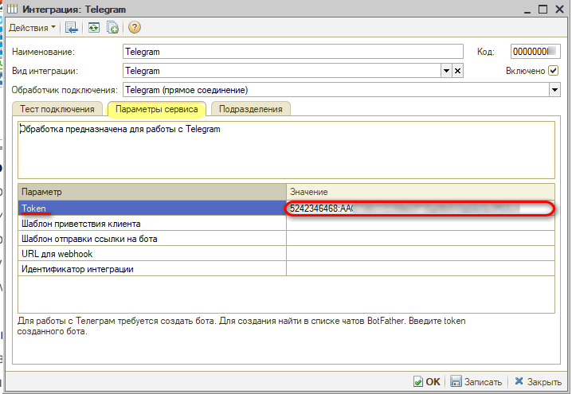
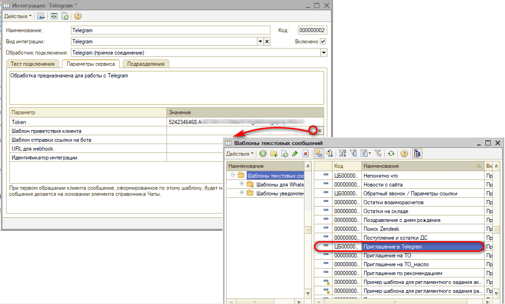
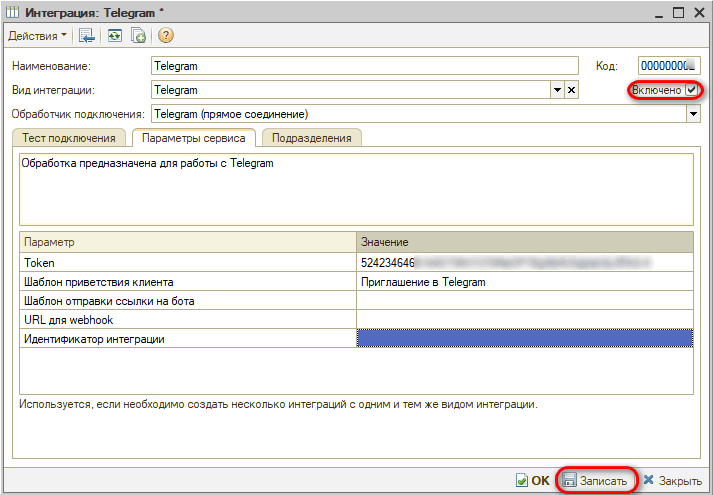
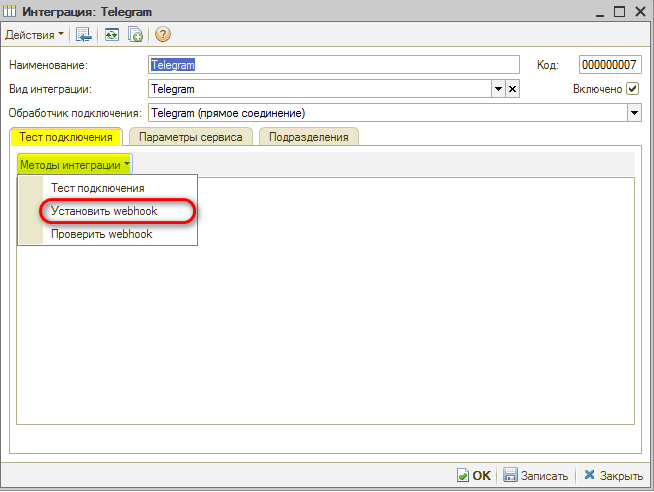
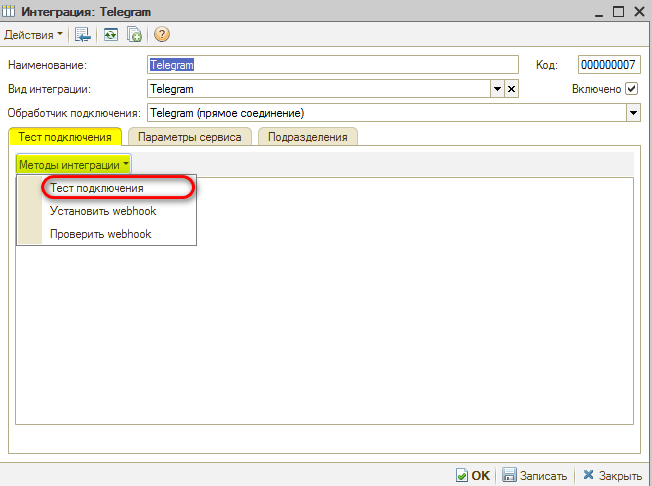
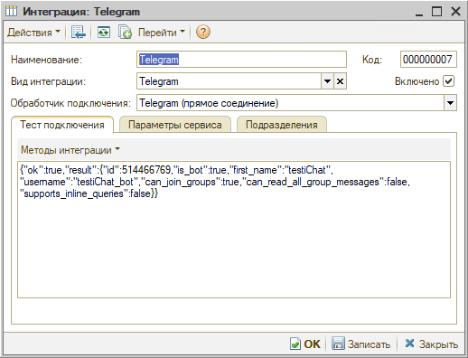

# Как подключить Telegram

<table><tr><td><b>Время чтения:</b> 5 мин.</td><td><b>Обновлено:</b> 27.05.2022</td></tr></table>

В системе предусмотрена интеграция с мессенджером ***Telegram*** для отправки сообщений клиентам или пользователям системы.

Для подключения Telegram необходимо предварительно создать бота. Чтобы создать бота, необходимо найти *BotFather* в *Telegram*: подробнее можно ознакомиться в [статье](../../../articles/5S%20AUTO/Сообщения/Интеграция%20с%20Telegram/integraciya-s-telegram.md).

Для настройки самой интеграции необходимо перейти в справочник "Интеграции": *Администрирование → Компания → CRM → Интеграции* или через верхнее меню *CRM → Все операции → Справочники → Интеграции*.

В открывшемся справочнике необходимо создать новую интеграцию по кнопке “Добавить”:

В форме создания интеграции следует выбрать *Вид интеграции "Telegram"*:

Затем устанавливаем *“Обработчик подключения → Telegram (прямое соединение)”*:

Нажимаем “Записать”, после чего на вкладке “Параметры сервиса” станут доступны параметры интеграции.

Заполним *Token* в соответствующем параметре:

При прямом соединении параметр “URL для webhook” должен быть пустым.

В поле “Шаблон приветствия клиента” можно выбрать *шаблон приветственного сообщения*, которое будет видеть клиент при получении приглашения в Telegram (текст изменяется в шаблоне текстовых сообщений):

Параметр можно не заполнять: по умолчанию интеграция будет отправлять типовое сообщение.

Все настройки внесены. Установим флаг *“Включено”* и запишем изменения, нажав кнопку *"Записать"*:

Далее необходимо перезайти в окно настройки интеграции с *Telegram*. На вкладке “Тест подключения” следует вызвать метод *"Установить webhook"*, чтобы установилось пустое значение:

О правильной установке пустого Webhook свидетельствует следующее сообщение: 
*{"ok":true,"result":true,"description":"Webhook is already deleted"}*

Увидеть, правильно ли вы указали данные бота, можно через *"Тест подключения"*:

Результат теста подключения:

---

**Теги:** мессенджеры, telegram, интеграция, бот, webhook

