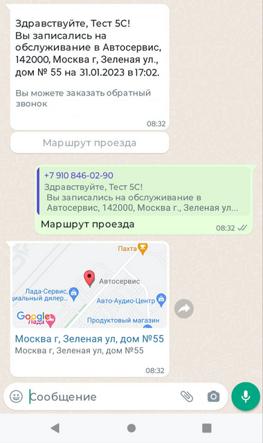
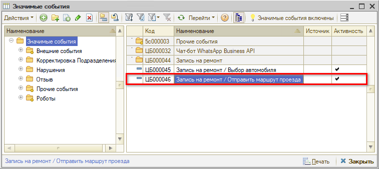
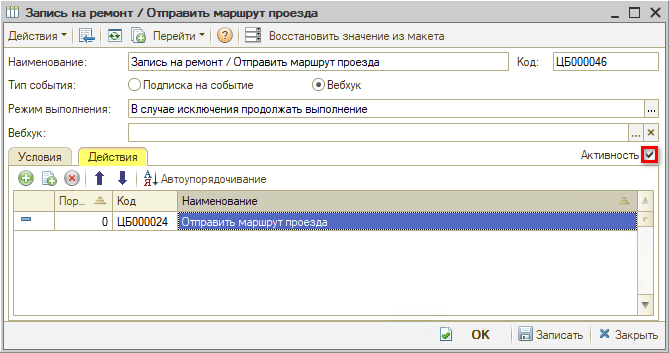
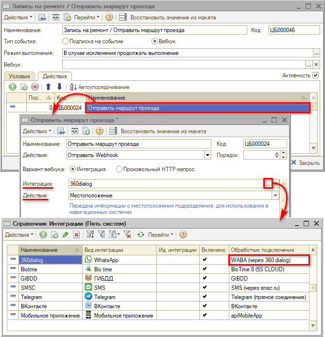
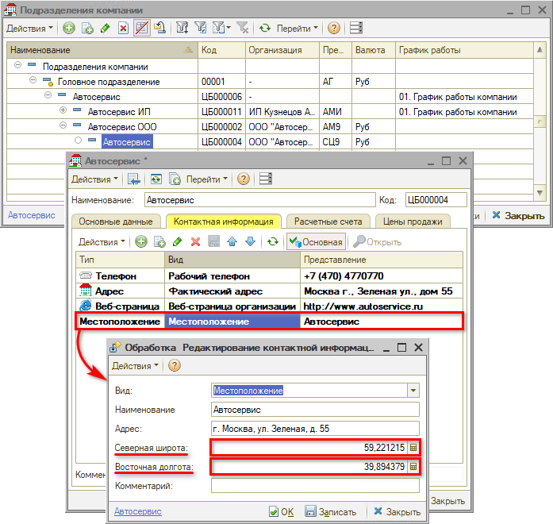
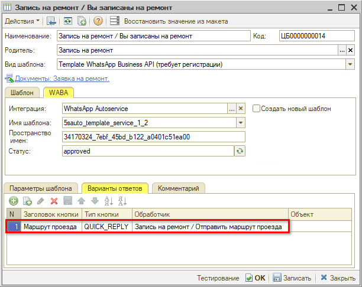

# Как указать ссылку на карту

<table><tr><td><b>Время чтения:</b> 3 мин.</td><td><b>Обновлено:</b> 28.07.2023</td></tr></table>

Источник: https://www.5systems.ru/help/kak-ukazat-ssylku-na-kartu

В программе предусмотрена возможность отправлять клиенту ссылку на местоположение автосервиса:

Для этого необходимо сделать следующие настройки.

## 1. Настройка значимого события

Необходимо включить значимое событие “Запись на ремонт / Отправить маршрут”. Расположение в справочнике “Значимые события” – *“Прочие события → Чат-бот WhatsApp Business API → Запись на ремонт → Запись на ремонт / Отправить маршрут”:*

Чтобы включить значимое событие, нужно в карточке события на вкладке “Действия” поставить галочку “Активность”:

В настройке действия “Отправить маршрут проезда” должна быть выбрана интеграция *WhatsApp Business API через 360dialog*, действие – *“Местоположение”:*

## 2. Настройка координат

Координаты местоположения автосервиса задаются в карточке подразделения компании:

Также должно быть включено значимое событие “Уведомление о записи на ремонт”, и в шаблоне сообщения *“Запись на ремонт/Вы записаны на ремонт”* настроена кнопка *“Маршрут проезда”:*

---

**Теги:** автоматические сообщения, whatsapp, маршрут проезда, значимые события, координаты

