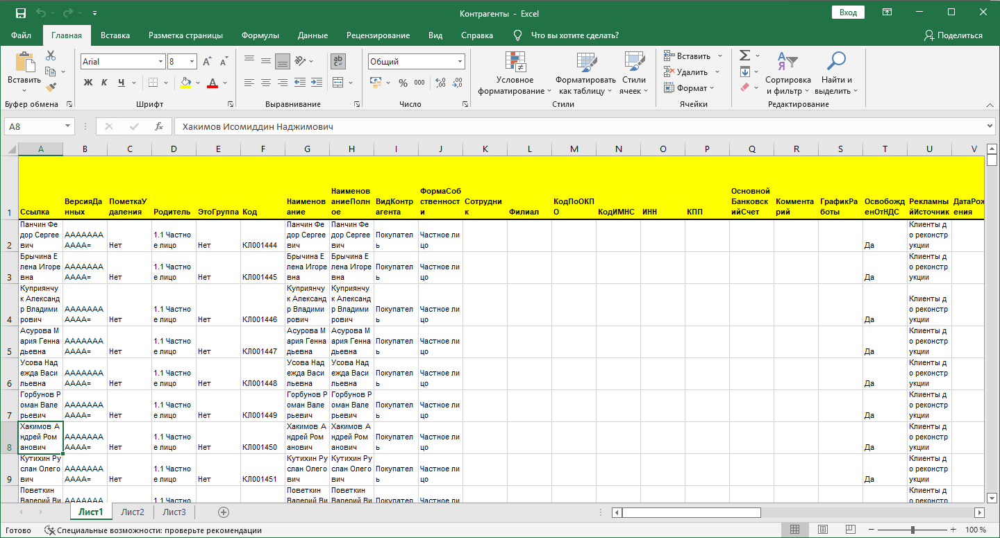
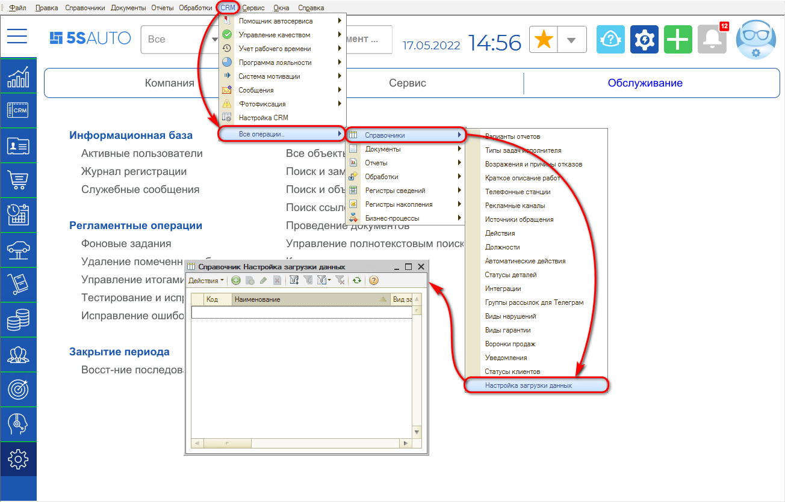
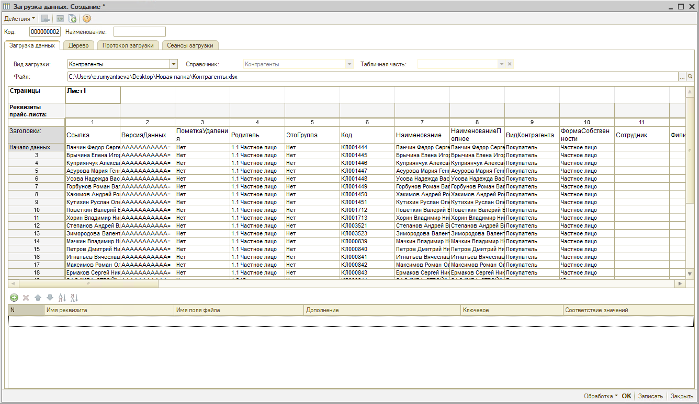
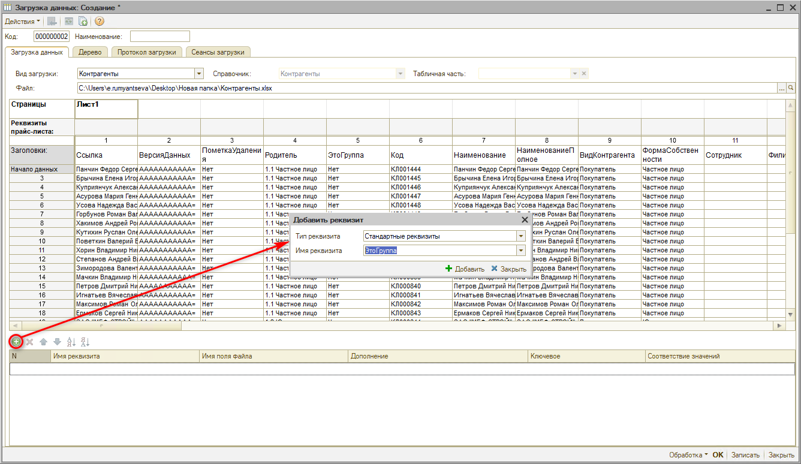
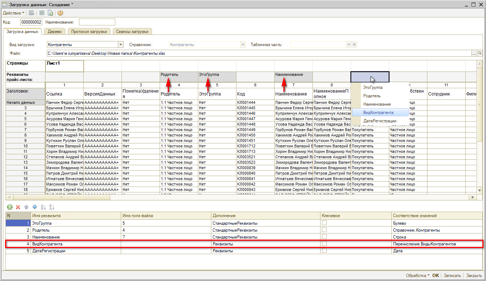
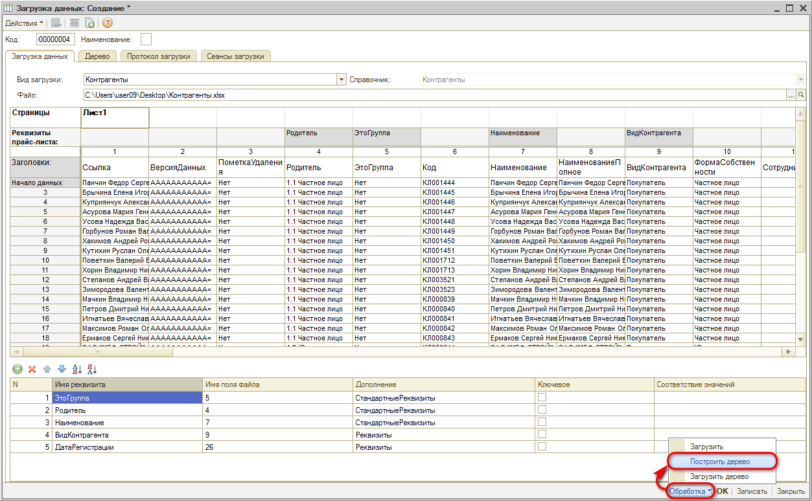
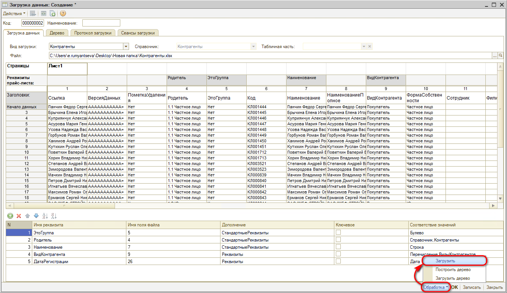
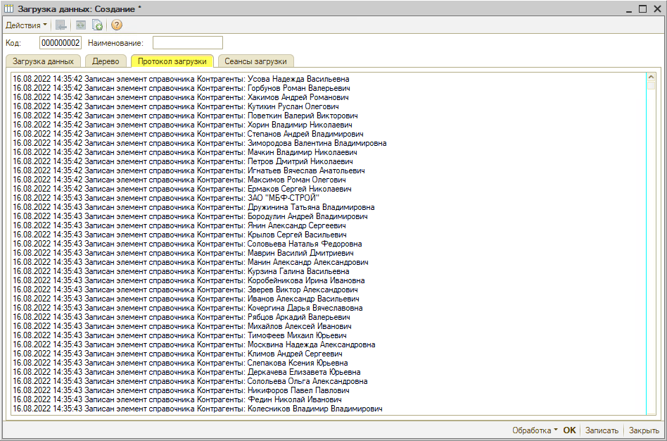

# Как загрузить данные клиентов

<table><tr><td><b>Время чтения:</b> 13 мин.</td><td><b>Обновлено:</b> 15.01.2026</td></tr></table>

Источник: https://www.5systems.ru/help/kak-zagruzit-dannye-klientov

>  **Статья для опытных пользователей!**

## Описание

Для начала должны быть подготовлены excel-файлы с данными, которые необходимо загрузить в базу. Пример:

Для переноса данных требуется перейти в справочник *“Настройка загрузки данных”*. Расположение справочника в стандартном меню: *CRM → Все операции → Справочники → Настройка загрузки данных*

В справочнике требуется создать новый элемент добавлением – нажать на кнопку *“Добавить”* . Откроется окно создания элемента загрузки данных:

Предусмотрено несколько *видов загрузки,* для загрузки клиентов требуется выбрать вид загрузки *Контрагенты* (справочник подставляется автоматически) и в поле "Файл" загрузить нужный файл с данными:

Для начала загрузки требуется в нижней части формы добавить необходимые реквизиты. Для этого сначала выбирается тип реквизита, а затем в поле “имя реквизита” – нужный реквизит:

Далее добавленные реквизиты нужно соотнести со столбцами таблицы. Для этого необходимо дважды кликнуть по ячейке в строке “Реквизиты” на пересечении с нужным столбцом таблицы и в выпадающем меню выбрать из списка добавленных реквизитов нужный. Необходимо добавить и соотнести все нужные для загрузки справочника реквизиты:

Затем нужно задать наименование элемента *Загрузки* и нажать кнопку “Записать”.

*Дополнительная настройка:* Можно поставить в поле “Наименование” галочку “Ключевое”: в этом случае, если при загрузке встретится контрагент с таким же наименованием, то он загружаться не будет. Можно выбрать два элемента: контрагент+телефон. Функция работает в любом справочнике.

Для проверки можно предварительно построить дерево данного справочника – *Обработка → Построить дерево*:

В настройке соответствия значений реквизита *Родитель* можно перенастроить всю иерархию справочника:

После установки соответствия всех реквизитов необходимо *Записать* настройки, затем следует нажать кнопку *Обработка → Загрузить*:

При этом открывается *Протокол загрузки* на соответствующей вкладке формы, где можно отследить произведенную загрузку данных:

В справочнике "Контрагенты" будут созданы карточки для загруженных из файла контрагентов в соответствии с заданными реквизитами. Для более расширенного заполнения требуется далее ввести оставшиеся значения вручную.

Подробнее см. статью: [Перенос данных](../../../articles/5S%20AUTO/Администрирование%20и%20настройка%20системы/Перенос%20данных/perenos-dannykh.md).

---

**Теги:** перенос данных, загрузка данных, контрагенты, excel, настройка загрузки данных

