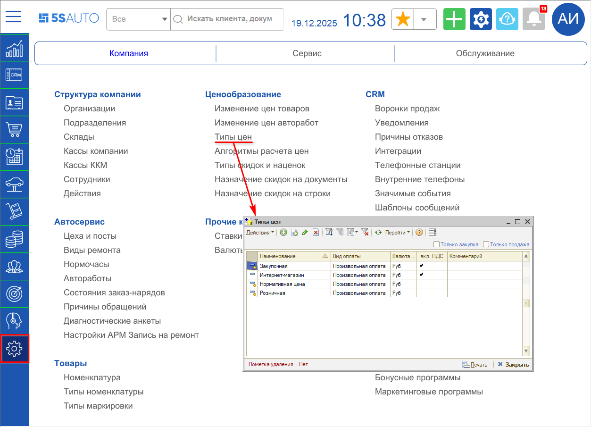
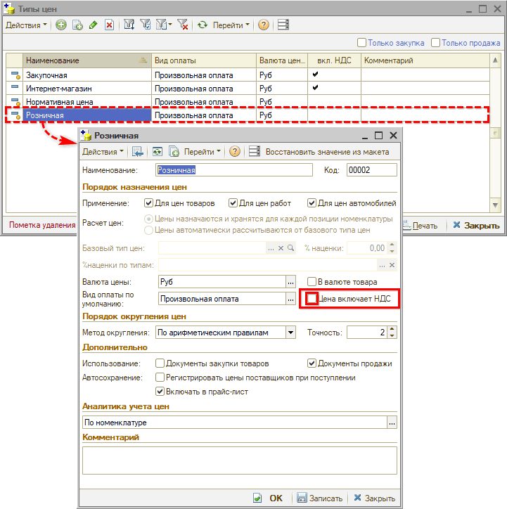
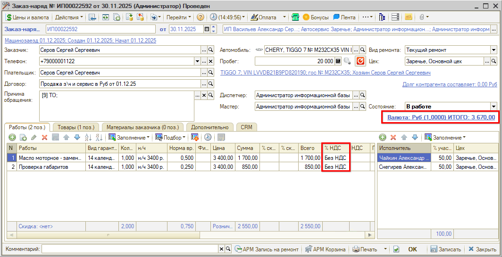
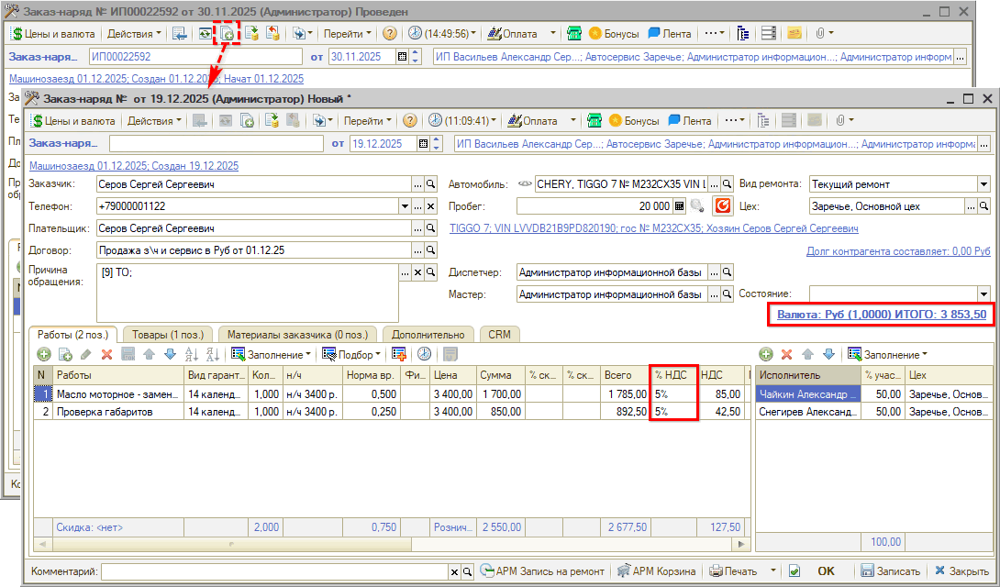

# Как добавить НДС к стоимости документа продажи

<table><tr><td><b>Время чтения:</b> 4 мин.</td><td><b>Обновлено:</b> 19.12.2025</td></tr></table>

> *Актуально начиная с версии релиза 5S AUTO **2.8.3.12**.*

## Содержание

- [Введение](#введение)
- [1. Основные настройки](#1-основные-настройки)
- [2. Настройка типов цен](#2-настройка-типов-цен)

## Введение

С 01.01.2026 г. многие компании впервые начинают работать с НДС. Подробнее см. статью “[Применение НДС при УСН](../../../tips/5S%20AUTO/Практики/Как%20настроить%20применение%20НДС%20при%20УСН/primenenie-nds-pri-usn.md)”.

При переходе с режима работы без НДС на НДС 5% или 7% важно правильно настроить систему учета. Следует принять решение по ценовой политике:

- добавить дополнительные проценты в стоимость товаров и услуг – тогда прибыль сохранится, но вырастут цены для клиентов;
- оставить цены прежними – тогда снизится маржа на размер НДС, т.к. он будет выделен из суммы уже установленных цен товаров и услуг.

Если требуется включить увеличившуюся налоговую нагрузку в стоимость товаров и услуг, т.е. добавить сумму НДС плюсом к цене, нужно внести изменения в настройки справочника “Типы цен” в программе.

*Примечание:* При этом произойдет повышение цен, о чем, возможно, потребуется заранее предупредить постоянных клиентов.

## 1. Основные настройки

При смене налогового режима на УСН с пониженной налоговой ставкой НДС 5% или 7% сначала следует произвести основные настройки:

1. Обновить кассу: прошивку, версию ФФД, драйвер
2. В программе задать режим налогообложения для организации – УСН
3. Выбрать ставку НДС 5% или 7%
4. Настроить справочник “Ставки НДС”
5. Настроить соответствия налоговых групп для касс

Подробное описание см. в статье “[Применение НДС для УСН](../../../tips/5S%20AUTO/Практики/Как%20настроить%20применение%20НДС%20при%20УСН/primenenie-nds-pri-usn.md)”.

## 2. Настройка типов цен

Для того, чтобы добавить НДС к стоимости товаров и услуг, следует настроить справочник “Типы цен”.

Перейти к справочнику можно через меню интерфейса *“Администрирование → Компания → Ценообразование → Типы цен”:*

Следует открыть карточку типа цен “Розничная” и проверить, чтобы в параметре *“Цена включает НДС”* в блоке “Порядок назначения цен” *НЕ была* установлена галочка:

*Примечание:* В случае, если признак был установлен – необходимо снять галочку и сохранить изменения.

После этого следует *проверить правильность начисления цен* в документах. Например, создать копированием документ и сравнить цены:

1. Без НДС:

   

2. После настройки с добавленным НДС 5%:

   

Общая стоимость работ и товаров в документе увеличилась на 5%.

---

**Теги:** ценообразование, НДС, УСН, типы цен

