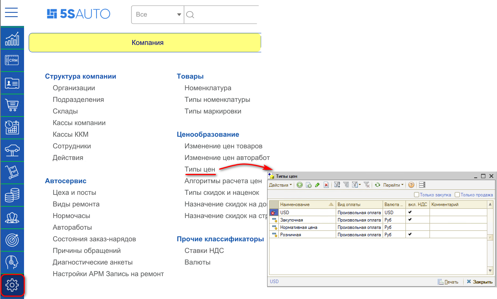
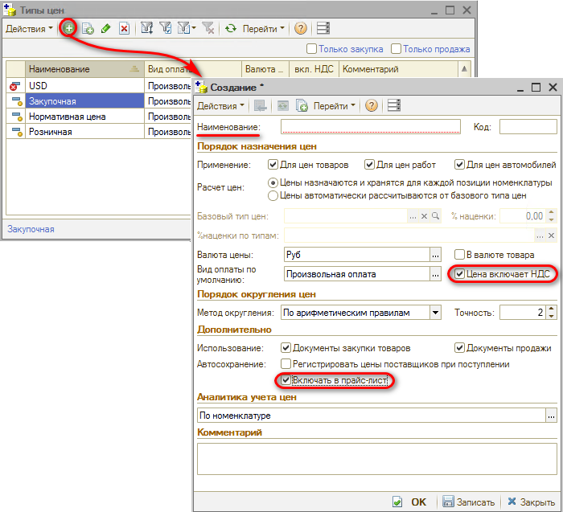
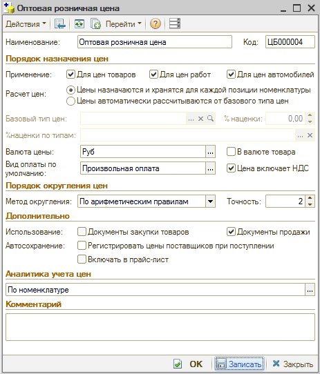
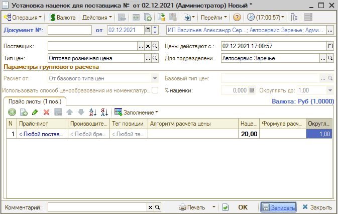
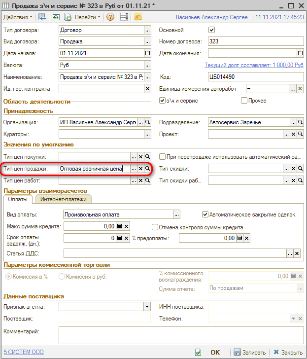

# Как добавить тип цен

<table><tr><td><b>Время чтения:</b> 4 мин.</td><td><b>Обновлено:</b> 29.08.2025</td></tr></table>

Источник: https://www.5systems.ru/help/kak-dobavit-tip-cen

***Тип цен*** используется для управления ценами на товары и услуги. В любом документе реализации или закупки, а также других документах указывается тип цены. Тип цены может быть установлен по умолчанию, либо его можно изменить на тот, который требуется.

В справочнике “Типы цен” содержится перечень типов цен. Это могут быть: Розничная, Оптовая, Дилерская и другие. Для каждой номенклатуры может быть назначено несколько цен из тех, что хранятся в данном справочнике.

Для добавления и настроек цен необходимо перейти в справочник "Типы цен" через пункт меню Администрирование → Компания → Типы цен:

Добавление нового типа цен происходит нажатием на кнопку “Добавить”:

1. Параметр **Для цен товаров** указывает, что тип цен используется для учета цен номенклатуры.
2. Свойство **Для цен работ** указывает, что тип цен используется для учета цен по работам в заказ-нарядах.
3. Параметр **Для цен автомобилей** указывает, что тип цен используется для учета цен автомобилей.
4. **Расчет цен** необходимо выбрать между двумя вариантами: *"Цены назначаются и хранятся для каждой позиции номенклатуры"* и *"Цены автоматически рассчитываются от базового типа цен"*. При выборе первого вида расчета цен становится активным флаг "Регистрировать цены при поступлении". При выборе второго вида расчета становится активным поле "Базовый тип цен".
5. **Валюта цены** - используемая валюта цены для данного типа цен.
6. **Вид оплаты**. Реквизит является обязательным для заполнения. Возможные значения: наличный расчет, безналичный расчет, произвольная оплата. 
   *Рекомендуется* указать в виде оплаты - *"Произвольная оплата"*, а также указать галочками **"Цена включает НДС"** и **"Включать в прайс-лист"**.
7. **Метод округления**:
   - *Всегда в большую сторону* – при округлении 0.04 будет округлена до 0.1;
   - *Округление по арифметическим правилам* – округление будет происходить по арифметическим правилам.
8. **Точность**. Точность в типах цен лучше не изменять, оставить по умолчанию "2". Если необходимо убрать копейки, то устанавливается значение "0". Точность обычно настраивается в документе установки наценок или алгоритмов.
   Количество значащих знаков цены после запятой:
   - 2 – округление до 1 копейки;
   - 1 – округление до 10 копеек;
   - 0 – округление до рубля;
   - -1 – округление до 10 рублей;
   - -2 – округление до 100 рублей.
9. **Закупка** – признак использования в качестве цен закупки.
10. **Продажа** – признак использования в качестве цен продажи.
11. **Регистрировать цены при поступлении** – автоматически регистрировать цены при поступлении товара на склад.

## Пример с отдельной розничной ценой для оптовых покупателей

Для этого создается новый тип цен для документов продажи.

В документах установки наценки для этого типа цен задаются свои наценки.

В договоре с клиентом, для которого подходит этот тип цен, устанавливается созданный тип цен.

---

**Теги:** ценообразование, типы цен, справочник, настройка

