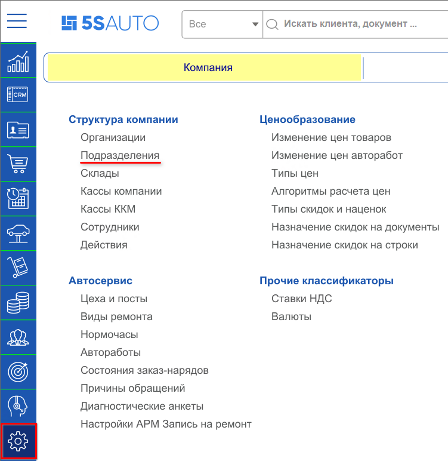
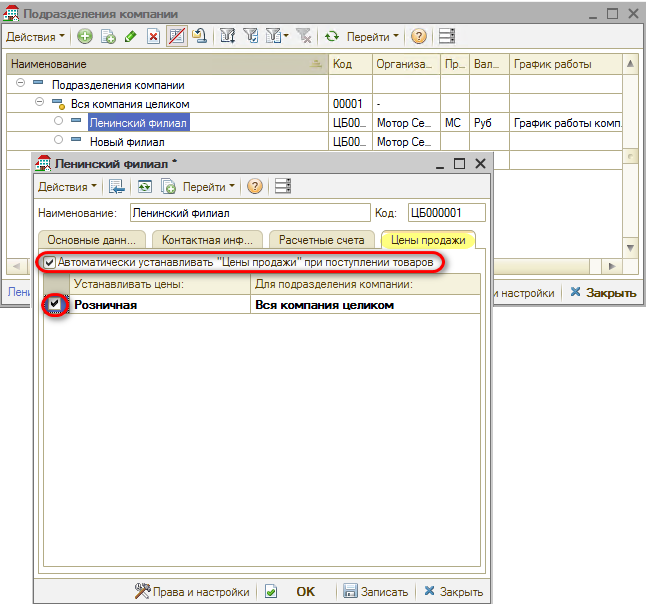
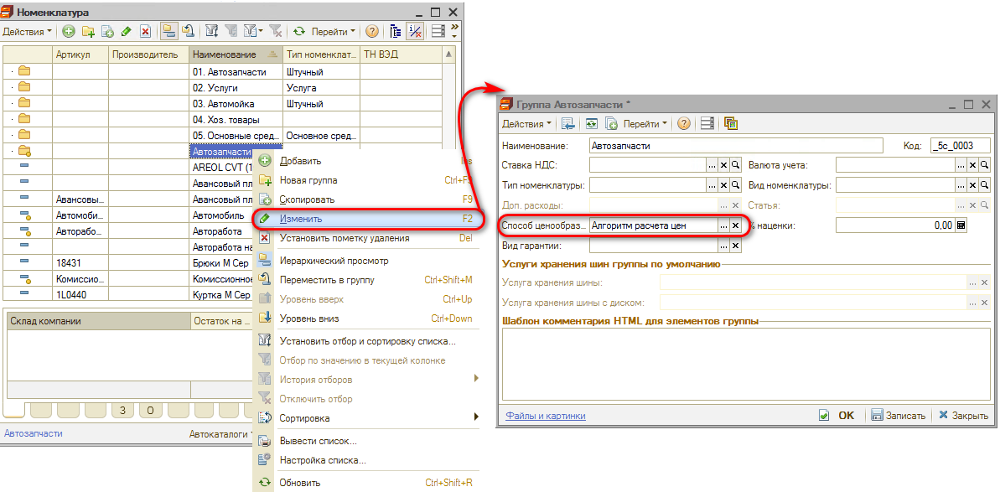
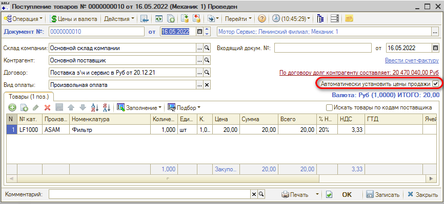
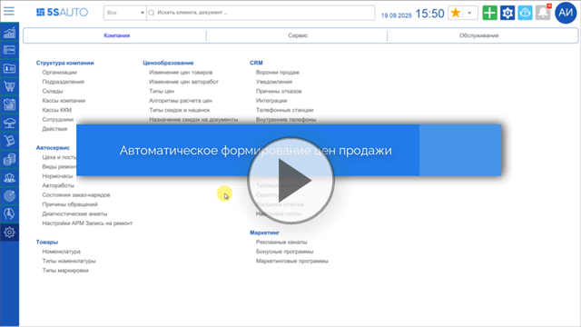

# Как настроить автоматическое формирование цен

<table><tr><td><b>Время чтения:</b> 5 мин.</td><td><b>Обновлено:</b> 13.05.2026</td></tr></table>

В программе предусмотрена возможность ***автоматического формирования цен*** на основе настроек номенклатуры, т.е. при поступлении товара на склад автоматически сформируется подчиненный документ "Изменение цен" с установленным параметром "Использовать способ ценообразования из номенклатуры".

Для включения автоматической установки цен продажи необходимо настроить подразделения, при поступлении товаров на которые должен формироваться документ установки цен и способ ценообразования в справочнике "Номенклатура".

## Настройка подразделений

Настройка подразделений производится в справочнике "Подразделения компании" – *Администрирование → Компания → Подразделения:*

В данном справочнике следует выбрать подразделение, которое требуется настроить и на которое будет формироваться документ поступления товаров. Открыть карточку подразделения и перейти на вкладку "Цена продажи", где установить флажок *"Автоматически устанавливать Цены продажи при поступлении товаров"*:

Установить параметры для формирования документа "Изменение цен", выбрав тип цены и подразделение.

Таким образом, в примере на скриншоте выше документ “Поступления товаров”, оформленный на подразделение “Ленинский филиал”, будет автоматически формировать документ “Установки цен” по правилам ценообразования, настроенных на головное подразделение “Вся компания целиком”.

## Настройка способа ценообразования в номенклатуре

Помимо настройки в справочнике “Подразделения компании” в каждой папке номенклатуры, для которой требуется настроить автоматическое формирование цен, следует установить способ ценообразования. Для этого необходимо открыть справочник “Номенклатура”, выделить папку и нажать на кнопку “Изменить”.

*Важно:* Выделяйте курсором ***наименование*** папки для корректного открытия настроек этой группы справочника номенклатуры.

*Примечание:* Если параметр "Способ ценообразования" в настройках номенклатуры заблокирован, необходимо включить право "Изменять розничные цены в приходной накладной" в значение "Да".

В открывшемся окне в поле “Способ ценообразования” указать "Алгоритм расчета цен":

После настройки способа ценообразования все вложенные в эту папку папки и карточки номенклатуры будут наследовать этот способ ценообразования, если у них он не заполнен.

Если у карточки номенклатуры один способ ценообразования, а у папки другой, то будет действовать тот, что указан в карточке номенклатуры.

*Примечание:* В некоторых случаях требуется *исключить* отдельные номенклатурные позиции из автоматического ценообразования, настроенного для группы, в которую она входит. Для этого следует установить в ее карточке способ ценообразования "Ручная установка цен".

После произведенной настройки в документах: Авансовый отчет, Ввод остатков товаров, Поступление товаров - флаг "Автоматически установить цены продажи" будет устанавливаться автоматически.

При проведении документа с опцией "Автоматически установить цены продажи" будет автоматически создан подчиненный документ "Изменение цен". Данный документ будет заполняться номенклатурой, которая поступает на свободный остаток на склад. Свободный остаток - это товар, который не зарезервирован по заказу покупателя.

Если документ “Поступление товаров” сформирован по документу, в котором товар зарезервирован под заказ покупателя, то документ установки цен на такие товары создан не будет.

*Подробнее с ценообразованием можно ознакомиться в статье: [Настройка ценообразования для товаров](../../../articles/5S%20AUTO/Ценообразование/Настройка%20ценообразования%20для%20товаров/nastroyka-cenoobrazovaniya-dlya-tovarov.md).*

***Также см. видео:***

---

**Теги:** ценообразование, изменение цен, поступление товаров, способ ценообразования, подразделения

