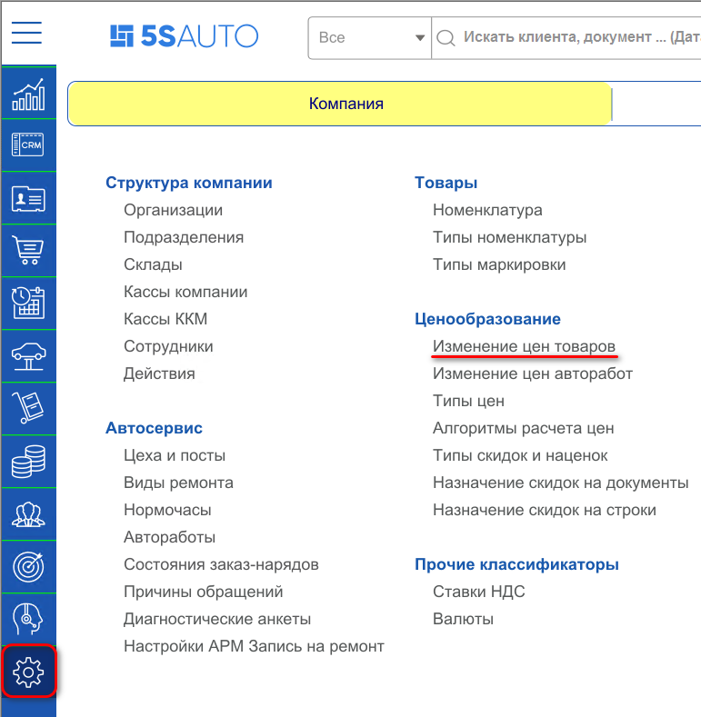
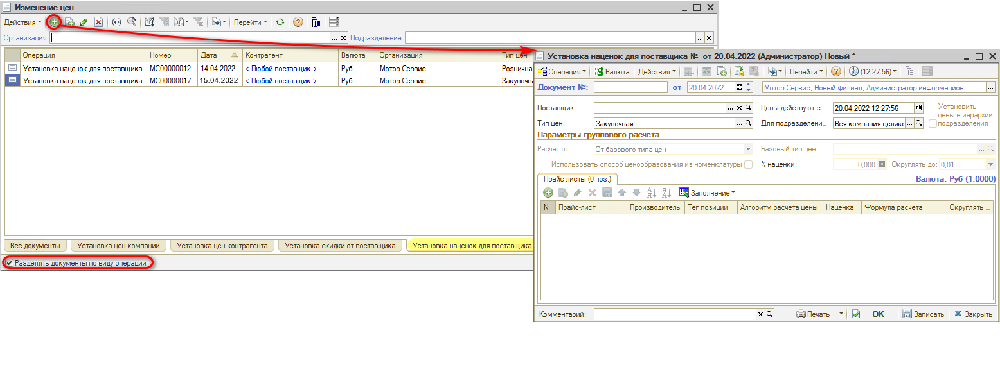
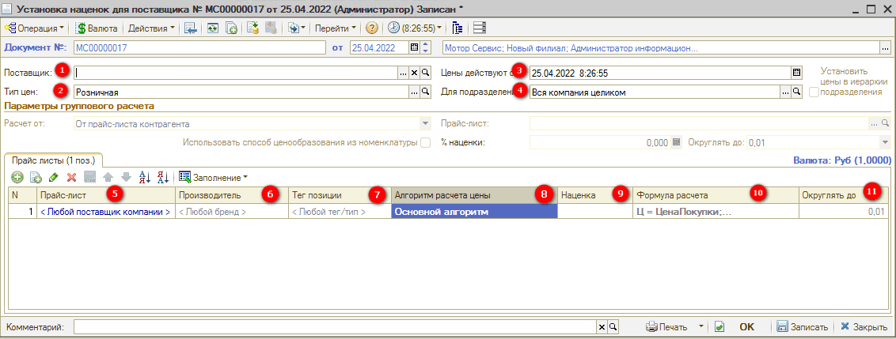
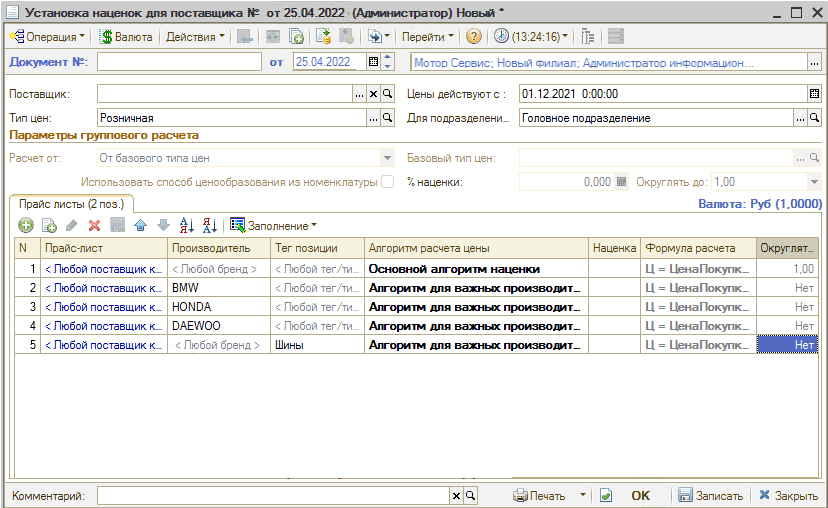
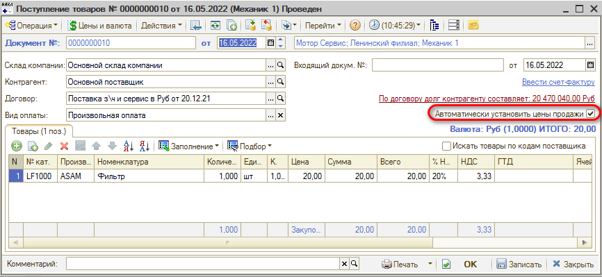
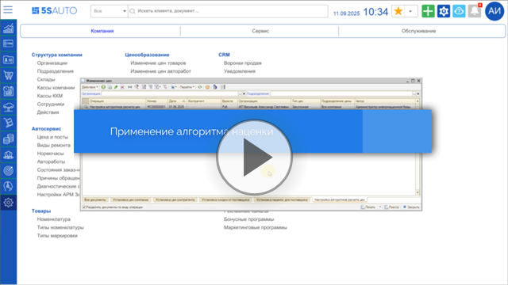
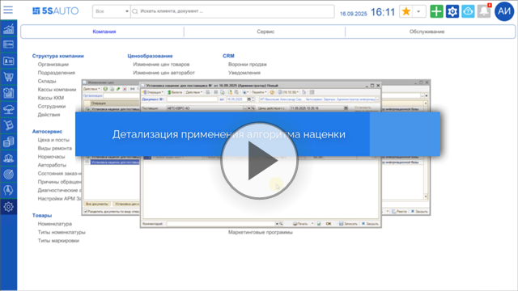

# Как применять алгоритмы наценки

<table><tr><td><b>Время чтения:</b> 4 мин.</td><td><b>Обновлено:</b> 13.05.2026</td></tr></table>

Источник: https://www.5systems.ru/help/kak-primenyat-algoritmy-nacenki

Для дальнейшего использования алгоритма наценки необходимо создать документ ***"Установка наценок для поставщика"***. Данный документ закрепляет правила ценообразования за способом ценообразования “Алгоритм расчета цен”.

Создать документ "Установка наценок для поставщика" можно через меню *Администрирование → Компания → Изменение цен товаров*.

В реестре "Изменение цен" внизу страницы можно поставить галочку "Разделять документы по виду операции", перейти на вкладку "Установка наценок для поставщика" и создать новую настройку. Для этого добавить новый документ, нажав на кнопку “Добавить”.

В табличной части документа добавляются строки, которые закрепляют наценку/алгоритм за определенными параметрами, такими как “Производитель”, “Тегом” или “Типом номенклатуры”.

***Важно:*** в документе обязательно должна присутствовать строка с *Любой поставщик*, *Любой производитель* и *Любой тег/тип номенклатуры*. Данная строка должна быть первой в документе.

Настройка градиентной наценки для организации.

1. Заполняется только тогда, когда необходимо отдельное ценообразование на конкретного поставщика;
2. Тип цен, на который будет действовать данный документ наценки;
3. Дата, с которой будет действовать данная наценка – желательно указывать начало месяца или ранее;
4. Указывается, для какого подразделения будет наценка. Наценка будет действовать не только на данное подразделение, но и на все вложенные.
5. Выбор прайс-листа, на который будет распространяться наценка. Рекомендуется не устанавливать наценку на прайс-лист в табличной части. Если нужна индивидуальная наценка, то обычно указывается на поставщика;
6. Уточнение по производителю;
7. Уточнение по тегу/типу номенклатуры;
8. Выбор алгоритма расчета цены;
9. Процент наценки, подставляется из настройки алгоритма расчета цен (простая наценка);
10. Формула расчета подставляется из документа “Настройка алгоритма расчета цен”;
11. Округление автоматически проставляется из настройки алгоритма расчета цен.

Пример уточняющих строк по производителю или типу номенклатуры.

После проведения документы установки цен больше даты "Цены действуют с" и подходящие под условия будут использовать этот алгоритм.

Данная наценка будет использоваться при ручной установке цены на номенклатуру либо при автоматическом формировании документа Установки цен при поступлении товаров.

Подробнее с ценообразованием можно ознакомиться в статье: [Настройка ценообразования для товаров](../../../articles/5S%20AUTO/Ценообразование/Настройка%20ценообразования%20для%20товаров/nastroyka-cenoobrazovaniya-dlya-tovarov.md).

***Также см. видео:***

1. *Применение алгоритма наценки для поставщика*

   

2. *Детализация применения алгоритма наценки:* применение алгоритма по прайс-листу, производителю, типу номенклатуры

   

---

**Теги:** ценообразование, установка наценок для поставщика, алгоритм расчета цен

