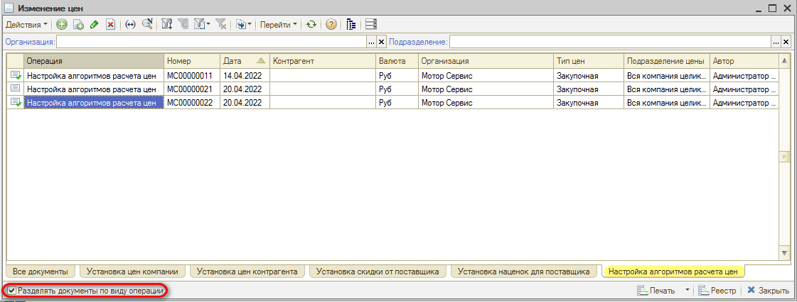
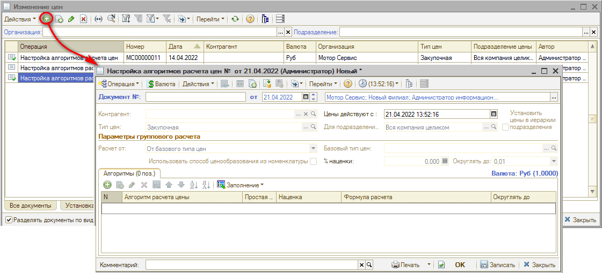
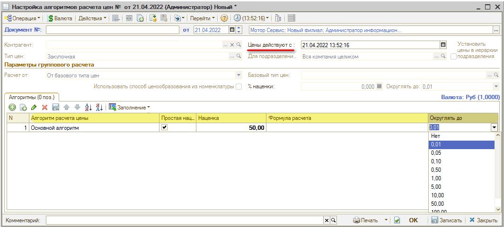
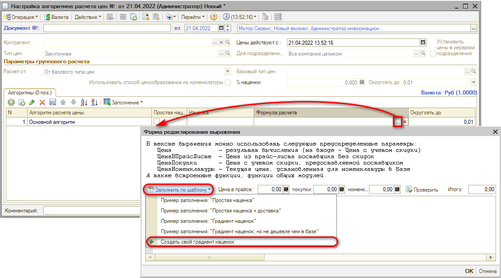
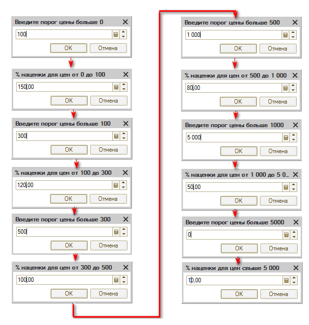
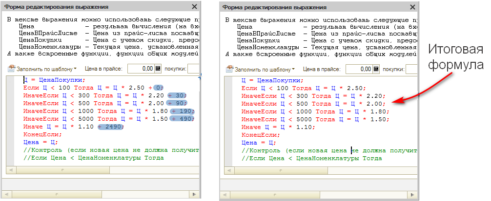
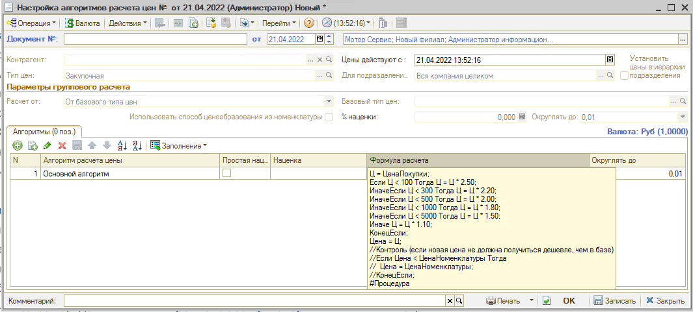
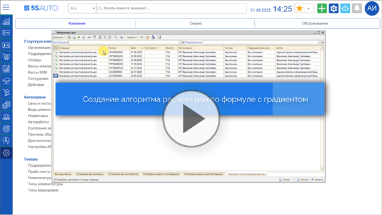

# Как создать алгоритм наценки

<table><tr><td><b>Время чтения:</b> 5 мин.</td><td><b>Обновлено:</b> 13.05.2026</td></tr></table>

***Алгоритм наценки*** создается для того, чтобы настроить одинаковые правила ценообразования и в дальнейшем изменять их одновременно для разных поставщиков.

Для создания алгоритма расчета цен необходимо перейти в реестр документов "Изменение цен". Сделать это можно через меню *Администрирование → Компания → Изменение цен товаров:*


В реестре "Изменение цен" внизу страницы можно поставить галочку "Разделять документы по виду операции".



Далее необходимо перейти вкладку "Настройка алгоритмов расчета цен" и создать новую настройку.



Строка *“Цены действуют с”* указывает на то с какой даты будет действовать данный алгоритм. Желательно указывать дату на пару недель раньше текущей.

Для создания *простой наценки*, необходимо поставить галочку в соответствующем столбце и указать процент наценки.

*Алгоритм расчета цены* - это выбор алгоритма для привязки наценки.

Простая наценка:

- если установить галочку, то будет работать столбец “Наценка”;
- если галочка не установлена – будет работать “Формула расчета”.

*“Округлять до”* - выбор округления.



На скриншоте представлена простая наценка 50%.

В случае выбора “Формула расчета” убирается галочка из столбца “Простая наценка” и настраивается формула расчета.

При установке “Формулы расчета” открывается форма редактирования выражения. В данном окне можно заполнить формулу по шаблону. Шаблон содержит несколько примеров заполнения, а также можно создать свой градиент наценок.

Ниже рассматривается пример создания своего градиента наценок.



Программа будет предлагать заполнять пороги и проценты наценки.

Пример формулы расчета:



```
Ц = ЦенаПокупки;
Если Ц < 100 Тогда Ц = Ц * 2.50;
ИначеЕсли Ц < 300 Тогда Ц = Ц * 2.20;
ИначеЕсли Ц < 500 Тогда Ц = Ц * 2.00;
ИначеЕсли Ц < 1000 Тогда Ц = Ц * 1.80;
ИначеЕсли Ц < 5000 Тогда Ц = Ц * 1.50;
Иначе Ц = Ц * 1.10;
КонецЕсли;
Цена = Ц;
//Контроль (Если новая цена не должна получиться дешевле, чем в базе. Не рекомендуется к использованию!)
//Если Цена < ЦенаНоменклатуры Тогда
// Цена = ЦенаНоменклатуры;
//КонецЕсли;
```



Проверить формулу расчета можно наведением мышки на столбец “Формула расчета”:



После того, как заполнены документ настройки алгоритмов, обязательно необходимо его провести.

Документ "Настройка алгоритма расчета цен" не является конечным, то есть это просто присваивание наценки или формулы за наименованием Алгоритма цен.

Без использования настроенного алгоритма в документах установки наценок расчет по данному алгоритму осуществляться не будет.

После проверки заполнения документа необходимо нажать на кнопку “Провести” либо кнопку “ОК” (запись с проведением и закрытием формы).

Подробнее с ценообразованием можно ознакомиться в статье: [Настройка ценообразования для товаров](../../../articles/5S%20AUTO/Ценообразование/Настройка%20ценообразования%20для%20товаров/nastroyka-cenoobrazovaniya-dlya-tovarov.md).

***Также см. видео:***

1. *Создание простого алгоритма наценки:*

   [](https://edu.5systems.ru/video/Algoritmy_nacenok/Prostoy_algoritm_nacenki.mp4)

2. *Создание алгоритма наценки по формуле с градиентом:*

   [](https://edu.5systems.ru/video/Algoritmy_nacenok/Algoritm_nacenki_po_formule.mp4)

---

**Теги:** ценообразование, алгоритм наценки, изменение цен, формула расчета

