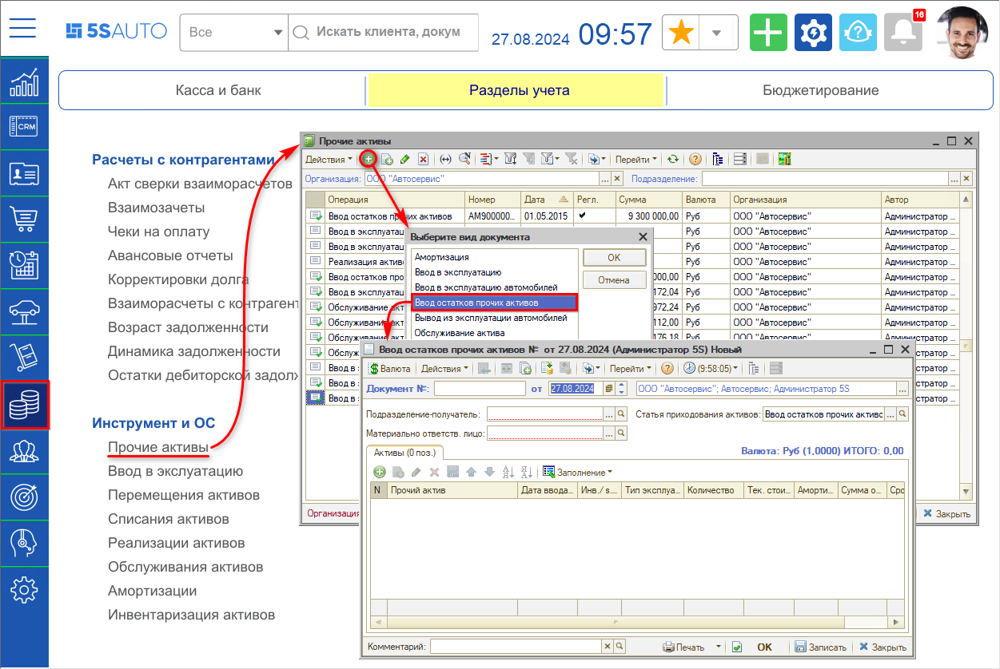
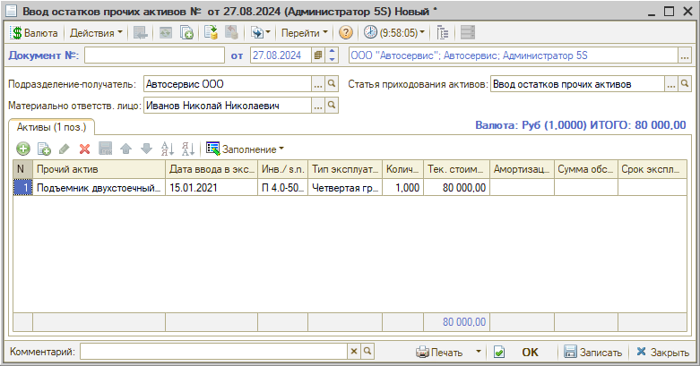

# Как ввести начальные остатки активов

<table><tr><td><b>Время чтения:</b> 4 мин.</td><td><b>Обновлено:</b> 09.09.2024</td></tr></table>

В случае если компания начинает использовать программу не с самого начала работы своего предприятия, вводить информацию обо всех хозяйственных операциях с нетоварными активами за весь период работы не имеет смысла.

Для ввода начальных сведений об имеющихся на предприятии основных средствах, нематериальных и прочих нетоварных активах используется документ *“Ввод остатков прочих активов”.* С помощью данного документа можно ввести в информационную базу сведения о наличии и состоянии нетоварных активов на определенную дату, служащую отправной точкой для ведения учета с помощью новой программы.

Для создания документа “Ввод остатков прочих активов” следует перейти в журнал “Прочие активы” – *Финансы → Разделы учета → Инструмент и ОС → Прочие активы,* нажать кнопку “Добавить” и выбрать соответствующий вид документа:

В создаваемом документе необходимо заполнить следующие параметры:

1. *Подразделение-получатель* – подразделение, на балансе которого находятся активы, перечисленные в таблице.
2. *Материально ответственное лицо* – сотрудник, отвечающий за эксплуатацию и сохранность указанных активов.
3. *Статья приходования активов* – должна быть указана статья доходов, предназначенная для проведения операций ввода начальных данных о нетоварных активах. Такая статья автоматически создается при первом запуске программы.

В таблице “Активы” перечисляются основные средства, информацию о которых необходимо ввести в информационную базу.

Колонки таблицы:

- *Прочий актив* – нетоварные активы, подбираемые из справочника "Прочие активы".
- *Тип эксплуатации* – следует выбрать тип эксплуатации, который будет задавать правила расчета амортизации актива.
- *Текущая стоимость* – остаточная (текущая) стоимость актива на дату ввода остатков.
- *Амортизация* – сумма начисленной на прочий актив амортизации за период эксплуатации на дату ввода остатков.
- *Сумма обслуживания* – сумма, потраченная на обслуживание актива за период его эксплуатации.
- *Срок эксплуатации* – остаток срока полезного использования актива на дату ввода остатков, в мес.

Проконтролировать ввод активов можно при помощи отчета “Остатки и обороты активов” (см. в уроке "[Что такое прочие активы](../Что%20такое%20прочие%20активы/chto-takoe-prochie-aktivy.md#как-контролировать-состояние-прочих-активов)").

---

**Теги:** основные средства, прочие активы, ввод остатков, начальные остатки

