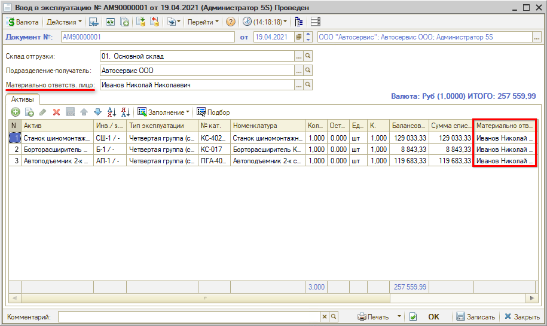

# Как закрепить инструмент за сотрудником

<table><tr><td><b>Время чтения:</b> 3 мин.</td><td><b>Обновлено:</b> 09.09.2024</td></tr></table>

За каждым основным средством предприятия закрепляется сотрудник, являющийся материально-ответственным лицом, который осуществляет эксплуатацию данного актива или отвечает за его сохранность.

Своевременность и полнота закрепления основных средств за материально-ответственными лицами обеспечивается:

- изданием приказов, которыми утверждается список материально-ответственных лиц;
- наличием договоров о полной материальной ответственности;
- наличием и работоспособностью технических средств охраны помещений.

Закрепление основного средства за материально-ответственным сотрудником производится при проведении документа “Ввод в эксплуатацию” основного средства – см. *урок “[Как передать актив в эксплуатацию](../Как%20передать%20актив%20в%20эксплуатацию/kak-peredat-aktiv-v-ekspluataciyu.md)”:*

Сотрудник, указанный в реквизите "Материально ответств. лицо", отображается в списке документов и по умолчанию подтягивается в таблицу "Активы". При необходимости для каждого актива в таблице можно выбрать отдельного материально-ответственного сотрудника.

При перемещении основного средства в другое подразделение компании или под материальную ответственность другого сотрудника необходимо перезакрепить ОС за новым материально-ответственным лицом. Это производится путем оформления документа “Перемещение активов” – см. [*следующий урок*](../Как%20оформить%20перемещение%20актива/kak-oformit-peremeschenie-aktiva.md).

---

**Теги:** основные средства, инструмент, материально-ответственное лицо, ввод в эксплуатацию

