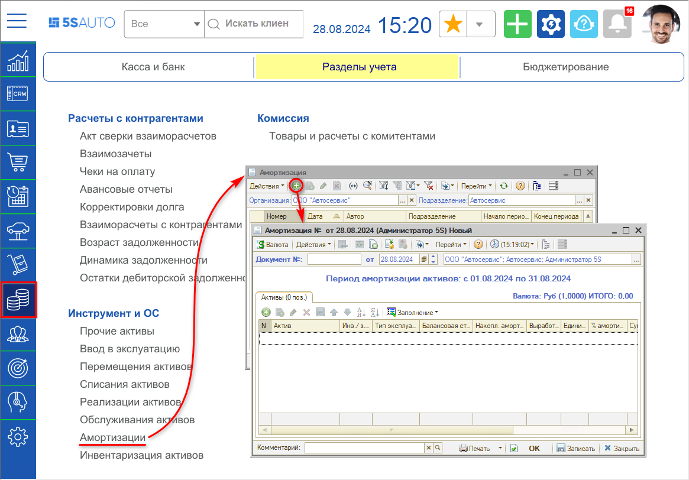
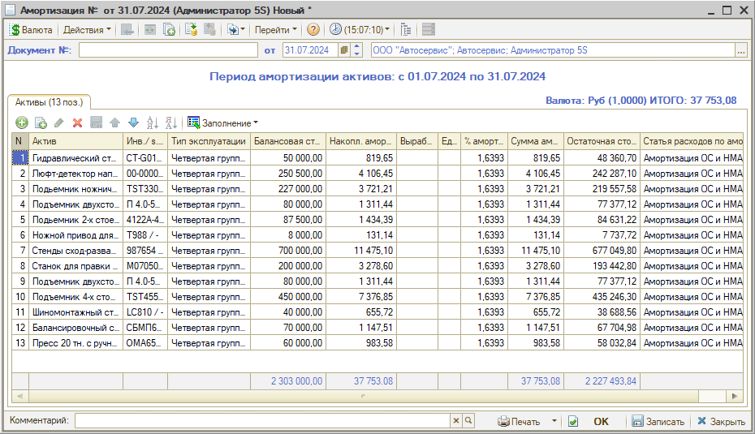

# Как начислить амортизацию

<table><tr><td><b>Время чтения:</b> 4 мин.</td><td><b>Обновлено:</b> 09.09.2024</td></tr></table>

Источник: https://www.5systems.ru/help/kak-nachislit-amortizaciyu

Стоимость объектов основных средств по мере износа уменьшается и переносится на себестоимость производимых услуг с помощью *амортизации.*

Начисление амортизации по объекту основных средств начинается с даты его принятия к бухгалтерскому учету и производятся в течение срока его полезного использования до полного погашения стоимости актива, либо его списания или реализации. Допускается начинать начисление амортизации с первого числа месяца, следующего за месяцем ввода в эксплуатацию, и прекращать с первого числа месяца, следующего за месяцем списания.

Для расчета и отражения в учете начисления амортизации активов используется документ “Амортизация”.

Для создания документа следует перейти в справочник “Амортизация” – *Финансы → Разделы учета → Инструмент и ОС* – и добавить новый элемент:

При создании нового документа определяется период (месяц), за который осуществляется расчет амортизации основных средств. Допускается изменение периода вручную – для этого следует установить дату документа. Рекомендуется оформлять документ “Амортизация” последним днем месяца, за который производится расчет.

Для заполнения таблицы можно воспользоваться кнопкой *“Заполнение → Заполнить активами подразделения”* либо добавить нужные позиции вручную. Для выбора доступны только активы, находящиеся на учете по текущему подразделению пользователя.

Колонки таблицы:

- *Актив* – наименование актива;
- *Тип эксплуатации* – тип эксплуатации актива;
- *Балансовая стоимость* – балансовая стоимость актива;
- *Накопленная амортизация* – сумма накопленной амортизации по активу;
- *Выработка* – выработка актива за текущий месяц, проставляется только для активов, имеющих вид актива "Оборудование" и тип эксплуатации со способом начисления амортизации “По объему выработки”;
- *Единица выработки* – единица выработки;
- *% амортизац.* – процент амортизации, рассчитывается автоматически в зависимости от типа эксплуатации;
- *Сумма амортизации* – сумма начисляемой амортизации, рассчитывается по проценту;
- *Остаточная стоимость* – остаточная стоимость актива с учетом суммы амортизации;
- *Статья расходов по амортизации* – статья, на которую списываются расходы по амортизации.

Заполненный документ следует записать и провести. При проведении документа автоматически рассчитается *сумма начисленной амортизации.* Счета аналитического учета начисленной амортизации и расходов также заполняются автоматически из установленных параметров и значений реквизитов основного средства.

---

**Теги:** основные средства, амортизация, прочие активы, износ

