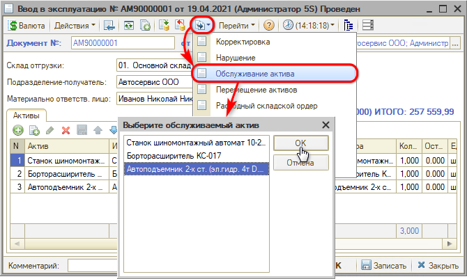
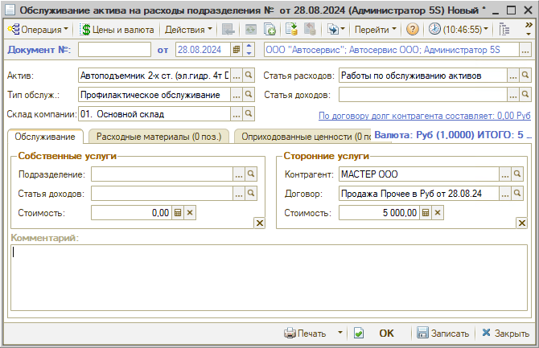

# Как отразить в учете обслуживание актива

<table><tr><td><b>Время чтения:</b> 5 мин.</td><td><b>Обновлено:</b> 09.09.2024</td></tr></table>

Для отражения в учете расходов, произведенных при обслуживании основного средства, необходимо оформить документ *“Обслуживание актива”.*

Документ вводится на основании “Ввода в эксплуатацию”, “Ввода остатков прочих активов” или “Перемещения активов” – также следует выбрать нужный актив:

В создаваемом документе следует выбрать хозяйственную операцию. Возможные хозяйственные операции:

- Обслуживание актива на расходы подразделения;
- Обслуживание актива на стоимость актива.

В обоих случаях хозяйственная операция производит следующие действия:

1. списывает со склада товарно-материальные ценности, потраченные на проведение обслуживания (вкладка “Расходные материалы”), с указанием статьи списания;
2. отражает сумму списанных товаров;
3. начисляет кредиторскую задолженность компании перед контрагентом на сумму оказанных услуг (выполненных работ), либо отражает доход по другому подразделению компании, оказывающему услуги (выполняющему работы) подразделению, на балансе которого числится обслуживаемый актив.

Однако в первом случае на сумму обслуживания начисляется расход подразделению, на балансе которого числится актив, а во втором случае на сумму обслуживания повышается балансовая стоимость обслуживаемого актива.

*Основные реквизиты* документа “Обслуживание актива”:

- *Актив* – актив, подлежащий обслуживанию;
- *Тип обслуживания* – выбирается из справочника “Типы обслуживания”. Можно предварительно задать список всех возможных на предприятии видов обслуживания нетоварных активов – ремонт, сервисное обслуживание, настройка, регулировка и т. п. Для каждого типа должна быть выбрана статья расходов, по которой следует проводить данный тип обслуживания;
- *Статья расходов* – реквизит используется, если по кнопке “Операция” выбрана хозяйственная операция “Обслуживание на расходы подразделения”. В этом случае после заполнения реквизита “Тип обслуживания” автоматически устанавливается статья расходов, указанная в справочнике “Типы обслуживания” для данного типа. При необходимости можно вручную выбрать другую статью.

На *вкладке “Обслуживание”* реквизиты в разделе *“Собственные услуги”* заполняются в случае, если обслуживание выполняется силами другого подразделения предприятия без привлечения сторонних поставщиков услуг:

- *Подразделение* – подразделение, выполняющее обслуживание актива;
- *Статья доходов* – статья доходов, по которой будет проводить стоимость работ подразделение, выполняющее обслуживание;
- *Стоимость* – стоимость работ по обслуживанию, выполненных подразделением нашей компании, без учета стоимости расходных материалов.

В разделе *“Сторонние услуги”* реквизиты заполняются в случае, если обслуживание выполняется сторонней организацией:

- *Контрагент* – контрагент, выполняющий работы по обслуживанию актива;
- *Договор* – договор со сторонней организацией, в рамках которого производится обслуживание;
- *Стоимость* – стоимость работ по обслуживанию, выполненных контрагентом сторонней организации. Сумма денег, указанная в этом реквизите, будет учтена при взаиморасчетах с контрагентом как при обычном оприходовании услуг.

На *вкладке "Расходные материалы"* в таблице перечисляются все собственные товарно-материальные ценности предприятия, потраченные при обслуживании актива, количество и сумма списания этих товарно-материальных ценностей. Сумма списания всегда берется без учета скидок, НДС в сумму списания не включается.

*Вкладка "Оприходованные ценности"* заполняется товарами, которые приходуются на склад компании после обслуживания актива.

---

**Теги:** основные средства, прочие активы, обслуживание актива, расходы

