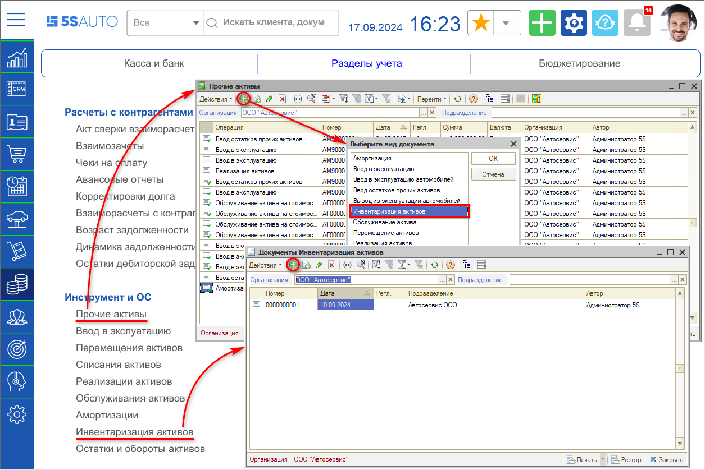
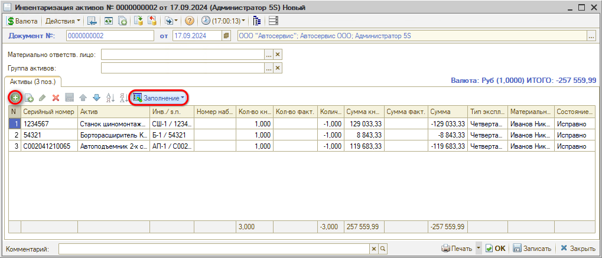
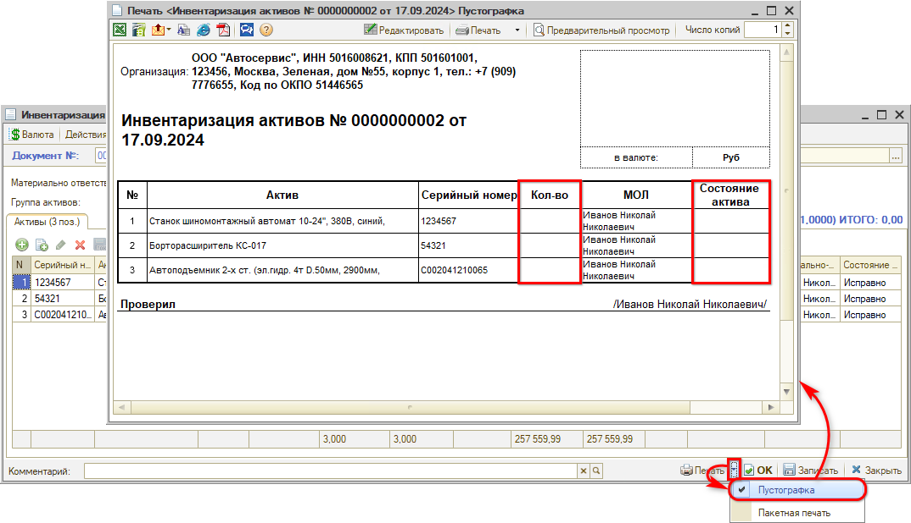
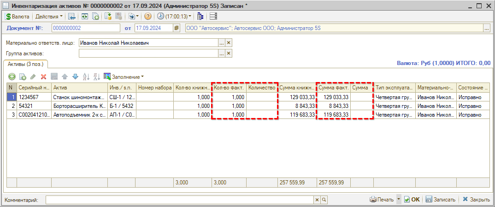

# Как отразить инвентаризацию активов

<table><tr><td><b>Время чтения:</b> 4 мин.</td><td><b>Обновлено:</b> 26.09.2024</td></tr></table>

Источник: https://www.5systems.ru/help/kak-otrazit-inventarizaciyu-aktivov

Для проверки наличия и сохранности *основных средств и инструмента* необходимо регулярно проводить их *инвентаризацию*. В результате инвентаризации производится сопоставление актуального состояния ОС с данными учета.

Также инвентаризацию следует проводить при смене материально-ответственного лица, реорганизации предприятия, передаче имущества в аренду, продаже и в других случаях.

Для отражения инвентаризации в программе предусмотрен специальный документ *“Инвентаризация прочих активов”.* Создать документ можно через журнал “Прочие активы” или добавить новый элемент непосредственно в списке документов “Инвентаризация активов”:

В создаваемом документе следует заполнить таблицу “Активы” – для этого используется кнопка *“Заполнение → Заполнить активами подразделения”,* также можно добавить строки вручную[\*](#snoska):

Показатели “Кол-во книжное” и “Сумма книжная” (расчетные по базе данных), а также "Тип эксплуатации" и "Материально-ответственное лицо" подтягиваются автоматически[\*](#snoska). Состояние по умолчанию устанавливается “Исправно” – можно изменить вручную позднее.

*\*Примечание: Подразделение, на котором числится актив, должно совпадать с текущим подразделением пользователя.*

Далее следует заполнить параметр документа "Материально-ответственное лицо" – это сотрудник, ответственный за проведение инвентаризации, который будет выводиться в печатной форме в графе “Проверил”. При этом перезаполнять таблицу активами по МОЛ не нужно (на вопрос системы выбрать ответ "Нет"). Документ следует записать.

После заполнения Инвентаризации есть возможность для удобства распечатать “Пустографку”, чтобы отмечать в ней фактическое количество и реальное состояние проверяемых активов (у пользователя должно быть право печатать непроведенные документы):

Затем данные значения необходимо перенести в форму документа в программе – заполнить показатели “Кол-во факт.” и “Сумма факт.”, при этом автоматически рассчитываются “Количество” и “Сумма” – расчетное значение минус фактическое (если не зафиксировано отклонений, то итоговые показатели будут нулевые):

Показатель "Состояние" при необходимости следует ввести вручную.

Заполненный документ следует *записать и провести.* Никаких движений по учету в системе документ “Инвентаризация активов” не производит.

На основании Инвентаризации активов затем могут быть введены документы “Реализация активов” и “Списание активов” – см. [следующий урок](../Как%20оформить%20реализацию%20и%20списание%20активов/kak-oformit-realizaciyu-i-spisanie-aktivov.md).

---

**Теги:** основные средства, инвентаризация, прочие активы, инструмент

