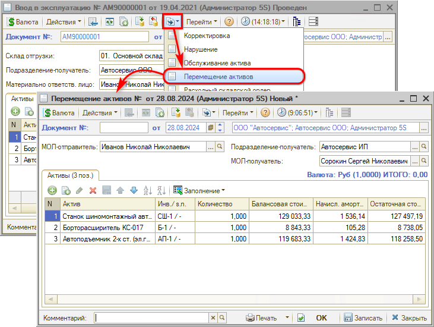

# Как оформить перемещение актива

<table><tr><td><b>Время чтения:</b> 3 мин.</td><td><b>Обновлено:</b> 09.09.2024</td></tr></table>

Источник: https://www.5systems.ru/help/kak-oformit-peremeschenie-aktiva

При перемещении основного средства в другое подразделение необходимо:

1. оприходовать основное средство в новом подразделении;
2. перезакрепить основное средство за новым материально-ответственным лицом.

Для оформления перемещения ОС используется документ “Перемещение активов”.

Также данный документ используется для оформления передачи актива под материальную ответственность от одного сотрудника другому – см. урок "[Как закрепить инструмент за сотрудником](../Как%20закрепить%20инструмент%20за%20сотрудником/kak-zakrepit-instrument-za-sotrudnikom.md)".

Документ “Перемещение активов” вводится на основании “Ввода в эксплуатацию” или “Ввода остатков прочих активов” – в данном случае таблица документа будет заполнена автоматически:

Также можно воспользоваться кнопкой *“Заполнение → Заполнить активами подразделения”.* В таблицу будут занесены все нетоварные активы, числящиеся на балансе текущего подразделения.

Параметры документа:

- *МОЛ-отправитель* – материально-ответственный за отправку активов сотрудник;
- *Подразделение-получатель* – подразделение компании, принимающее на баланс нетоварные активы;
- *МОЛ-получатель* – материально-ответственный за получение активов сотрудник.

Колонки таблицы:

- *Актив* – наименование прочего актива;
- *Инвентарный номер* – инвентарный номер актива;
- *Балансовая стоимость* – балансовая стоимость актива на дату документа;
- *Начисл. амортизация* – сумма начисленной амортизации на дату документа;
- *Остаточная стоимость* – остаточная стоимость актива (балансовая стоимость за вычетом начисленной амортизации).

---

**Теги:** основные средства, прочие активы, перемещение активов, подразделение

