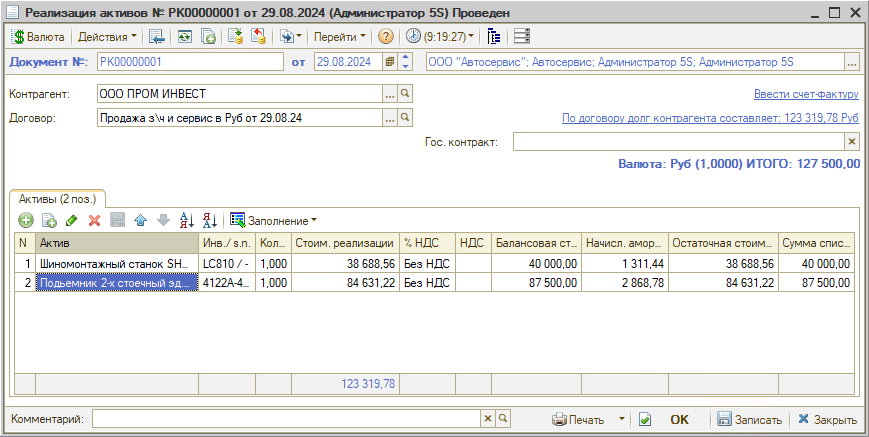
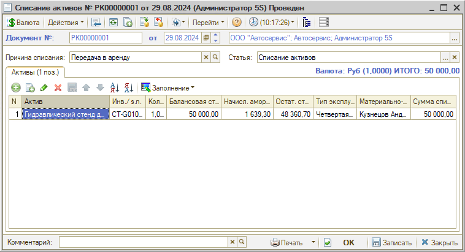

# Как оформить реализацию и списание активов

<table><tr><td><b>Время чтения:</b> 6 мин.</td><td><b>Обновлено:</b> 26.09.2024</td></tr></table>

Прочие активы могут убывать с предприятия вследствие их реализации или прихода в негодное для использования состояние. Для отражения факта продажи используется документ *“Реализация активов”,* а для списания – *“Списание активов”.*

Данные документы могут быть введены на основании документов “Ввод в эксплуатацию”, “Ввод остатков прочих активов”, “Перемещение активов” или "Инвентаризация активов" – при этом таблица документа заполняется автоматически.

Также можно воспользоваться кнопкой “Заполнение” либо добавить позиции вручную. Для выбора доступны только активы, числящиеся на балансе текущего подразделения.

**1. Реализация активов**

В документе “Реализация активов” необходимо заполнить следующие реквизиты:

- *Контрагент* – покупатель, которому реализуются активы;
- *Договор* – договор, по которому ведутся взаиморасчеты с покупателем.

Столбцы таблицы “Активы”:

- *Актив* – наименование актива.
- *Стоим. реализации* – сумма реализации актива.
- *% НДС* – ставка НДС по активу.
- *НДС* – сумма НДС по активу.
- *Балансовая стоимость* – балансовая стоимость актива на дату документа.
- *Начисл. амортизация* – сумма начисленной амортизации на дату документа.
- *Остаточная стоимость* – остаточная стоимость актива на дату документа (балансовая стоимость за вычетом начисленной амортизации).
- *Сумма списания* – сумма списанной балансовой стоимости актива.

При проведении “Реализации активов” хозяйственная операция списывает с баланса все позиции нетоварных активов, перечисленные в документе, и отражает остаточную стоимость списанных активов. Разность суммы реализации и остаточной стоимости актива фиксируется по соответствующей статье как внереализационный доход либо расход предприятия. На взаиморасчетах с покупателем операция отражается аналогично обычной продаже. На сумму продажи начисляется задолженность покупателя перед предприятием или списывается задолженность предприятия перед покупателем.

**2. Списание активов**

В документе “Списание активов” необходимо заполнить параметры:

- *Причина списания* – текстовое описание причины списания активов, например, физический или моральный износ при отсутствии перспектив продажи, физическое выбытие объекта в связи с ЧС, истечение нормативно-допустимых параметров эксплуатации этого объекта и т.д.;
- *Статья доходов и расходов* – списание активов, заполняется автоматически.

Таблица заполняется автоматически при вводе документа на основании других документов, также таблица может быть заполнена с помощью кнопки “Заполнение” или вручную – при этом для выбора доступны активы, числящиеся на балансе подразделения, от имени которого составляется документ.

Колонки таблицы:

- *Актив* – наименование актива.
- *Инвентарный номер* – инвентарный номер актива.
- *Балансовая стоимость* – балансовая стоимость актива.
- *Начисленная амортизация* – начисленная амортизация актива.
- *Остаточная стоимость* – остаточная стоимость актива.
- *Тип эксплуатации* – тип эксплуатации.
- *Материально-ответственное лицо* – сотрудник, который является материально-ответственным за отправку активов лицом.
- *Сумма списания* – сумма списания актива.

При проведении документа хозяйственная операция списывает с баланса стоимость всех указанных в табличной части документа нетоварных активов с указанием статьи списания за вычетом начисленной по ним амортизации, в учетном блоке доходов и расходов отражается остаточная стоимость списанных активов.

---

**Теги:** основные средства, прочие активы, реализация активов, списание активов

