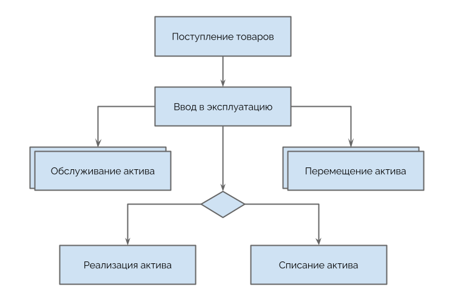
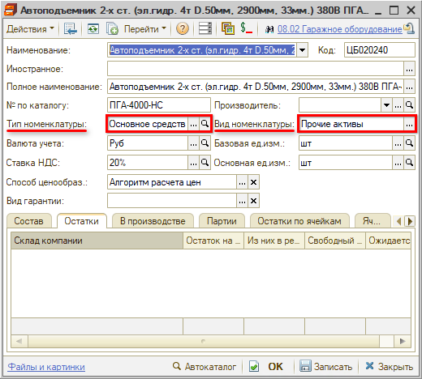
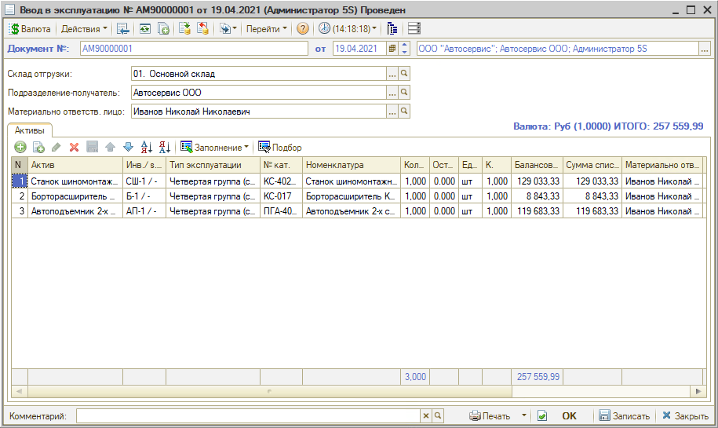
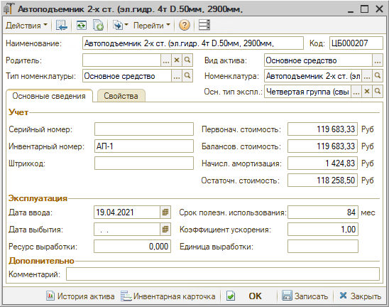

# Как передать актив в эксплуатацию

<table><tr><td><b>Время чтения:</b> 7 мин.</td><td><b>Обновлено:</b> 09.09.2024</td></tr></table>

**Общая схема документооборота прочих активов:**

Поступление актива от поставщика оформляется документом "Поступление товаров". Далее формируется документ ввода в эксплуатацию данного актива (с созданием карточки справочника "Прочие активы") и в дальнейшем уже этот элемент используется в документообороте.

**Поступление прочих активов**

Оформление поступления прочего актива не отличается от поступления обычных товаров (см. [урок](../../Урок%205.%20Складской%20учет/Как%20оформить%20поступление%20товаров%20от%20поставщика/kak-oformit-postuplenie-tovarov-ot-postavschika.md)), за исключением того, что номенклатура, указанная в табличной части, должна иметь вид номенклатуры "Прочие активы":

**Ввод в эксплуатацию**

Для отражения в учете факта ввода в эксплуатацию нетоварных активов необходимо создать документ *“Ввод в эксплуатацию”:*

Этот документ можно создать путем ввода на основании документов “Поступление товаров”, “Перемещение товаров”. При этом активы в таблице заполняются автоматически.

Необходимо заполнить ***реквизиты*** документа:

1. *Склад отгрузки* – склад компании, с которого происходит списание.
2. *Подразделение-получатель* – подразделение компании, принимающее на баланс нетоварные активы: по ним ведется учет активов.
3. *Материально-ответственное лицо* – за каждой позицией нетоварных активов закрепляется сотрудник предприятия, являющийся материально-ответственным лицом, который осуществляет эксплуатацию данного актива или отвечает за его сохранность. Сотрудник, указанный в данном реквизите, будет отображаться в списке документов и по умолчанию подтягиваться в таблицу "Активы". При этом для каждого актива в таблице можно выбрать отдельного материально-ответственного сотрудника.

В ***таблице “Активы”*** перечисляются товарно-материальные ценности, подбираемые из справочника "Номенклатура". Возможен подбор с учетом характеристик.

*Колонки таблицы:*

- *Актив* – каждой списываемой товарной позиции назначается соответствующий элемент справочника "Прочие активы", т.е. нетоварный актив, для ведения инвентарного учета.
- *Тип эксплуатации* – каждому элементу нетоварного актива присваивается определенный тип эксплуатации. Для каждого типа эксплуатации предусмотрена возможность указать амортизационную группу и способ начисления амортизации. Здесь же может быть установлен признак консервации актива, что подразумевает вывод актива из эксплуатации и приостановку начисления амортизации по данному активу. Количество типов эксплуатации нетоварных активов не ограничено.
- *Номенклатура* – каждой списываемой товарной позиции назначается соответствующий элемент справочника “Номенклатура”.
- *Количество* – количество единиц измерения номенклатуры.
- *Остаток* – количество номенклатуры на складе отгрузки.
- *Коэффициент* – коэффициент пересчета по отношению к базовой единице номенклатуры.
- *Балансовая стоимость* – фиксируется первоначальная стоимость актива, по которой этот актив будет оприходован на баланс подразделения. По умолчанию рассчитывается по сумме списываемой номенклатуры по партиям.
- *Сумма списания* – указывается складская учетная себестоимость актива, по которой этот актив учитывался на складе.
- *Материально ответственное лицо* – сотрудник, являющийся материально-ответственным за учет нетоварных активов лицом, принимающий актив в эксплуатацию.
- *Ячейка* – ячейка хранения для номенклатуры. По умолчанию заполняется из номенклатуры.

При формировании и проведении документа “Ввод в эксплуатацию” перечисленные в таблице товарно-материальные ценности списываются со склада, указанного в поле "Склад отгрузки" и приходуются как нетоварные активы на баланс подразделения, указанного в поле "Получатель" под ответственность сотрудника, указанного в поле "Материально-ответственное лицо”. Автоматически *создаются новые элементы справочника “Прочие активы”* – создавать вручную их не рекомендуется.

**Карточка прочего актива**

В реквизиты карточки прочего актива заносятся следующие данные:

- *Наименование* – наименование прочего актива.
- *Родитель* – актив, который является вышестоящим группирующим элементом для данного актива.
- *Вид актива* – реквизит, позволяющий классифицировать прочие активы на основные средства, нематериальные активы, объекты строительства, оборудование, спецоснастку, инструменты, инвестиционные активы.
- *Тип номенклатуры* – этот реквизит формирует отбор элементов при заполнении реквизита “Номенклатура”, контролирует соответствие выбранного элемента нужному типу номенклатуры, автоматически заполняет реквизит “Тип номенклатуры” при вводе нового элемента справочника “Номенклатура” в режиме подбора.
- *Номенклатура* – элемент справочника “Номенклатура”, которому соответствует данный прочий актив.
- *Основной тип эксплуатации* – основной, используемый по умолчанию, тип эксплуатации.
- *Серийный номер* – присваивается, как правило, производителем.
- *Инвентарный номер* – присваивается, как правило, материально-ответственным лицом при вводе актива в эксплуатацию.
- *Штрих-код* – присваивается или вводится имеющийся штрих-код. Например, для того, чтобы в дальнейшем проводить инвентаризации с использованием сканера штрих-кодов или терминала сбора данных. При нажатии на кнопку в правой части поля этого реквизита программа автоматически сформирует случайный штрих-код.
- *Первоначальная стоимость* – балансовая (закупочная без учета НДС) первоначальная стоимость актива. Реквизит заполняется автоматически при проведении документа «Ввод в эксплуатацию».
- *Балансов. стоимость* – реквизит заполняется автоматически при проведении документа Обслуживание актива.
- *Начисл. амортизация* – сумма начисленной амортизации. Заполняется автоматически при проведении документа “Амортизация”.
- *Остаточн. стоимость* – стоимость актива с учетом износа, т.е. первоначальная стоимость актива за минусом начисленной амортизации.
- *Дата ввода* – дата ввода актива в эксплуатацию.
- *Ресурс выработки* – ресурс выработки оборудования в натуральных величинах (шт., км., дни и пр.).
- *Дата выбытия* – дата выбытия актива из эксплуатации. Реквизит заполняется при выбытии, списании актива. До выбытия реквизит остается незаполненным.
- *Срок полезного использования* – срок полезного использования актива в месяцах согласно сопроводительной документации или планам предприятия.
- *Коэффициент ускорения* – коэффициент ускорения амортизации. По умолчанию равен 1. Используется в случае нелинейного начисления амортизации.
- *Единица выработки* – единица выработки актива (час, день, заезд).

На вкладке “Свойства” имеется возможность установки *дополнительных свойств* прочих активов. Виды дополнительных значений свойств определяются в справочнике “Свойства объектов” и устанавливаются для справочника “Прочие активы” в справочнике “Назначение свойств объектов”.

---

**Теги:** основные средства, прочие активы, ввод в эксплуатацию, поступление товаров

