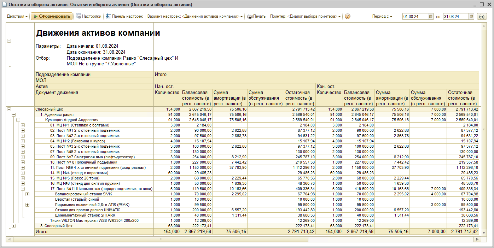
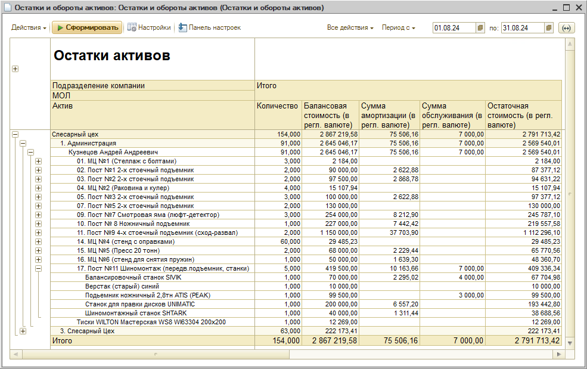
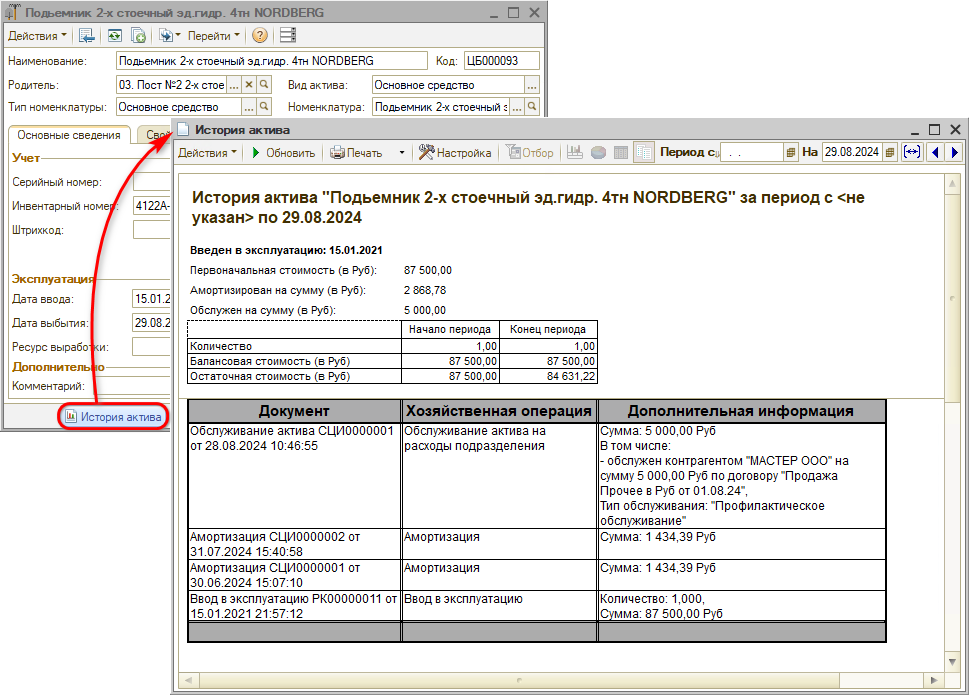

# Что такое прочие активы

<table><tr><td><b>Время чтения:</b> 6 мин.</td><td><b>Обновлено:</b> 09.09.2024</td></tr></table>

Источник: https://www.5systems.ru/help/chto-takoe-prochie-aktivy

## Содержание

1. [Что такое “прочие активы”](#что-такое-прочие-активы)
2. [Как контролировать состояние прочих активов](#как-контролировать-состояние-прочих-активов)

## Что такое “прочие активы”

***Прочие активы*** – это все материальные и нематериальные активы предприятия, не предназначенные для продажи или использования в качестве расходных материалов: основные средства (оборудование, мебель, вычислительная техника, хозяйственный инвентарь и т.д.), инструмент, нематериальные активы и другие нетоварные активы, учет которых может повлиять на общую оценку стоимости предприятия и показатели успешности его работы.

Необходимо вести учет основных средств, так же как и товаров на складе – отражать в системе поступление, перемещение, амортизацию, списание, продажу и прочие операции.

Задачи учета основных средств:

- правильное документальное оформление движения основных средств;
- корректное отображение данных в бухгалтерской, налоговой и финансовой отчетности;
- контроль за сохранностью объектов, проверка наличия инструмента, своевременное исключение фактов хищения и нанесения вреда имуществу компании;
- оценка состояния объектов, определение остаточного срока службы;
- своевременное начисление амортизации и износа, что способствует более эффективному использованию ОС;
- определение цены, по которой можно продать оборудование;
- контроль затрат на ремонт, улучшение ОС, определение их целесообразности;
- формирование себестоимости произведенных товаров или услуг.

Информация обо всех нетоварных активах, производственных и офисных помещениях, оборудовании, собственных транспортных средствах, других основных средствах и нематериальных активах, нужная для целей управления предприятием, заносится в справочник “Прочие активы” – подробнее см. *[следующий урок](../Как%20передать%20актив%20в%20эксплуатацию/kak-peredat-aktiv-v-ekspluataciyu.md).*

## Как контролировать состояние прочих активов

Для анализа стоимости и расходов, связанных с прочими активами, используются отчеты "Остатки и обороты прочих активов" и "История актива".

**1. Остатки и обороты прочих активов**

Отчет “Остатки и обороты активов” служит для анализа эксплуатации нетоварных активов предприятия.

Выбор вида отчета производится переключением кнопки “Вариант настройки" на верхней панели окна настройки отчета.

Варианты отчета следующие:

- *Остатки и обороты активов* – позволяет получить информацию об остатках и оборотах эксплуатируемых нетоварных активов подразделений компании на заданную дату.
- *Остатки активов* – позволяет получить информацию об остатках эксплуатируемых активов подразделений компании на заданную дату;
- *Движения активов компании* – позволяет получить информацию о движении эксплуатируемых активов подразделений компании.

Поле “Показатели” формы настройки отчета содержит группы:

- *Нач. ост.* – группа показателей “Начальный остаток”. Остаток активов на складе на начало периода формирования отчета.
- *Приход* – группа показателей поступления активов на склад за период.
- *Расход* – группа показателей отгрузки активов со склада за период.
- *Кон. ост.* – группа показателей “Конечный остаток”. Остаток активов на складе на конец периода формирования отчета.

В каждой группе содержатся следующие показатели:

- *Количество* – количество активов.
- *Балансовая стоимость (в регл. валюте/в упр. валюте)* – первоначальная стоимость актива в валюте регламентированного/управленческого учета.
- *Сумма амортизации (в регл. валюте/в упр. валюте)* – сумма амортизации, начисленной на актив.
- *Сумма обслуживания (в регл. валюте/в упр. валюте)* – сумма, израсходованная на обслуживание актива.
- *Остаточная стоимость (в регл. валюте/в упр. валюте)* – остаточная стоимость (Первоначальная стоимость с учетом обслуживания актива за минусом амортизации).

*Примеры сформированного отчета:*

1. Вариант отчета “Движения активов компании”:

   

2. Вариант отчета “Остатки активов”:

   

**2. История актива**

Отчет “История актива” предназначен для вывода сведений обо всех хозяйственных операциях с выбранным нетоварным активом, а также для анализа суммовых показателей этих операций.

Для формирования отчета следует перейти в карточку нужного актива и нажать на нижней панели кнопку “История актива”:

---

**Теги:** основные средства, прочие активы, инструмент, справочник, учет активов

