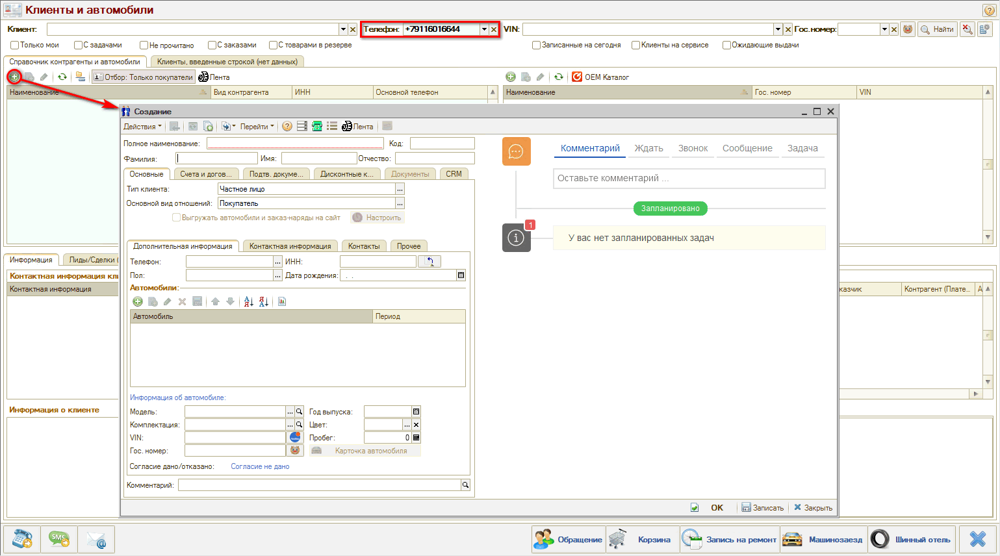

# Как добавить нового клиента

<table><tr><td><b>Время чтения:</b> 1 мин.</td><td><b>Обновлено:</b> 08.07.2022</td></tr></table>

Источник: https://www.5systems.ru/help/kak-dobavit-novogo-klienta

В АРМ “Клиенты и автомобили” можно найти имеющегося в базе клиента и зарегистрировать новую Сделку.

Если клиент не найден в программе по телефону или по ФИО, то нужно создать карточку клиента.

Для этого в области “Список клиентов” требуется нажать кнопку “Добавить” и заполнить данные в открывшемся окне создания нового элемента справочника.

Подробное описание работы с карточкой клиента и справочником "Контрагенты и контакты" см. в статье [Контрагенты и контакты](../Как%20работать%20со%20справочником%20«Контрагенты%20и%20контакты»/kontragenty-i-kontakty.md).

Созданную карточку клиента необходимо сохранить: если планируется продолжать работу с ней – нажать кнопку "Записать", либо нажать "ОК" – сохранить и закрыть.

---

**Теги:** клиенты и автомобили, АРМ Клиенты и автомобили, новый клиент, контрагент

