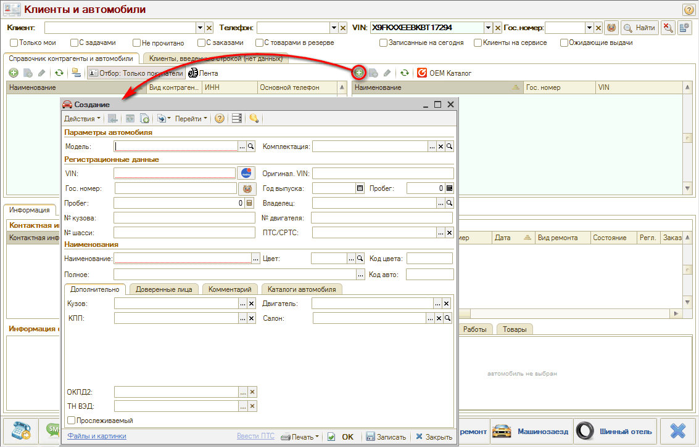

# Как добавить новый автомобиль

<table><tr><td><b>Время чтения:</b> 1 мин.</td><td><b>Обновлено:</b> 11.09.2026</td></tr></table>

Источник: https://www.5systems.ru/help/kak-dobavit-novyy-avtomobil

В [*АРМ “Клиенты и автомобили”*](../../../articles/5S%20AUTO/Работа%20с%20клиентами/Работа%20в%20АРМ%20Клиенты%20и%20автомобили/rabota-v-arm-klienty-i-avtomobili.md) можно найти имеющийся в базе автомобиль, зарегистрированный на определенного [клиента](../Как%20работать%20со%20справочником%20«Контрагенты%20и%20контакты»/kontragenty-i-kontakty.md). Если автомобиль не найден в программе по VIN или гос. номеру, то можно создать новую карточку автомобиля.

Для этого в области “Список автомобилей” требуется нажать кнопку “Добавить” и заполнить данные в открывшемся окне создания нового элемента справочника.

Подробное описание работы с карточкой автомобиля и справочником "Автомобили" см. в статье ["Автомобили"](../Как%20работать%20со%20справочником%20«Автомобили»/avtomobili.md).

Созданную карточку автомобиля необходимо сохранить: если планируется продолжать работу с ней – нажать кнопку "Записать", если работа завершена – сохранить и закрыть нажатием на кнопку "ОК".

---

**Теги:** клиенты и автомобили, АРМ Клиенты и автомобили, новый автомобиль, расшифровка VIN

