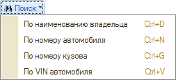
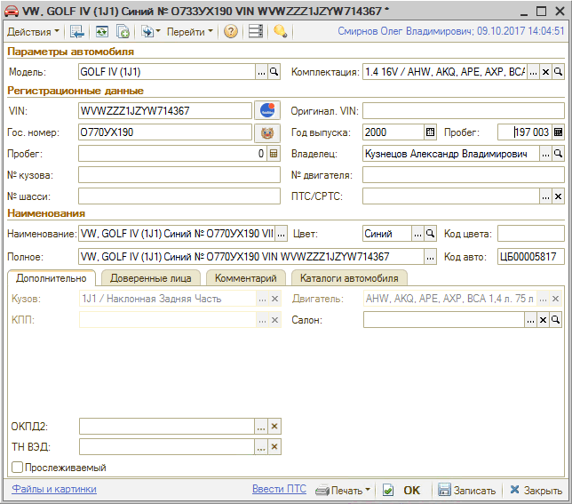
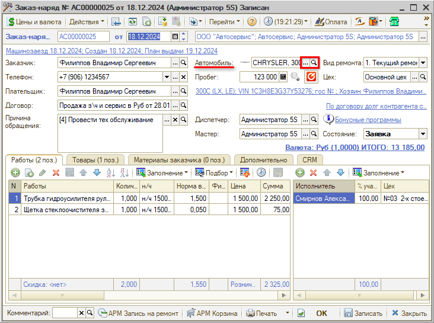

# Как работать со справочником «Автомобили»

<table><tr><td><b>Время чтения:</b> 8 мин.</td><td><b>Обновлено:</b> 20.12.2024</td></tr></table>

Источник: https://www.5systems.ru/help/avtomobili

## Содержание

1. [Работа со справочником “Автомобили”](#работа-со-справочником-автомобили)
2. [Карточка автомобиля](#карточка-автомобиля)
3. [Как перейти в карточку автомобиля](#как-перейти-в-карточку-автомобиля)

В справочник **"Автомобили"** заносится информация обо всех автомобилях: как клиентских, так и собственных автомобилях предприятия. Информация из этого справочника используется в *заказ-нарядах* и заявках на ремонт, заказах покупателей и других документах и рабочих местах программы.

Справочник расположен в меню интерфейса *Автосервис → Приемка → Справочники → Автомобили:*

## Работа со справочником “Автомобили”

**Кнопки панели управления:**

<table><tr><td><b>Кнопка</b></td><td><b>Описание</b></td></tr><tr><td></td><td>Добавить: создать новую карточку автомобиля</td></tr><tr><td></td><td>Добавить группу: создать папку для группировки списка</td></tr><tr><td></td><td>Добавить новый элемент копированием</td></tr><tr><td></td><td>Изменить текущий элемент</td></tr><tr><td></td><td>Установить пометку удаления</td></tr><tr><td></td><td>Включить/отключить иерархический просмотр</td></tr><tr><td></td><td>Переместить элемент в другую группу</td></tr><tr><td></td><td>Фильтры и отборы</td></tr><tr><td></td><td>Ввести на основании</td></tr><tr><td></td><td>Обновить текущий список</td></tr><tr><td></td><td>Перейти к связанной информации</td></tr><tr><td></td><td>Отобразить/скрыть панель информации</td></tr><tr><td></td><td><i>Рекомендации</i> по автомобилю</td></tr><tr><td></td><td>Поиск по справочнику</td></tr></table>

## Карточка автомобиля

**Описание полей карточки автомобиля:**

<table><tr><td><b>Поле</b></td><td><b>Содержимое</b></td></tr><tr><td>Параметры автомобиля</td><td>Указывается <a href="../Как%20работать%20со%20справочником%20«Модели%20автомобилей»/modeli-avtomobiley.md"><i>модель</i></a> автомобиля и вариант его <i>комплектации</i>. Значения выбираются из справочников “Модели автомобилей” и “Варианты комплектации” соответственно. Введенные значения автоматически отображаются в наименовании автомобиля</td></tr><tr><td>VIN</td><td>Идентификационный номер автомобиля. Автоматически отображается в наименовании автомобиля. При заполнении этого поля происходит проверка на ввод недопустимых символов. Допустимыми символами считаются цифры и латинские буквы.   Также можно установить ограничения ввода запрещенных символов, список которых устанавливается правом “Контроль ввода запрещенных символов VIN” (группа прав “Справочники”). Данное право хранит строку запрещенных символов для VIN. Запрещенные символы вводятся строкой без дополнительных разделителей.   В случае наличия недопустимых символов в VIN автомобиля пользователю выдается служебное сообщение об этом</td></tr><tr><td>Кнопка “Расшифровать а/м” </td><td>По кнопке осуществляется переход в обработку “Идентификация автомобилей”, где можно <a href="https://5systems.ru/help/kak-rasshifrovat-avtomobil-po-vin">расшифровать автомобиль</a> при помощи TecDoc и онлайн-каталога</td></tr><tr><td>Оригинал. VIN</td><td>VIN-код автомобиля назначенный производителем.  Реквизит не обязателен для заполнения</td></tr><tr><td>Гос. номер,  Год выпуска,  Пробег,  № кузова,  № двигателя,  № шасси,  ПТС/СРТС</td><td>В этих полях отображаются регистрационные и текущие данные автомобиля</td></tr><tr><td>Кнопка “Расшифровать а/м по гос.номеру” </td><td>Нажатием на кнопку с эмблемой ГИБДД осуществляется <a href="https://5systems.ru/help/kak-rasshifrovat-avtomobil-po-gos-nomeru">расшифровка автомобиля по гос.номеру</a>. Данные отображаются на вкладке “Комментарий”. <i>Функционал доступен при условии настроенной интеграции с базой ГИБДД, каждый запрос платный</i></td></tr><tr><td>Владелец</td><td><a href="../Как%20работать%20со%20справочником%20«Контрагенты%20и%20контакты»/kontragenty-i-kontakty.md">Контрагент</a>, которому принадлежит автомобиль. Выбирается из справочника “Контрагенты и контакты”. Для автомобилей, принадлежащих предприятию, этот реквизит не заполняется</td></tr><tr><td>Цвет</td><td>Цвет автомобиля по классификации ГИБДД. Выбирается из справочника “Цвета”</td></tr><tr><td>Код цвета</td><td>Код цвета автомобиля по классификации производителя</td></tr><tr><td>Наименование</td><td>Наименование автомобиля</td></tr><tr><td>Полное наименование</td><td>Полное наименование автомобиля</td></tr></table>

***Кнопка-ссылка “Файлы и картинки”***

При нажатии на ссылку открывается форма списка файлов и картинок, прикрепленных к карточке автомобиля.

***Кнопка-ссылка “Ввести ПТС”***

С помощью ссылки “Ввести ПТС” можно создать “Паспорт транспортного средства” для автомобиля.

### Вкладки

***1. Вкладка “Дополнительно”***

- *Кузов* – тип кузова;
- *Двигатель* – тип двигателя;
- *КПП* – тип КПП;
- *Салон* – тип салона. 
  Определяются по варианту комплектации автомобиля.

***2. Вкладка “Доверенные лица”***

Список доверенных лиц и список подтверждающих документов:

***3. Вкладка “Комментарий”***

На вкладке может быть введена любая текстовая информация. Сюда подгружаются данные из каталога ГИБДД при расшифровке автомобиля по гос.номеру:

***4. Вкладка “Каталоги автомобиля”***

На данной вкладке отображаются данные по сделанным ранее и сохраненным расшифровкам автомобиля в TecDoc и онлайн-каталогах: каталог, модель, комплектация (модификация) автомобиля.

## Как перейти в карточку автомобиля

### 1. Из Сделки

При нажатии на наименование автомобиля в [*Сделке*](../../../articles/5S%20AUTO/CRM/Работа%20со%20сделкой/rabota-so-sdelkoy.md) появляются кнопки “Выбрать”, “Очистить” и “Показать”:

Кнопка “Показать”   открывает карточку автомобиля. Кнопка “Выбрать”   открывает справочник “Автомобили”.

Справочник “Автомобили” открывается с отбором по текущему клиенту.

### 2. Из АРМ Клиенты и автомобили

В [*АРМ “Клиенты и автомобили”*](../../../articles/5S%20AUTO/Работа%20с%20клиентами/Работа%20в%20АРМ%20Клиенты%20и%20автомобили/rabota-v-arm-klienty-i-avtomobili.md) можно найти имеющийся в базе автомобиль по VIN-номеру или гос. номеру и открыть карточку автомобиля двойным кликом по нужной строке в списке автомобилей (список автомобилей выводится по клиенту, выделенному в области "Список клиентов"):

### 3. Из АРМ "Корзина"

Открыть карточку автомобиля или перейти в справочник для выбора другого автомобиля клиента можно из [*АРМ “Корзина”*](../../../articles/5S%20AUTO/Проценка%20запчастей%20и%20работ/Работа%20в%20АРМ%20Корзина/rabota-v-arm-korzina.md) нажатием на кнопки “Выбрать” или “Открыть” в поле “Автомобиль”:

### 4. Из АРМ "Запись на ремонт"

Из [*АРМ “Запись на ремонт”*](../../../articles/5S%20AUTO/Запись%20на%20ремонт/Календарь%20для%20планирования%20работ/kalendar-dlya-planirovaniya-rabot.md) можно перейти в справочник “Автомобили” по кнопке “Выбрать” в параметре “Автомобиль”:

### 5. Из карточки клиента

Открыть автомобиль из [*карточки клиента*](../Как%20работать%20со%20справочником%20«Контрагенты%20и%20контакты»/kontragenty-i-kontakty.md) можно кнопкой "Открыть карточку автомобиля" в поле "Информация об автомобиле":

### 6. Из документов

Из документов “Заявка на ремонт”, *“[Заказ-наряд](../../../articles/5S%20AUTO/Автосервис/Работа%20с%20Заказ-нарядами/Заказ-наряды/zakaz-naryady.md)”*, "Заказ покупателя" карточка автомобиля и справочник “Автомобили” открываются кнопками “Выбрать” и “Открыть” в параметре “Автомобиль”:

---

**Теги:** клиенты и автомобили, автомобили, карточка автомобиля, справочник автомобилей, VIN

